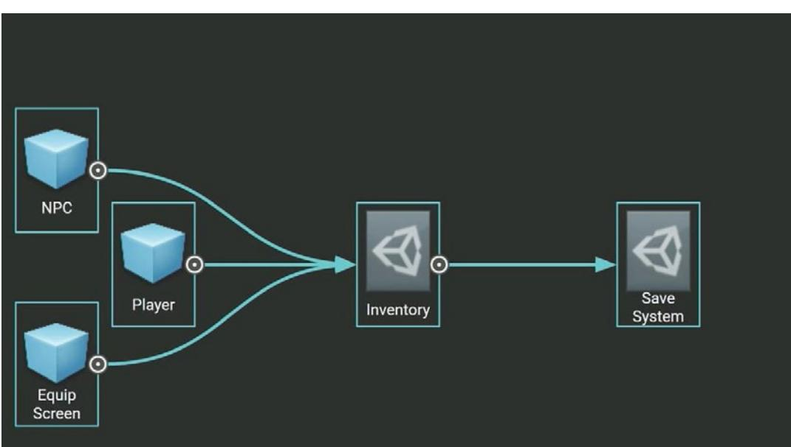

# **Optimize your game performance for consoles and PCs in Unity**


## **Contents**

| Introduction 8 |                                                  |  |
|----------------|--------------------------------------------------|--|
| Profiling 9    |                                                  |  |
|                | Profile early, often, and on the target device 9 |  |
|                | Focus on optimizing the right areas 10           |  |
|                | Understand how the Unity Profiler works 11       |  |
|                | Deep Profiling 15                                |  |
|                | Use the Profile Analyzer 15                      |  |
|                | Frames per second: A deceptive metric 17         |  |
|                | Determine if you are GPU-bound or CPU-bound 18   |  |
|                | Use native profiling and debugging tools 19      |  |
|                | Native profiling tools 19                        |  |
|                | GPU debugging and profiling tools 20             |  |
|                | Project Auditor 20                               |  |
|                | Memory 21                                        |  |
|                | Use the Memory Profiler 22                       |  |
|                | Reduce the impact of garbage collection (GC) 22  |  |
|                | Time garbage collection whenever possible 23     |  |
|                | Use the Incremental Garbage Collector            |  |
|                | to split the GC workload 24                      |  |
|                | Assets 25                                        |  |
|                | Compress textures 25                             |  |
|                | Texture import settings 26                       |  |
|                | Atlas your textures 27                           |  |
|                | Check your polygon counts 28                     |  |
|                | Mesh import settings 30                          |  |
|                | Other mesh optimizations 30                      |  |

| Audit your assets 31                              |
|---------------------------------------------------|
| The AssetPostprocessor 31                         |
| UnityDataTools 31                                 |
| Async texture buffer 31                           |
| Stream mipmaps and textures 32                    |
| Use Addressables 33                               |
| Programming and code architecture 36              |
| Understand the Unity PlayerLoop 36                |
| Minimize code that runs every frame 38            |
| Avoid heavy logic in Start/Awake 38               |
| Cache the results of expensive functions 39       |
| Avoid empty Unity event functions 40              |
| Build a custom Update Manager 40                  |
| Remove Debug Log statements 41                    |
| Disable Stack Trace logging 42                    |
| Use hash values instead of string parameters 42   |
| Choose the right data structure 43                |
| Avoid adding components at runtime 43             |
| Use object pools 43                               |
| Transform once, not twice 44                      |
| Use ScriptableObjects 45                          |
| Avoid lambda expressions 46                       |
| The C# job system 46                              |
| The Burst compiler 48                             |
| Project configuration 50                          |
| Disable unnecessary Player or Quality settings 50 |
| Switch to IL2CPP 50                               |
| Avoid large hierarchies 51                        |

| Graphics 52                                                  |  |
|--------------------------------------------------------------|--|
| Commit to a render pipeline 52                               |  |
| Around 90% of Unity games on PC/console<br>are using SRPs 53 |  |
| Render pipeline packages for consoles 55                     |  |
| Select a rendering path 56                                   |  |
| Forward 57                                                   |  |
| Forward + 57                                                 |  |
| Deferred shading 58                                          |  |
| Optimize Shader Graph 59                                     |  |
| Remove built-in shader settings 61                           |  |
| Strip shader variants 61                                     |  |
| Particle simulations: Particle System or VFX Graph63         |  |
| Smooth with anti-aliasing 64                                 |  |
| Spatial-Temporal Post-Processing 66                          |  |
| Common lighting optimizations 67                             |  |
| Bake lightmaps 67                                            |  |
| Minimize reflection probes 68                                |  |
| Adaptive Probe Volumes 68                                    |  |
| Disable shadows 70                                           |  |
| Substitute a shader effect 70                                |  |
| Use Light Layers 71                                          |  |
| GPU Lightmapper 71                                           |  |
| GPU optimization 72                                          |  |
| Benchmark the GPU 72                                         |  |
| Watch the rendering statistics 73                            |  |
| Use draw call batching 74                                    |  |
| Check the Frame Debugger 76                                  |  |

| Optimize fill rate and reduce overdraw 77         |
|---------------------------------------------------|
| Draw order and render queues 77                   |
| Optimizing graphics for consoles 81               |
| Identify your performance bottlenecks 81          |
| Reduce the batch count 82                         |
| Profile the post-processing 82                    |
| Avoid tessellation shaders 82                     |
| Replace geometry shaders with compute shaders. 82 |
| Aim for good wavefront occupancy 83               |
| Use HDRP built-in and custom passes 84            |
| Reduce the size of shadow mapping                 |
| render targets 84                                 |
| Utilize Async Compute 84                          |
| Culling 86                                        |
| Dynamic resolution 88                             |
| Multiple camera views 88                          |
| Render Objects Renderer Feature in URP 90         |
| Custom Pass Volumes in HDRP 91                    |
| Use Level of Detail (LOD) 92                      |
| Profile post-processing effects 93                |
| GPU Resident Drawer 93                            |
| GPU occlusion culling 95                          |
| Split Graphics Jobs 96                            |
| User interface 97                                 |
| User interface 97                                 |
| UGUI performance optimization tips 97             |
| Divide your Canvases 97                           |

| Hide invisible UI elements 98                                    |
|------------------------------------------------------------------|
| Limit GraphicRaycasters and disable<br>Raycast Target 98         |
| Avoid Layout Groups 99                                           |
| Avoid large List and Grid views 99                               |
| Avoid numerous overlaid elements 99                              |
| When using a fullscreen UI, hide everything else . 99            |
| Assign the Camera to World Space<br>and Camera Space Canvases 99 |
| UI Toolkit performance optimization tips 100                     |
| Use efficient layouts 100                                        |
| Avoid expensive operations in Update 100                         |
| Optimize event handling 100                                      |
| Optimize style sheets 101                                        |
| Profile and optimize 101                                         |
| Test on target platforms 101                                     |
| Audio 102                                                        |
| Use lossless files as your source 102                            |
| Reduce your AudioClip 103                                        |
| AudioClip Import Settings 103                                    |
| Optimize the AudioMixer 105                                      |
| Physics 107                                                      |
| Simplify colliders 108                                           |
| Optimize your settings 109                                       |
| Adjust simulation frequency 110                                  |
| Modify CookingOptions for MeshColliders 112                      |
| Use Physics.BakeMesh 113                                         |
| Use Box Pruning for large scenes 113                             |

| Modify solver iterations 115                                       |
|--------------------------------------------------------------------|
| Disable automatic transform syncing 116                            |
| When to manually sync 116                                          |
| Performance best practice 116                                      |
| Use Contact Arrays 117                                             |
| Reuse Collision Callbacks 117                                      |
| Move static colliders 118                                          |
| Use non-allocating queries 118                                     |
| 2D Physics 118                                                     |
| Batch queries for ray casting 119                                  |
| Visualize with the Physics Debugger 119                            |
| Animation 120                                                      |
| Use generic rather than humanoid rigs 120                          |
| Use alternatives for simple animation 121                          |
| Avoid scale curves 121                                             |
| Update only when visible 121                                       |
| Optimize workflow 121                                              |
| Separate animating hierarchies 122                                 |
| Minimize binding costs 122                                         |
| Avoid using component-based constraints on deep<br>hierarchies 122 |
| Consider performance implications<br>of animation rigging 122      |
| Workflow and collaboration 123                                     |
| Use version control 123                                            |
| Unity Version Control 124                                          |
| Break up large scenes 126                                          |
| Resources for advanced developers and artists 127                  |

## <span id="page-7-0"></span>Introduction

This guide brings together all the best and latest PC and console performance optimization tips available in Unity 6. It is one of two optimization guides available for Unity 6, the other being *[Optimize your game performance for mobile, XR, and Unity Web in Unity 6](https://unity.com/resources/mobile-xr-web-game-performance-optimization-unity-6)*.

Performance optimization is a vast topic that requires careful attention. In order to find an efficient solution that satisfies your design requirements, you will need to master Unity's classes and components, algorithms and data structures, and your platform's profiling tools.

Optimizing your console or PC application is an essential process that underpins the entire game development cycle. While your audience may take it for granted that your game runs at silky-smooth 60+ frames per second (fps), achieving your performance goals across multiple platforms is not always easy. To optimize effectively requires effort to make both your code architecture and art assets more efficient and an understanding of how your target hardware operates within its limitations.

This guide assembles knowledge and advice from Unity's expert software engineers who have tested these best practices with our industry partners in real-world scenarios.

Follow these steps to get the best performance from your PC and console game.

## <span id="page-8-0"></span>Profiling

#### Profile early, often, and on the target device

Profiling is the process of measuring aspects of your game's performance at runtime and therefore, it's at the heart of any optimization workflow. It's key to understand the suite of profiling tools available both from Unity and the manufacturer of your target hardware.

It's essential that you can measure how your game runs on its target platform and use this information to track down the cause of a performance problem. By watching the profiling tool as you make changes, you can gauge whether the changes actually fix the performance problem.

The [Unity Profiler](https://docs.unity3d.com/6000.0/Documentation/Manual/Profiler.html?) provides performance information about your application, but it can't help you if you don't use it.

Profiling is the process of measuring aspects of your game's performance at runtime and to track down the cause of a performance problem. By monitoring the profiling tool as you make changes, you can gauge whether changes actually fix the performance problem.

Profile your project early and throughout the development cycle, not just when you are close to shipping. Investigate glitches or spikes as soon as they appear and make sure to benchmark performance before and after major changes in your project. As you develop a "performance signature" for your project, you'll be able to spot new issues more easily.

While profiling in the Editor can give you an idea of the relative performance of different systems in your game, profiling on each device gives you the opportunity to gain more

<span id="page-9-0"></span>

accurate insights. Profile a development build on target devices whenever possible. Remember to profile and optimize for both the highest- and lowest-spec devices that you plan to support.

Unity offers a suite of profiling tools to help identify bottlenecks including the [Unity Profiler](https://docs.unity3d.com/6000.0/Documentation/Manual/Profiler.html?), the [Memory Profiler](https://docs.unity3d.com/Packages/com.unity.memoryprofiler@1.1/manual/index.html) and [Profile Analyzer.](https://docs.unity3d.com/Packages/com.unity.performance.profile-analyzer@1.2/manual/index.html)

#### Focus on optimizing the right areas

Don't guess or make assumptions about what is slowing down your game's performance. Use the Unity Profiler and platform-specific tools to locate the precise source of a lag. Profiling tools ultimately help you understand what's going on under the hood of your Unity project. But don't wait for significant performance problems to start showing before digging into your detective toolbox.

Of course, not every optimization described here will apply to your application. Something that works well in one project may not translate to yours. Identify genuine bottlenecks and concentrate your efforts on what benefits your work.

To learn more about how to plan your profiling workflows see the *[Ultimate guide to profiling](https://unity.com/resources/ultimate-guide-to-profiling-unity-games?isGated=false)  [Unity games](https://unity.com/resources/ultimate-guide-to-profiling-unity-games?isGated=false)*.


<span id="page-10-0"></span>


Follow this workflow for profiling your Unity projects efficiently.

## Understand how the Unity Profiler works

The Unity Profiler can help you detect the causes of any bottlenecks or freezes at runtime and better understand what's happening at a specific frame or point in time.

The Profiler is instrumentation-based. It profiles timings of game and engine code that are automatically marked up (such as MonoBehaviour's Start or Update methods, or specific API calls), or explicitly wrapped with the help of [ProfilerMarker](https://docs.unity3d.com/6000.0/Documentation/ScriptReference/Unity.Profiling.ProfilerMarker.html?) API.

Begin by enabling the CPU and Memory tracks as your default. You can monitor supplementary Profiler Modules like Renderer, Audio, and Physics as needed for your game (for example, profiling as needed for physics-heavy or music-based gameplay). However, only enable what you need so you don't impact performance and skew your results.

| C. Profiler                             |                                                                                                                                                                                                                                 | ×ロ×                                   |
|-----------------------------------------|---------------------------------------------------------------------------------------------------------------------------------------------------------------------------------------------------------------------------------|---------------------------------------|
| Profiler Modules                        | · Playmode · (2) 14 Pl Frame: 3023 / 3182 Clear<br>Clear on Play Deep Profile Call Stacks ▼                                                                                                                                     | 1 0 @ 1                               |
| CPU Usage                               |                                                                                                                                                                                                                                 |                                       |
| Rendering<br>Scripts                    | 16ms (60FPS)                                                                                                                                                                                                                    |                                       |
| Physics                                 |                                                                                                                                                                                                                                 |                                       |
| · Animation<br>GarbageCollector         | 1.74ms<br>1.99ms<br>10ms (100FPS)                                                                                                                                                                                               |                                       |
| · VSync                                 |                                                                                                                                                                                                                                 |                                       |
| Global Illumination<br>5                | Sms (200FPS)                                                                                                                                                                                                                    |                                       |
| Others                                  |                                                                                                                                                                                                                                 |                                       |
| & Rendering                             | 239 -                                                                                                                                                                                                                           |                                       |
| Batches Count                           | 106<br>136.15k<br>115,68k                                                                                                                                                                                                       |                                       |
| · SetPass Calls Count                   |                                                                                                                                                                                                                                 |                                       |
| · Thangles Count<br>· Vertices Count    |                                                                                                                                                                                                                                 |                                       |
|                                         |                                                                                                                                                                                                                                 |                                       |
|                                         |                                                                                                                                                                                                                                 |                                       |
| O Memory                                | 0.96 GB 0.73 GB<br>-6.1 MB 195                                                                                                                                                                                                  |                                       |
| · Total Used Memory<br>· Texture Memory | 10.03K<br>91.5 MB                                                                                                                                                                                                               |                                       |
| · Mesh Memory                           |                                                                                                                                                                                                                                 |                                       |
| · Material Count<br>Object Count        | 0,9 KE                                                                                                                                                                                                                          |                                       |
| · GC Used Memory                        |                                                                                                                                                                                                                                 |                                       |
| GC Allocated In Frame                   |                                                                                                                                                                                                                                 |                                       |
| Timeline                                | CPU:12.32ms GPU :- ms<br>· Live                                                                                                                                                                                                 |                                       |
| Main Thread                             | 750 (ARDL (APP) (400) (400) (400) (430) (430) (430) (430) (430) (430) (430) (450) (450) (450) (450) (450) (450) (450) (450) (450) (450) (450) (450) (450) (450) (450) (450) (4<br>PlayerLoop (1.82ms)                           |                                       |
|                                         | RenderPipelineManager.DoRenderLoop_Internal() (1.68ms)<br>Int UnivercalRendor Total (1.68ms)                                                                                                                                    |                                       |
|                                         | In_RenderCameraStack (1.67ms)                                                                                                                                                                                                   |                                       |
|                                         | Ini_UniversalRonderPlyellno.RonderSingleCamora: Main Camera (0.49ms)<br>eginCamera imeFrame<br>Ini_Context.Submit (0.53ms)<br>CullScriptsble (0.24ms)<br>UniversalRonderPipeline.RenderSingleComera: Main Camera (0.48ms)       |                                       |
| Render Thread                           | der = ScriptableRanderer, Execute: BoatDemoRenderer (0.22<br>UniversalRenderPipeline.RenderSingleCamera: Main Camera (0.48ms)<br>Gfz.WaitForGfxCommandsFromMainThread (0.38ms)<br>Gfx WaitForGfxCommandsFromMainThread (0.22ms) |                                       |
|                                         | ScriptableRenderer Execute: BoatDemoRenderer (0.45ms)<br>Semaphore. Wait For Signall (0.38ms)<br>Semaphore.WaitForSignal (0,22ms)                                                                                               |                                       |
|                                         | ghtShadow (D) PpacurObjects (O.C.) = = = = = = = = = = = = = = = = = = = = = = = = = = = = = = = = = = = = = = = = = = = = = = = = = = = = = = = = = = = = = = = = = = = = = =                                                  |                                       |
| > Job<br>Loading                        |                                                                                                                                                                                                                                 |                                       |
| Scripting Threads                       |                                                                                                                                                                                                                                 |                                       |
| Background Job                          |                                                                                                                                                                                                                                 |                                       |
| Profiler                                | Cam and san Mad Carline at 13 00mm<br>HabTa of Honak 18 Coller                                                                                                                                                                  | Com nothers link Corlland 11 18 as at |
| Other Threads                           |                                                                                                                                                                                                                                 |                                       |
| Audio                                   |                                                                                                                                                                                                                                 |                                       |
| AssetDatabase                           |                                                                                                                                                                                                                                 |                                       |
| BakingJobs                              |                                                                                                                                                                                                                                 |                                       |
| CloudJob                                |                                                                                                                                                                                                                                 |                                       |
|                                         |                                                                                                                                                                                                                                 |                                       |

Use the Unity Profiler to test performance and resource allocation.

To capture profiling data from an actual device within your chosen platform, check the **Development Build** before you click Build and Run. Then, connect the Profiler to your application manually once it's running.

You can optionally check **Autoconnect Profiler** under **Platform Settings** in the [Build Profiles](https://docs.unity3d.com/6000.0/Documentation/Manual/build-profiles.html) window. Sometimes this is useful if you specifically want to capture the first few frames of the application. Be warned that this option can add 5–10 seconds of startup time, so only use it when necessary.


|  | Build Profiles                                                                                                                                                                             |                                                                                                                                                                |                                                                                                                                                                                                                    | ×                      |
|--|--------------------------------------------------------------------------------------------------------------------------------------------------------------------------------------------|----------------------------------------------------------------------------------------------------------------------------------------------------------------|--------------------------------------------------------------------------------------------------------------------------------------------------------------------------------------------------------------------|------------------------|
|  | Build Profilios                                                                                                                                                                            |                                                                                                                                                                |                                                                                                                                                                                                                    |                        |
|  | Add Build Profile                                                                                                                                                                          |                                                                                                                                                                | Player Settings Learn about Unity Dev Ops. Asset Import Overrides                                                                                                                                                  |                        |
|  | Piatforms<br>Scene List<br>Active<br>Windows<br>Android™                                                                                                                                   | Windows<br>1                                                                                                                                                   |                                                                                                                                                                                                                    | Build And Run<br>Build |
|  | SOF S<br>WebGL<br>& macos<br>@ Linux<br>至 Windows Server                                                                                                                                   | Build Data<br>Y Scene List                                                                                                                                     | Packers builds was the shared some int. To cline settings independently, crosts a Build Profile for this platfym. Add Build Profile                                                                                |                        |
|  | E macOS Server<br>Linux Server<br>· Play Station®4<br>· PlayStation®5                                                                                                                      | > Scenes/SampleScene                                                                                                                                           |                                                                                                                                                                                                                    | 0                      |
|  | Universal Windows Platform<br>SONE #                                                                                                                                                       |                                                                                                                                                                |                                                                                                                                                                                                                    | Open Scene List        |
|  | Build Profiles                                                                                                                                                                             | Platform Sottings<br>Windows Settings                                                                                                                          |                                                                                                                                                                                                                    |                        |
|  | Welcome to Build Profiles.                                                                                                                                                                 | Architecture                                                                                                                                                   | Intel 64-bit                                                                                                                                                                                                       |                        |
|  | Add a Bulld Profile to configure as<br>many builds as you need for any<br>supported platform. Build profiles<br>are stored as assets you can<br>share with your team.<br>Add Build Profile | Build and Run on<br>Copy PDB files<br>Create Visual Studio Solution<br>Development Build<br>Autoconnect Profiler<br>Deep Profiling Support<br>Script Debugging | Local Machine<br>ﺍﻟﻤﺴﺎﻋﺪ ﺍﻟﻤﺴﺘﻮﻯ ﺍﻟﻤﺴﺘﻮﻯ ﺍﻟﻤﺴﺘﻮﻯ ﺍﻟﻤﺴﺘﻮﻯ ﺍﻟﻤﺴﺘﻮﻯ ﺍﻟﻤﺴﺘﻮﻯ ﺍﻟﻤﺴﺘﻮﻯ ﺍﻟﻤﺴﺘﻮﻯ ﺍﻟﻤﺴﺘﻮﻯ ﺍﻟﻤﺴﺘﻮﻯ ﺍﻟﻤﺴﺘﻮﻯ ﺍﻟﻤﺴﺘﻮﻯ ﺍﻟﻤﺴﺘﻮﻯ ﺍﻟﻤﺴﺘﻮﻯ ﺍﻟﻤﺴﺘﻮﻯ ﺍﻟﻤﺴﺘﻮﻯ ﺍﻟﻤﺴﺘﻮﻯ ﺍﻟﻤﺴﺘﻮﻯ ﺍﻟﻤﺴﺘﻮﻯ ﺍﻟﻤﺴﺘﻮﻯ ﺍﻟﻤﺴﺘ<br>S<br>€<br>1<br>1 |                        |
|  |                                                                                                                                                                                            | Compression Method                                                                                                                                             | Default                                                                                                                                                                                                            |                        |

Adjust your Platform Settings before profiling.

Choose the platform target to profile. The Record button tracks several seconds of your application's playback (300 frames by default). Go to **Unity > Preferences > Analysis > Profiler > Frame Count** to increase this up to 2000 if you need longer captures. While this costs more CPU and memory resources, it can be useful depending on your specific scenario.


Use the Timeline view to determine if you are CPU-bound or GPU-bound.


When using the [Deep Profiling s](https://docs.unity3d.com/6000.0/Documentation/Manual/ProfilerWindow.html)etting, Unity can profile the beginning and end of every function call in your script code, telling you exactly which part of your application is being executed and potentially causing a delay. However, deep profiling adds overhead to every method call and may skew the performance analysis.

Click in the window to analyze a specific frame. Next, use either the Timeline or Hierarchy view for the following:

- **Timeline** shows the visual breakdown of timing for a specific frame. This allows you to visualize how the activities relate to one another and across different threads. Use this option to determine if you are CPU- or GPU-bound.
- **Hierarchy** shows the hierarchy of ProfileMarkers, grouped together. This allows you to sort the samples based on time cost in milliseconds (Time ms and Self ms). You can also count the number of Calls to a function and the managed heap memory (GC Alloc) on the frame.


The Hierarchy view allows you to sort ProfileMarkers by time cost.

If you're new to profiling, start with this series of short video tutorials:

- [Profiler walkthrough](https://www.youtube.com/watch?v=xjsqv8nj0cw&t=1s)
- [Profile Analyzer walkthrough](https://www.youtube.com/watch?v=Ypg84Fr20Sw&t=1s)
- [Memory Profiler walkthrough](https://www.youtube.com/watch?v=Uuzd39AjFWQ&t=1s)

For a complete overview of the Unity Profiler, download the profiling e-book [here.](https://unity.com/resources/ultimate-guide-to-profiling-unity-games?isGated=false)

<span id="page-14-0"></span>

Before optimizing anything in your project, save the Profiler .data file. Implement your changes and compare the saved .data before and after the modification. Rely on this cycle to improve performance: profile, optimize, and compare.

#### **Deep Profiling**

You can also enable [Deep Profiling Support](https://docs.unity3d.com/6000.0/Documentation/Manual/ProfilerWindow.html) in the Build Settings. When the built Player starts, the Deep Profiler profiles every part of your code, not just code timings explicitly wrapped in [ProfilerMarkers.](https://docs.unity3d.com/6000.0/Documentation/ScriptReference/Unity.Profiling.ProfilerMarker.html)

When Deep Profiling is enabled, Unity can profile the beginning and end of every function call in your script code. This can help you identify exactly which part of your application is causing a slowdown.

However, Deep Profiling is resource intensive and uses a lot of memory. Each ProfilerMarker adds a tiny bit of overhead (about 10ns, depending on the platform), so each additional point of measurement slows your application more. Also, be warned that if you have a lot of function calls, deep profiling amplifies their overhead as well.

If you want to see more details on samples with markers such as [GC.Alloc](https://docs.unity3d.com/6000.0/Documentation/Manual/profiler-markers.html) or [JobHandle.](https://docs.unity3d.com/6000.0/Documentation/Manual/profiler-markers.html) [Complete](https://docs.unity3d.com/6000.0/Documentation/Manual/profiler-markers.html), navigate to the Profiler window toolbar and enable the **Call Stacks** setting. This provides the sample's full call stack, which gives you the information you need without incurring the overhead of Deep Profiling.


### Use the Profile Analyzer

The Profile Analyzer lets you aggregate multiple frames of Profiler data, then locate frames of interest. Do you want to see what happens to the Profiler after you make a change to your project? The **Compare** view allows you to load and differentiate two data sets, so you can test changes and improve their outcome. The [Profile Analyzer](https://docs.unity3d.com/Packages/com.unity.performance.profile-analyzer@1.2/manual/index.html) is available via Unity's Package Manager.

| Profile Analyzer            | Compare Export Close Profiler Window            |                          |                                   |               |               |                                 |       |                   |                                  |                         |                |             | X ■ ×  |
|-----------------------------|-------------------------------------------------|--------------------------|-----------------------------------|---------------|---------------|---------------------------------|-------|-------------------|----------------------------------|-------------------------|----------------|-------------|--------|
| Mode: Single                |                                                 |                          |                                   |               |               |                                 |       |                   |                                  |                         |                |             |        |
| Pull Data                   |                                                 | 117.77ms ▼               | 33.00ms                           |               |               |                                 |       |                   |                                  | Frame Summary           |                |             |        |
| Load                        | Save VikingVillage_Left_MacPlayer_Wind          | 0.00ms                   |                                   |               |               |                                 |       |                   |                                  |                         | Left           | Right       | Diff   |
| Pull Data                   |                                                 | 117.77ms ▼               |                                   |               | 184 [262] 445 |                                 |       |                   | Gag                              | Frame Count             | 262            | 262         | O      |
| Load                        | Save VikingVillage_Right_MacPlayer_Win          | 0.00ms                   | 33.00ms                           |               |               |                                 |       |                   |                                  | Start                   | 184            | 184         |        |
|                             |                                                 |                          |                                   |               | 184 [262] 445 |                                 |       |                   | 999                              | End                     | 445            | 445         |        |
|                             |                                                 | > 2 Pair Graph Selection |                                   |               |               |                                 |       |                   | PlayerLoop                       |                         |                |             |        |
|                             |                                                 |                          |                                   |               |               |                                 |       |                   |                                  |                         | ms             | ms          | ms     |
| v Filters                   |                                                 |                          |                                   |               |               |                                 |       |                   |                                  | Max                     | 22.91          | 16.10       | -6.80  |
| Remove :                    | None                                            | >                        |                                   |               |               |                                 |       |                   |                                  | Upper Quartile          | 16.61          | 12.05       | -4.56  |
| Name Filter :               | All ▼                                           |                          | Exclude Names : Any ▼             |               |               |                                 |       |                   |                                  | Median                  | 15.63          | 11.35       | -4.28  |
| Thread :                    | Select Main Thread                              |                          |                                   |               |               |                                 |       |                   |                                  | Mean                    | 15.90          | 11.60       | -4.30  |
| Depth Slice :               | All + + Auto Depth (Diff: None)                 |                          |                                   |               |               | Analysis Type: Total            |       |                   |                                  | Lower Quartile          | 14.90          | 10.80       | -4.10  |
| Parent Marker :             | Clear PlayerLoop                                |                          |                                   |               |               | Units :                         |       | Milliseconds      |                                  | Min                     | 13.71          | 9.62        | -4.10  |
| Compare                     | 494 of 554 markers , 1 of 47 threads            |                          |                                   |               |               | Marker Columns : Time and Count |       |                   |                                  |                         |                |             | 22.905 |
|                             | Top 10 markers on median frames                 |                          |                                   |               |               |                                 |       |                   |                                  |                         |                |             |        |
| 219                         | FinishFrameRe Render                            | GBuffer                  |                                   |               |               |                                 |       |                   | 94.1ms                           | 0                       | 22,905         |             | O      |
| 292                         | PlayerLoop<br>PlayerLoop<br>FinishFrameR Render | GBuffer                  | Drawing Opaqt<br>Drawing Opaqı Cu |               |               |                                 |       |                   | 65.0ms                           |                         |                |             |        |
| (All depths)                |                                                 |                          |                                   |               |               |                                 |       | Ratio: Normalized |                                  | Thread Summary          |                |             |        |
|                             |                                                 |                          |                                   |               |               |                                 |       |                   |                                  |                         | Lett           | Right       | Total  |
|                             | Marker Comparison for currently selected range  |                          |                                   |               |               |                                 |       |                   |                                  | Total Count :           | 47             | 47          | 47     |
| Marker Name                 |                                                 | Left Mei <               | >                                 | Right Mc Diff |               |                                 |       |                   | Abs Diff Count L Count R Count D | Unique Count :          | 0              | 0           | 0      |
| PlayerLoop                  |                                                 | 15.60                    |                                   | 11,31         | -4.29         | 4.29                            | 262   | 262               | 0                                | Selected :              |                | 11          | 1      |
|                             | PostLateUpdate.FinishFrameRendering             | 12.14                    |                                   | 8.02          | -4.12         | 4.12                            | 262   | 262               | 0                                | Graph Scale :           | Upper quartile |             |        |
| Camera. Render              |                                                 | 11.60                    |                                   | 7.57          | -4.04         | 4.04                            | 262   | 262               | 0                                |                         | Median         | Thread      |        |
| RenderDeferred.GBuffer      |                                                 | 9.76                     |                                   | 5,78          | -3.98         | 3.98                            | 524   | 524               | 0                                |                         | -11 15.60      | Main Thread |        |
| Drawing                     |                                                 | 7.85                     |                                   | 4.80          | -3.05         | 3.05                            | 524   | 524               | 0                                | -11.31                  |                |             |        |
| Render. Opaque Geometry     |                                                 | 6.06                     |                                   | 3.65          | -2.41         | 2.41                            | 524   | 524               | 0                                |                         |                |             |        |
| BatchRenderer.Flush         |                                                 | 1.41                     |                                   | 0.61          | -0.80         | 0.80                            | 45512 | 24812             | -20700                           | Marker Summary          |                |             |        |
| WaitForJobGroupID           |                                                 | 2.02                     |                                   | 1.23          | -0.79         | 0.79                            | 3999  | 3622              | -377                             | PlayerLoop              |                |             |        |
| RenderForward.RenderLoopJob |                                                 | 0.94                     |                                   | 0.38          | -0.56         | 0.56                            | 524   | 524               | 0                                | Mean frame contribution |                |             |        |
| Culling                     |                                                 | 2.49                     |                                   | 1.93          | -0.56         | 0.56                            | 524   | 524               | 0                                |                         | Left           | Right       | Diff   |
| Render. TransparentGeometry |                                                 | 0.98                     |                                   | 0.48          | -0.50         | 0.50                            | 524   | 524               | 0                                |                         | 99.79%         | 99.65%      | -0.14% |
| RenderForwardAlpha.Render   |                                                 | 0.71                     |                                   | 0.28          | -0.43         | 0.43                            | 524   | 524               | 0                                | First frame             | 184            | 184         |        |
|                             | Cull Results. Create Shared Renderer Scene      | 1.01                     |                                   | 0.66          | -0.35         | 0.35                            | 524   | 524               | 0                                | Top 3 ▼ by frame costs  |                |             |        |
| SceneCulling                |                                                 | 1.34                     |                                   | 1.05          | -0.28         | 0.28                            | 524   | 524               | 0                                |                         | 22.87          | 16.07       | -6.81  |

Take an even deeper dive into frames and marker data with the [Profile Analyzer](https://docs.unity3d.com/Packages/com.unity.performance.profile-analyzer@1.0/manual/index.html?), which complements the existing Profiler.

[Watch this Profile Analyzer tutorial](https://www.youtube.com/watch?v=Ypg84Fr20Sw&t=1s) to learn more about its features.

#### **Work on a specific time budget per frame**

Each frame will have a time budget based on your target frames per second (fps). For an application to run at 30 fps, its frame budget can't exceed 33.33 ms per frame (1000 ms / 30 fps). Likewise, a target of 60 fps leaves 16.66 ms per frame.

<span id="page-16-0"></span>

#### **Frames per second: A deceptive metric**

A common way that gamers measure performance is with frame rate, or frames per second. This can, however, be a deceptive metric when gauging your application's performance.

We recommend that you use frame time in milliseconds instead. To understand why, look at this graph of **fps versus Frame Time**:


If you look at the differences between 60 fps and 56.25 fps, that translates into 16.666 milliseconds per frame and 17.777 milliseconds per frame, respectively. This also represents 1.111 milliseconds extra per frame, but here, the drop in frame rate feels far less dramatic percentage-wise.

<span id="page-17-0"></span>

This is why developers use the average frame time to benchmark game speed rather than fps.

Don't worry about fps unless you drop below your target frame rate. Focus on frame time to measure how fast your game is running, then stay within your frame budget.

Read the original article, ["Robert Dunlop's FPS versus Frame Time,](http://www.mvps.org/directx/articles/fps_versus_frame_time.htm)" for more information.

## Determine if you are GPU-bound or CPU-bound

The central processing unit (CPU) is responsible for determining what must be drawn, and the graphics processing unit (GPU) is responsible for drawing it.

When the CPU takes too long to process and prepare the frame for the GPU, then the overall frame rate is limited by the CPU's performance – it becomes CPU bound.

Similarly, when the GPU takes too long to render the frame after it has been prepared by the CPU, it's GPU bound.

The Profiler can tell you if your CPU is taking longer than your allotted frame budget, or if the culprit is your GPU. It does this by [emitting markers prefixed with Gfx](https://docs.unity3d.com/6000.0/Documentation/Manual/profiler-markers.html) as follows:

- If you see the **Gfx.WaitForCommands** marker, it means that the render thread is ready, but you might be waiting for a bottleneck on the main thread.
- If you frequently encounter **Gfx.WaitForPresentOnGfxThread**, it means that the main thread was ready but was waiting for the render thread. This might indicate that your application is GPU-bound. Check the [CPU Profiler module's Timeline view](https://docs.unity3d.com/6000.0/Documentation/Manual/ProfilerCPU.html) to see activity on the render thread.

If the render thread spends time in **Camera.Render**, your application is CPU-bound and might be spending too much time sending draw calls or textures to the GPU.

If the render thread spends time in **Gfx.PresentFrame**, your application is GPU-bound or might be [waiting for VSync](https://docs.unity3d.com/6000.0/Documentation/Manual/profiler-markers.html#rendering) on the GPU.

Refer to the [Common Profiler markers](https://docs.unity3d.com/6000.0/Documentation/Manual/profiler-markers.html?) documentation for a complete list of markers. Also, check out our blog post on [Fixing Time.deltaTime in Unity 2020.2 for smoother gameplay](https://blog.unity.com/technology/fixing-time-deltatime-in-unity-2020-2-for-smoother-gameplay-what-did-it-take?utm_source=demand-gen&utm_medium=pdf&utm_campaign=asset-links-gmg-choose-unity-for-multiplatform&utm_content=optimize-game-performance-2020-lts-ebook) for more information about the frame pipeline.

## <span id="page-18-0"></span>Use native profiling and debugging tools

Start your profiling with Unity's tools, and if you need greater detail, reach for the native profiling and debugging tools available for your target platform.

#### **Native profiling tools**

#### **Intel**

- [Intel VTune:](https://software.intel.com/en-us/intel-vtune-amplifier-xe) Quickly find and fix performance bottlenecks on Intel platforms with this suite of tools for Intel processors only.
- [Intel GPA suite:](https://software.intel.com/content/www/us/en/develop/tools/graphics-performance-analyzers.html) This suite of graphics-focused tools can help you improve your game's performance by quickly identifying problem areas.

#### **Xbox consoles and Windows PC**

— [PIX](https://devblogs.microsoft.com/pix/introduction/): PIX is a performance tuning and debugging tool for Windows and Xbox console game developers using DirectX 12. It includes tools for understanding and analyzing CPU and GPU performance, as well as monitoring various real-time performance counters. For Windows developers, [start here](https://devblogs.microsoft.com/pix/download/). For more details about PIX for Xbox, you need to be a registered Xbox developer: [Start here](https://www.xbox.com/en-US/developers/id).

#### **PC / Universal**

- [AMD μProf](https://developer.amd.com/amd-uprof/): AMD uProf is a performance analysis tool for understanding and profiling performance for applications running on AMD hardware.
- [NVIDIA NSight Developer Tools](https://developer.nvidia.com/tools-overview): This tooling enables developers to build, debug, profile, and develop class-leading and cutting-edge software using the latest accelerated computing hardware from NVIDIA.
- [Superluminal:](https://superluminal.eu/) Superluminal is a high-performance, high-frequency profiler that supports profiling applications on Windows, Xbox consoles, and PlayStation® written in C++, Rust and .NET. It is a paid product, though, and must be licensed for use.

#### **PlayStation®**

— CPU profiler tools are available for the PlayStation development environment. For more details, you need to be a registered PlayStation developer: [Start here.](https://partners.playstation.net/)

#### **Web**

- [Firefox Profiler:](https://profiler.firefox.com/) Dig into the call stacks and view flame graphs for Unity Web builds (among other things) with the Firefox Profiler. It also features a comparison tool to look at profiling captures side by side.
- [Chrome DevTools Performance](https://developer.chrome.com/docs/devtools/evaluate-performance/): This web browser tool can be used to profile Unity Web builds.

## <span id="page-19-0"></span>GPU debugging and profiling tools

While the Unity Frame Debugger captures and illustrates draw calls that are sent from the CPU, the following tools can help show you what the GPU does when it receives those commands.

Some are platform-specific and offer closer platform integration. Here are some of the tools specifically available for various platforms:

- [RenderDoc](https://docs.unity3d.com/6000.0/Documentation/Manual/RenderDocIntegration.html?): GPU debugger for desktop and mobile platforms
- [Intel GPA](https://software.intel.com/content/www/us/en/develop/tools/graphics-performance-analyzers.html): Graphics profiling for Intel-based platforms
- [Apple Frame Capture Debugging Tools](https://developer.apple.com/documentation/metal/frame_capture_debugging_tools/): GPU debugging for Apple platforms
- [Visual Studio Graphics Diagnostics:](https://docs.microsoft.com/en-gb/visualstudio/debugger/graphics/visual-studio-graphics-diagnostics?view=vs-2019&redirectedfrom=MSDN&viewFallbackFrom=vs-2015) Choose this and/or PIX for DirectX-based platforms such as Windows or Xbox
- [NVIDIA Nsight Graphics:](https://developer.nvidia.com/nsight-graphics) Graphics profiler and debugger for NVIDIA GPUs.
- [AMD Radeon Developer Tool Suite:](https://gpuopen.com/tools/) GPU profiler for AMD GPUs
- [Xcode frame debugger](https://docs.unity3d.com/2020.1/Documentation/Manual/XcodeFrameDebuggerIntegration.html): For iOS and macOS

### Project Auditor

The [Project Auditor](https://github.com/Unity-Technologies/ProjectAuditor) is an experimental tool capable of performing static analysis of a project's scripts and settings. It offers a great way to track down the causes of managed memory allocations, inefficient project configurations, and possible performance bottlenecks.

The Project Auditor is a free, unofficial package for use with the Editor. For information, please refer to the [Project Auditor documentation.](https://github.com/Unity-Technologies/ProjectAuditor/blob/master/Documentation~/index.md)

## <span id="page-20-0"></span>Memory

Unity employs automatic memory management for user-generated code and scripts. Small pieces of data, like value-typed local variables, are allocated to the stack. Larger pieces of data and long-term storage are allocated to the managed or native heaps.

The garbage collector periodically identifies and deallocates unused managed heap memory. The Asset garbage collection runs on demand or when you load a new scene, and it deallocates native objects and resources. While this runs automatically, the process of examining all the objects in the heap can cause the game to stutter or run slowly.

Optimizing your memory usage means being conscious of when you allocate and deallocate managed heap memory, and how you minimize the effect of garbage collection.

See [Understanding the managed heap](https://docs.unity3d.com/6000.0/Documentation/Manual/performance-memory-overview.html) for more information.

<span id="page-21-0"></span>

Capture, inspect, and compare snapshots in the Memory Profiler.

## Use the Memory Profiler

The [Memory Profiler package](https://docs.unity3d.com/Packages/com.unity.memoryprofiler@1.0/manual/index.html) takes a snapshot of your managed heap memory to help you identify problems like fragmentation and memory leaks. For a quick introduction check out [this](https://www.youtube.com/watch?v=Uuzd39AjFWQ&t)  [Memory Profiler tutorial.](https://www.youtube.com/watch?v=Uuzd39AjFWQ&t)

Use the **Unity Objects** tab to identify areas where you can eliminate duplicate memory entries or find which objects use the most memory. The **All of Memory** tab displays a breakdown of all the memory in the snapshot that Unity tracks.

Learn how to leverage the [Memory Profiler in Unity](https://docs.unity3d.com/Packages/com.unity.memoryprofiler@latest) for improved memory usage.

## Reduce the impact of garbage collection (GC)

Unity uses the [Boehm-Demers-Weiser garbage collector](https://www.hboehm.info/gc/), which stops running your program code and only resumes normal execution once its work is complete.

Be aware of certain unnecessary heap allocations, which could cause GC spikes:

— **Strings:** In C#, strings are reference types, not value types. This means that every new string will be allocated on the managed heap, even if it's only used temporarily. Reduce unnecessary string creation or manipulation if you are using them at large scale. Avoid parsing string-based data files such as JSON and XML, and store data in ScriptableObjects or formats like MessagePack or Protobuf instead. Use the [StringBuilder](https://msdn.microsoft.com/en-us/library/system.text.stringbuilder) class if you need to build strings at runtime.

- <span id="page-22-0"></span>— **Unity function calls**: Some Unity API functions create heap allocations, particularly ones which return an array of managed objects. Cache references to arrays rather than allocating them in the middle of a loop. Also, take advantage of certain functions that avoid generating garbage. For example, use **GameObject.CompareTag** instead of manually comparing a string with **GameObject.tag** (as returning a new string creates garbage).
- **Boxing**: Avoid passing a value-typed variable in place of a reference-typed variable. This creates a temporary object, and the potential garbage that comes with it implicitly converts the value type to a type object (e.g., **int i = 123; object o = i**). Instead, try to provide concrete overrides with the value type you want to pass in. Generics can also be used for these overrides.
- **Coroutines**: Though yield does not produce garbage, creating a new WaitForSeconds object does. Cache and reuse the WaitForSeconds object rather than creating it in the yield line.
- **LINQ and Regular Expressions**: Both of these generate garbage from behind-thescenes boxing. Avoid LINQ and Regular Expressions if performance is an issue. Write for loops and use lists as an alternative to creating new arrays.
- **Generic Collections and other managed types**: Don't declare and populate a List or collection every frame in Update (for example, a list of enemies within a certain radius of the player). Instead make the List a member of the MonoBehaviour and initialize it in Start. Simply empty the collection with Clear every frame before using it.

For more information, see the manual page on [Garbage Collection Best Practices](https://docs.unity3d.com/6000.0/Documentation/Manual/performance-garbage-collection-best-practices.html).

#### Time garbage collection whenever possible

If you are certain that a garbage collection freeze won't affect a specific point in your game, you can trigger garbage collection with **System.GC.Collect**.

See [Understanding Automatic Memory Management](https://docs.unity3d.com/6000.0/Documentation/Manual/performance-garbage-collector.html) for examples of how to use this to your advantage. 1

<sup>1</sup> Note that using the GC can add read-write barriers to some C# calls, which come with little overhead that can add up to ~1 ms per frame of scripting call overhead. For optimal performance, it is ideal to have no GC Allocs in the main gameplay loops and to hide the GC.Collect where a user won't notice it.

#### <span id="page-23-0"></span>Use the Incremental Garbage Collector to split the GC workload

Rather than creating a single, long interruption during your program's execution, incremental garbage collection uses multiple, much shorter interruptions that distribute the workload over many frames. If garbage collection is impacting performance, try enabling this option to see if it can reduce the problem of GC spikes. Use the Profile Analyzer to verify its benefit to your application.

**Note:** Incremental GC can temporarily help mitigate garbage collection issues, but the best long-term course of action is to locate and stop frequent allocations that trigger garbage collection.

| Project Settings                            |                                         |                                          |   |
|---------------------------------------------|-----------------------------------------|------------------------------------------|---|
|                                             |                                         |                                          | ರ |
| Adaptive Performance                        | Player                                  |                                          |   |
| Audio<br>Burst AOT Settings                 | Version®                                | 1.0                                      |   |
| Editor                                      | Bundle Version Code                     |                                          |   |
| Graphics                                    | Minimum API Level                       | Android 6.0 'Marshmallow' (API level 23) |   |
| Input Manager                               | Target API Level                        | Automatic (highest Installed)            |   |
| Input System Package<br>Settings            | Configuration                           |                                          |   |
| Memory Settings                             | Scripting Backend                       | IL2CPP                                   |   |
| Package Manager                             | Api Compatibility Level®                | .NET Standard 2.1                        |   |
| v Physics<br>Settings                       | Editor Assemblies Compatibility Level®  | Default (.NET Framework)                 |   |
| Physics 2D                                  | IL2CPP Code Generation                  | Faster runtime                           |   |
| Player                                      | C++ Compiler Configuration              | Release                                  |   |
| Preset Manager<br>Quality<br>Scene Template | IL2CPP Stacktrace Information           | Method Name                              |   |
|                                             | Use incremental GC                      | >                                        |   |
| Script Execution Order                      | Allow downloads over HTTP®              | Not allowed                              |   |
| Services<br>ShaderGraph                     | Mute Other Audio Sources®               |                                          |   |
| Tags and Layers                             | Target Architectures                    |                                          |   |
| TextMesh Pro                                | ARMV7                                   | 1                                        |   |
| Settings                                    | ARM64                                   | 1                                        |   |
| Time<br>Timeline                            | x86-64 (Magic Leap 2)                   | D                                        |   |
| Ul Toolkit                                  | Enable Armv9 Security Features for Arm6 |                                          |   |
| Version Control<br>VEX                      | Split APKs by target architecture       | 1                                        |   |
|                                             | Install Location                        | Prefer External                          |   |
| Visual Scripting<br>XR Plugin Management    | Internet Access<br>Write Permission     | Auto<br>Internal                         |   |
|                                             | Filter Touches When Obscured            | 1                                        |   |
|                                             |                                         |                                          |   |

Use the Incremental Garbage Collector to reduce GC spikes.

## <span id="page-24-0"></span>Assets

The asset pipeline can dramatically impact your application's performance. An experienced technical artist can help your team define and enforce asset formats, specifications, and import settings for smooth processes.

Don't rely on default settings. Use the platform-specific override tab to optimize assets such as textures and mesh geometry. Incorrect settings might yield larger build sizes, longer build times, poor GPU performance, and poor memory usage. Consider using the [Presets](https://docs.unity3d.com/6000.0/Documentation/Manual/Presets.html) feature to help customize baseline settings that will enhance a specific project.

See [this guide to best practices for importing art assets.](https://docs.unity3d.com/6000.0/Documentation/Manual/ImportingAssets.html) For a mobile-specific guide (with many general tips as well), check out the Unity Learn course on [3D art optimization for mobile](https://learn.unity.com/course/3d-art-optimization-for-mobile-gaming-5474?utm_source=demand-gen&utm_medium=pdf&utm_campaign=clean-code&utm_content=console-pc-performance-optimization-ebook)  [applications.](https://learn.unity.com/course/3d-art-optimization-for-mobile-gaming-5474?utm_source=demand-gen&utm_medium=pdf&utm_campaign=clean-code&utm_content=console-pc-performance-optimization-ebook) And watch the GDC 2023 session ["Technical tips for every stage of game](https://youtu.be/o_QBMz0WZjI?list=PLX2vGYjWbI0TkxPwhWgsBhvj-EwxJDt5x&t=656)  [creation"](https://youtu.be/o_QBMz0WZjI?list=PLX2vGYjWbI0TkxPwhWgsBhvj-EwxJDt5x&t=656) to learn more about how to leverage Presets.

#### Compress textures

Consider these two examples using the same model and texture. The settings on the top consume more than five times the memory compared to those on the bottom, without much benefit in visual quality.

<span id="page-25-0"></span>

Uncompressed textures require more memory.

[Texture compression](https://docs.unity3d.com/6000.0/Documentation/Manual/class-TextureImporter.html?) offers significant performance benefits when you apply it correctly.

This can result in faster load times, a smaller memory footprint, and dramatically increased rendering performance. Compressed textures only use a fraction of the memory bandwidth needed for uncompressed 32-bit RGBA textures.

Refer to this [recommended list of texture compression formats](https://docs.unity3d.com/6000.0/Documentation/Manual/class-TextureImporterOverride.html?) for your target platform:

- **iOS / Android /**: Use **ASTC**.
- **PC/XBox One/PlayStation®4**: **BC7** (high quality) or **DXT1** (low/normal quality)

#### Texture import settings

Textures can potentially use a lot of resources. Import settings here are critical. Try to follow these guidelines:

- **Lower the Max Size**: Use the minimum settings that produce visually acceptable results. This is non-destructive and can quickly reduce your texture memory.
- **Use powers of two (POT)**: Unity requires POT texture dimensions for texture compression formats.
- **Toggle off the Read/Write Enabled option**: When enabled, this option creates a copy in both CPU- and GPU-addressable memory, doubling the texture's memory footprint. In

<span id="page-26-0"></span>most cases, keep this disabled (only enable this if you generate a texture at runtime and need to overwrite it). You can also enforce this option via **Texture2D.Apply**, passing in **makeNoLongerReadable** set to true.

— **Disable unnecessary mipmaps**: While mipmaps are used to optimize performance by reducing the amount of detail that needs to be rendered at different distances from the camera, they aren't always needed. For textures that remain at a consistent size on screen, such as 2D sprites and UI graphics (leave mipmap enabled for 3D models with varying distance from the camera) you can leave them out.

| cene a Game                                                                              |                                                                                        | · Inspector · Project Settings<br>10                                                                         |                                                        | a !       |
|------------------------------------------------------------------------------------------|----------------------------------------------------------------------------------------|--------------------------------------------------------------------------------------------------------------|--------------------------------------------------------|-----------|
| Pivot · [Local · 1 · 1 · 2 ·                                                             | 0 0 0 0 0 0 8 = 20 16 2 = 20 == 20 == 20 == 20 == 20 == 0 == 0 ==                      | Brass_Albedo (Texture 2D) Import Settings *                                                                  |                                                        | 071 .     |
| 中 呈 榮 ○ 念 ○ 中 零                                                                          |                                                                                        | Texture Type<br>PA<br>Texture Shape                                                                          | Default<br>2D                                          | Open<br>V |
|                                                                                          |                                                                                        | sRGB (Color Texture)<br>< Persp<br>Alpha Source<br>Alpha is Transparency                                     | V<br>Input Texture Alpha                               |           |
|                                                                                          |                                                                                        | Advanced<br>Non-Power of 2<br>Read/Write<br>Virtual Texture Only<br>Generate Mipmap<br>T Generation Settings | ToNearest<br>D<br>1<br>>                               |           |
|                                                                                          |                                                                                        | Mipmap Filtering<br>Preserve Coverage<br>Replicate Border<br>Fadeout to Gray<br>Mipmap Limit                 | Box<br>12 19<br>- 1<br>0<br>V                          |           |
| 8000                                                                                     |                                                                                        | Mipmap Limit Group<br>Stream Mipmap Levels<br>Ignore PNG Gamma<br>Swizzlo<br>1                               | None (Use Global Mipmap Limit)<br>RE<br>- G<br>TB<br>A |           |
|                                                                                          |                                                                                        | Wrap Mode<br>Filter Mode<br>Aniso Level<br>G<br>Default                                                      | Repeat<br>Billnear<br>P<br>200<br>0                    | @         |
|                                                                                          |                                                                                        | Max Size                                                                                                     | 1024                                                   |           |
| SceneAssets > Textures > General                                                         | a                                                                                      | a R<br>Resize Algorithm<br>因為 # # # 27<br>Format                                                             | Mitchell<br>Automatic                                  |           |
|                                                                                          |                                                                                        | Compression<br>Use Crunch Compression<br>Brass_Albedo                                                        | Normal Quality<br>S<br>RGB R G B C                     |           |
| mboo A                                                                                   | Bamboo.A  Bamboo.A  Bamboo.A  Brass.Able. Brass.Mao  Brass.Nor  Bush.01.00.00.00.00.00 | Bush_01_M                                                                                                    |                                                        |           |
| Concretel. Concretat. Concretati. Concretabl. ConcreteM  ConcreteM  ConcreteM  Concretel |                                                                                        | ConcreteP  ConcreteP                                                                                         |                                                        |           |
|                                                                                          |                                                                                        |                                                                                                              | DIANSA MINISTRA<br>TO SUNTIONS (REMARY THE FORMER )    |           |

Proper texture import settings will help optimize your build size.

#### Atlas your textures

Atlasing is the process of grouping together several smaller textures into a single uniformly sized larger texture. This can reduce the GPU effort needed to draw the content (using fewer draw calls) and reduce memory usage.

For 2D projects, you can use a [Sprite Atlas](https://docs.unity3d.com/6000.0/Documentation/Manual/class-SpriteAtlas.html) (**Asset > Create > 2D > Sprite Atlas**) rather than rendering individual Sprites and Textures.

For 3D projects, you can use your digital content creation (DCC) package of choice. Several third-party tools like [MA\\_TextureAtlasser](https://maxkruf.com/ma_textureatlas/) or [TexturePacker](https://www.codeandweb.com/texturepacker) also can build texture atlases.

<span id="page-27-0"></span>

Use texture atlases to save draw calls.

Combine textures and remap UVs for any 3D geometry that doesn't require high-resolution maps. A visual editor gives you the ability to set and prioritize the sizes and positions in the texture atlas or sprite sheet.

The texture packer consolidates the individual maps into one large texture. Unity can then issue a single draw call to access the packed Textures with a smaller performance overhead.

## Check your polygon counts

Higher-resolution models mean more memory usage and potentially longer GPU times. Does your background geometry really need a million polygons?

Keep the geometric complexity of GameObjects in your scenes to a minimum, otherwise Unity has to push a lot of vertex data to the graphics card.

Consider cutting down models in your DCC package of choice. Delete unseen polygons from the camera's point of view. For example, if you never see the back of a cupboard resting against a wall, the model should not have any faces there.


Remove any unseen faces to optimize your models.

Be aware that the bottleneck is not usually polygon count on modern GPUs, but rather polygon density. We recommend performing an art pass across all assets to reduce the polygon count of distant objects. [Microtriangles](https://www.g-truc.net/post-0662.html) can be a significant cause of poor GPU performance.

Depending on the target platform, investigate adding details via high-resolution textures to compensate for low-poly geometry. Use textures and normal maps instead of increasing the density of the mesh.

Reduce pixel complexity by baking as much detail into the textures as possible. For example, capture the specular highlights into the texture to avoid having to compute the highlight in the fragment shader.

Be mindful and remember to profile regularly, as these techniques can impact performance, and may not be suitable for your target platform.

<span id="page-29-0"></span>

## Mesh import settings

Much like textures, meshes can consume excess memory if not imported carefully. To minimize meshes' memory consumption:

- **Use mesh compression**: Aggressive mesh compression can reduce disk space (memory at runtime, however, is unaffected). Note that mesh quantization can result in inaccuracy, so experiment with compression levels to see what works for your models.
- **Disable Read/Write**: Enabling this option duplicates the mesh in memory, which keeps one copy of the mesh in system memory and another in GPU memory. In most cases, you should disable it (in Unity 2019.2 and earlier, this option is checked by default).
- **Disable rigs and BlendShapes**: If your mesh does not need skeletal or blendshape animation, disable these options wherever possible.
- **Disable normals and tangents**: If you are absolutely certain the mesh's material will not need normals or tangents, uncheck these options for extra savings.


Check your mesh import settings.

## Other mesh optimizations

In the Player Settings, you can also apply a couple of other optimization to your meshes:

— **Vertex Compression sets** vertex compression per channel. For example, you can enable compression for everything except positions and lightmap UVs. This can reduce runtime memory usage from your meshes.

<span id="page-30-0"></span>

Note that the Mesh Compression in each mesh's Import Settings overrides the vertex compression setting. In that event, the runtime copy of the mesh is uncompressed and may use more memory.

— **Optimize Mesh Data** removes any data from meshes that is not required by the material applied to them (such as tangents, normals, colors, and UVs).

#### Audit your assets

By automating the Asset audit process, you can avoid accidentally changing asset settings. A couple tools can help both to standardize your import settings or analyze your existing assets.

#### **The AssetPostprocessor**

The [AssetPostprocessor](https://docs.unity3d.com/6000.0/Documentation/ScriptReference/AssetPostprocessor.html?) allows you to hook into the import pipeline and run scripts prior to or when importing assets. This prompts you to customize settings before and/or after importing models, textures, audio, and so on in a way that's similar to presets but through code. Learn more about the process in the GDC 2023 talk "[Technical tips for every stage of game](https://youtu.be/o_QBMz0WZjI?list=PLX2vGYjWbI0TkxPwhWgsBhvj-EwxJDt5x&t=816)  [creation](https://youtu.be/o_QBMz0WZjI?list=PLX2vGYjWbI0TkxPwhWgsBhvj-EwxJDt5x&t=816)."

#### **UnityDataTools**

[UnityDataTools](https://github.com/Unity-Technologies/UnityDataTools) is a collection of open source tools provided by Unity that aim to enhance the data management and serialization capabilities in Unity projects. It includes features for analyzing and optimizing project data, such as identifying unused assets, detecting asset dependencies, and reducing build size.

Learn more about the tools [here](https://github.com/Unity-Technologies/UnityDataTools) and read more about [Asset Auditing](https://docs.unity3d.com/6000.0/Documentation/Manual/UnderstandingPerformanceAssetAuditing.html) in the [Understanding](https://docs.unity3d.com/6000.0/Documentation/Manual/UnderstandingPerformance.html)  [Optimization in Unity](https://docs.unity3d.com/6000.0/Documentation/Manual/UnderstandingPerformance.html) section of the best practice guide.

#### Async texture buffer

Unity uses a ring buffer to push textures to the GPU. You can manually adjust this async texture buffer via [QualitySettings.asyncUploadBufferSize](https://docs.unity3d.com/6000.0/Documentation/ScriptReference/QualitySettings-asyncUploadBufferSize.html).

If either the upload rate is too slow or the main thread stalls while loading several Textures at once, adjust the Texture [buffers](https://docs.unity3d.com/6000.0/Documentation/ScriptReference/QualitySettings-asyncUploadBufferSize.html?). Usually you can set the value (in MB) to the size of the largest texture you need to load in the Scene.

**Note:** Be aware that changing the default values can lead to high memory pressure. Also, you cannot return ring buffer memory to the system after Unity allocates it. If GPU memory overloads, the GPU unloads the least-recently used Texture and forces the CPU to reupload it the next time it enters the camera frustum.

Read more about memory restrictions in Texture buffers when using time-slice awake in the [Memory Management in Unity](https://unity3d.com/learn/tutorials/topics/best-practices/guide-optimizing-memory?playlist=30089?utm_source=demand-gen&utm_medium=pdf&utm_campaign=clean-code&utm_content=console-pc-performance-optimization-ebook) guide.

### <span id="page-31-0"></span>Stream mipmaps and textures

The [mipmap streaming system](https://docs.unity3d.com/6000.0/Documentation/Manual/TextureStreaming.html) gives you control over which mipmap levels load into memory. To enable it, go to Unity's Quality Settings (**Edit > Project Settings > Quality**) and check **Texture Streaming**. Enable **Streaming Mipmaps** in the texture's Import Settings under **Advanced**.

| O<br>●                                  | Project Settings                                           |                     |  |   |  |  |
|-----------------------------------------|------------------------------------------------------------|---------------------|--|---|--|--|
| Project Settings                        |                                                            |                     |  |   |  |  |
|                                         |                                                            | Q                   |  |   |  |  |
| Adaptive Performance<br>Audio<br>Editor | Quality                                                    |                     |  |   |  |  |
| Graphics                                | Rendering                                                  |                     |  | 0 |  |  |
| Input Manager                           | G 3DCharacterUl-RP-Asset (Universal Render Pipeline Asset) |                     |  |   |  |  |
| Package Manager                         | Texture Quality                                            | Full Res            |  | > |  |  |
| Physics<br>Physics 2D                   | Anisotropic Textures                                       | Forced On           |  | D |  |  |
| Player                                  | Realtime Reflection Probes                                 | V                   |  |   |  |  |
| Preset Manager                          | Billboards Face Camera Position                            | 1                   |  |   |  |  |
| Quality                                 | Resolution Scaling Fixed DPI Factor                        | 1                   |  |   |  |  |
| Scene Template                          | Texture Streaming                                          | B                   |  |   |  |  |
| Script Execution Order<br>Services      | Add All Cameras                                            | V                   |  |   |  |  |
| Ads                                     | Memory Budget                                              | 512                 |  |   |  |  |
| Analytics                               | Renderers Per Frame                                        | 512                 |  |   |  |  |
| Cloud Build                             | Max Level Reduction                                        | 2                   |  |   |  |  |
| Cloud Diagnostics<br>Collaborate        | Max IO Requests                                            | 1024                |  |   |  |  |
| In-App Purchasing                       | Shadows                                                    |                     |  |   |  |  |
| Tags and Layers<br>TextMesh Pro         | Shadowmask Mode                                            | Distance Shadowmask |  | ▶ |  |  |

Texture Streaming settings

| Inspector                  |                     | 3 |
|----------------------------|---------------------|---|
| sRGB (Color Texture)       | V                   |   |
| Alpha Source               | Input Texture Alpha | V |
| Alpha Is Transparency      |                     |   |
| Ignore PNG file gamma      |                     |   |
| Advanced                   |                     |   |
| Non-Power of 2             | ToNearest           | P |
| Read/Write Enabled         |                     |   |
| Streaming Mipmaps          | >                   |   |
| Mip Map Priority           | O                   |   |
| Virtual Texture Only       |                     |   |
| Generate Mip Maps          | >                   |   |
| Border Mip Maps            |                     |   |
| Mip Map Filtering          | Box                 | D |
| Mip Maps Preserve Coverage |                     |   |
| Fadeout Mip Maps           |                     |   |
| Wrap Mode                  | Repeat              | V |
| Filter Mode                | Bilinear            | > |
| Aniso Level                |                     |   |

Streaming Mipmaps is enabled.

<span id="page-32-0"></span>

This system reduces the total amount of memory needed for textures because it only loads the mipmaps necessary to render the current Camera position. Otherwise, Unity loads all of the textures by default. Texture streaming trades a small amount of CPU resources to save a potentially large amount of GPU memory.

You can use the [Mipmap Streaming API](https://docs.unity3d.com/Manual/TextureStreaming-API.html) for additional control. Texture streaming automatically reduces mipmap levels to stay within the user-defined memory budget.

## Use Addressables

The [Addressable Asset System](https://docs.unity3d.com/Packages/com.unity.addressables@2.2/manual/index.html) simplifies how you manage the assets that make up your game. Any asset, including scenes, prefabs, text assets, and so on, can be marked as "addressable" and given a unique name. You can then call this alias from anywhere.

Titles being developed for platforms that include standalone and consoles should consider reviewing the following default settings on Addressable Asset Groups:

- AssetBundle Compression set to LZ4 is unnecessary on consoles (the filesystem has its own better compression) and also prevents efficient patching of small changes within a large bundle. Consider setting this to Uncompressed on console platforms and to LZ4 on Windows.
- AssetBundle CRC set to Enabled, Including Caching on console platforms will significantly increase load times unnecessarily. This setting should be set to Disabled on console platforms where the local filesystem can be trusted. Consider setting this to Enabled, Including Caching on Windows if file tampering is considered to be an issue.
- The Bundle Naming Mode setting is set to Append Hash to Filename works against consoles' patching systems, which do not recognize a rename to "the same" file. Console platforms should have this setting set to Filename.

Adding this extra level of abstraction between the game and its assets can streamline certain tasks, such as creating a separate downloadable content pack. Addressables makes referencing those asset packs easier as well, whether they're local or remote.

| THE                                                                                                                                                                                                     |                                                                                                                                              |                              |
|---------------------------------------------------------------------------------------------------------------------------------------------------------------------------------------------------------|----------------------------------------------------------------------------------------------------------------------------------------------|------------------------------|
|                                                                                                                                                                                                         | Addressables Groups                                                                                                                          |                              |
| Addressables Groups                                                                                                                                                                                     |                                                                                                                                              |                              |
| Create . Profile: Default . Tools .                                                                                                                                                                     |                                                                                                                                              | Play Mode Script · Build · & |
| Group Name \ Addressable Name<br>Built In Data<br>v Inventory Items (Default)<br>Assets/Weapons/Prefabs/BossSword.prefab<br>Assets/Weapons/Prefabs/Shield.prefab<br>Assets/Weapons/Prefabs/Sword.prefab | ి Path<br>Assets/Weapons/Prefabs/BossSword.prefab<br>ଜି<br>Assets /Weapons/Prefabs/Shield.prefab<br>G<br>Assets/Weapons/Prefabs/Sword.prefab | Labels<br>><br>><br>>        |

In this example, Addressables tracks the inventory of prefabs.

Install the [Addressables package](https://docs.unity3d.com/Packages/com.unity.addressables@2.2/manual/index.html) from the Package Manager. Each asset or prefab in the project has the ability to become "addressable" as a result. Checking the option under an asset's name in the Inspector assigns it a default unique address.


Addressable option enabled with default Addressable Name

Once marked, the corresponding assets appear in the **Window > Asset Management > Addressables > Groups** window.

| # Scene       | Co Profiler                        | Memory Profiler                         | Addressables Groups |                                      |                                         |
|---------------|------------------------------------|-----------------------------------------|---------------------|--------------------------------------|-----------------------------------------|
|               | Create ▼ Profile: Default ▼ Tools▼ |                                         |                     | Play Mode Script ▼ Build ▼           | 0-                                      |
|               | Group Name \ Addressable Name      |                                         | Path                |                                      |                                         |
| Built In Data |                                    |                                         |                     |                                      |                                         |
|               | T Inventory Items (Default)        |                                         |                     |                                      |                                         |
|               |                                    | Assets/Weapons/Prefabs/BossSword.prefab | T                   |                                      | Assets/Weapons/Prefabs/BossSword.prefab |
|               |                                    | Assets/Weapons/Prefabs/Shield.prefab    | 7                   | Assets/Weapons/Prefabs/Shield.prefab |                                         |
|               |                                    | Assets/Weapons/Prefabs/Sword.prefab     | B                   | Assets/Weapons/Prefabs/Sword.prefab  |                                         |

In the Addressables Groups, you can see each asset's custom address paired with its location.


Whether the asset is hosted elsewhere or stored locally, the system will locate it using the Addressable Name string. An addressable prefab does not load into memory until needed and automatically unloads its associated assets when no longer in use.

Two helpful blog posts to read on Addressables are:

- [Tales from the optimization trenches: Saving memory with Addressables](https://blogs.unity3d.com/2021/03/31/tales-from-the-optimization-trenches-saving-memory-with-addressables/?utm_source=demand-gen&utm_medium=pdf&utm_campaign=clean-code&utm_content=console-pc-performance-optimization-ebook) which demonstrates an example of how to organize your Addressable Groups in order to be more efficient with memory.
- [Addressables: Planning and best practices](https://unity.com/blog/engine-platform/addressables-planning-and-best-practices) which provides tips for organizing, building, loading, and unloading addressable assets.

## <span id="page-35-0"></span>Programming and code architecture

The Unity [PlayerLoop](https://docs.unity3d.com/6000.0/Documentation/ScriptReference/LowLevel.PlayerLoop.html?) contains functions for interacting with the core of the game engine. This structure includes a number of systems that handle initialization and per-frame updates. All of your scripts will rely on this PlayerLoop to create gameplay.

When profiling, you'll see your project's user code under the PlayerLoop (with Editor components under the EditorLoop).


The Profiler will show your custom scripts, settings, and graphics in the context of the entire engine's execution.

## Understand the Unity PlayerLoop

Make sure you understand the [execution order](https://docs.unity3d.com/6000.0/Documentation/Manual/ExecutionOrder.html) of Unity's frame loop. Every Unity script runs several event functions in a predetermined order. You should understand the difference between **Awake**, **Start**, **Update**, and other functions that create the lifecycle of a script. You can utilize the Low-Level API to add custom logic to the player's update loop.


Get to know the PlayerLoop and the [lifecycle of a script.](https://docs.unity3d.com/Manual/ExecutionOrder.html?)

<span id="page-37-0"></span>

#### Minimize code that runs every frame

Consider whether code must run every frame. Move unnecessary logic out of Update, LateUpdate, and FixedUpdate. These event functions are convenient places to put code that must update every frame, while extracting any logic that does not need to update with that frequency. Whenever possible, only execute logic when things change.

If you do need to use **Update**, consider running the code every *n* frames. This is one way to apply time slicing, a common technique of distributing a heavy workload across multiple frames. In this example, we run the **ExampleExpensiveFunction** once every three frames:


Better yet, if **ExampleExpensiveFunction** performs some operation on a set of data, consider using time slicing to operate on a different subset of that data every frame. By doing 1/*n* of the work every frame rather than all of the work every n frames, you end up with performance that is more stable and predictable overall, rather than seeing periodic CPU spikes.

The trick is to interleave this with other work that runs on the other frames. In this example, you could "schedule" other expensive functions when **Time.frameCount % interval == 1** or **Time.frameCount % interval == 2**.

Alternatively, use a custom UpdateManager class (below) and update subscribed objects every n frames.

#### **Avoid heavy logic in Start/Awake**

When your first scene loads, these functions get called for each object:

- **Awake**
- **OnEnable/OnDisable**
- **Start**

Avoid expensive logic in these functions until your application renders its first frame. Otherwise, you might encounter longer loading times than necessary.

Refer to the [order of execution for event functions](https://docs.unity3d.com/6000.0/Documentation/Manual/ExecutionOrder.html?) for more details on the first scene load.

<span id="page-38-0"></span>

### Cache the results of expensive functions

It's generally best to cache references in either Awake or Start in order to avoid calling them in the Update method.

Frequently calling these methods can contribute to CPU spikes. Wherever possible, run expensive functions in the initialization phase (i.e., [MonoBehaviour.Awake](https://docs.unity3d.com/6000.0/Documentation/ScriptReference/MonoBehaviour.Awake.html) and [MonoBehaviour.](https://docs.unity3d.com/6000.0/Documentation/ScriptReference/MonoBehaviour.Start.html) [Start](https://docs.unity3d.com/6000.0/Documentation/ScriptReference/MonoBehaviour.Start.html)). Cache the needed references and reuse them later.

Here's an example that demonstrates inefficient use of a repeated GetComponent call:


Instead, invoke **GetComponent** only once, as the result of the function is cached. The cached result can be reused in **Update** without any further calls to **GetComponent**.

```
private Renderer myRenderer;
void Start()
{
 myRenderer = GetComponent<Renderer>();
}
void Update()
{
 ExampleFunction(myRenderer);
}
```
In Unity versions prior to Unity 2020.2 **GameObject.Find, GameObject.GetComponent**, and **Camera.main** used to be very expensive, however this is no longer the case. That said, it's best to avoid calling them in **Update** methods and follow the practice above by caching the results.

<span id="page-39-0"></span>

## Avoid empty Unity event functions

Even empty MonoBehaviours require resources, so you should remove blank Update or LateUpdate methods.

Use preprocessor directives if you are employing these methods for testing:


Here, you can freely use the Update in-Editor for testing without unnecessary overhead slipping into your build.

#### Build a custom Update Manager

A common usage pattern for Update or LateUpdate is to run logic only when some condition is met. This can lead to a lot of per-frame callbacks that effectively run no code except for checking this condition.

Everytime Unity calls a Message method like Update or LateUpdate, it makes an **interop call**, a call from the C/C++ side to the managed C# side. For a small number of objects, this is not an issue. When you have thousands of objects, this overhead starts becoming significant.

Consider creating a custom UpdateManager if you have a large project using Update or LateUpdate in this fashion (e.g. an open-world game). Have active objects subscribe to this UpdateManager when they want callbacks, and unsubscribe when they don't. This pattern could reduce many of the interop calls to your Monobehaviour objects.

<span id="page-40-0"></span>

Refer to [Game engine-specific optimization techniques for Unity](https://github.com/Menyus777/Game-engine-specific-optimization-techniques-for-Unity) for an example of implementation and potential performance gains.

## Remove Debug Log statements

Log statements (especially in Update, LateUpdate, or FixedUpdate) can bog down performance. Disable your Log statements before making a build.

To do this more easily, consider making a [Conditional attribute](https://docs.microsoft.com/en-us/dotnet/api/system.diagnostics.conditionalattribute?view=net-5.0) along with a preprocessing directive. For example, create a custom class like this:


<span id="page-41-0"></span>


Adding a custom preprocessor directive lets you partition your scripts.

Generate your log message with your custom class. If you disable the **ENABLE\_LOG** preprocessor in the **Player Settings > Scripting Define Symbols**, all of your Log statements disappear in one fell swoop.

The same thing applies for other use cases of the Debug Class, such as Debug.DrawLine and Debug.DrawRay. These are also only intended for use during development and can significantly impact performance.

Handling strings and text is a common source of performance problems in Unity projects. Removing Log statements – and their expensive string formatting – can be a huge win.

#### Disable Stack Trace logging

Use the Stack Trace options in the Player Settings to control what type of log messages appear.

If your application is logging errors or warning messages in your release build (e.g., to generate crash reports in the wild), disable stack traces to improve performance.

| Stack Trace* |      |            |      |
|--------------|------|------------|------|
| Log Type     | None | ScriptOnly | Full |
| Error        | 0    | >          |      |
| Assert       | D    | >          |      |
| Warning      |      | >          |      |
| Log          |      | >          |      |
| Exception    | 0    | >          |      |

Stack Trace options

#### Use hash values instead of string parameters

Unity does not use string names to address animator, material, and shader properties internally. For speed, all property names are hashed into property IDs, and these IDs are actually used to address the properties.

When using a Set or Get method on an animator, material, or shader, harness the integervalued method instead of the string-valued methods. The string methods simply perform string hashing and then forward the hashed ID to the integer-valued methods.

<span id="page-42-0"></span>

Use [Animator.StringToHash](https://docs.unity3d.com/6000.0/Documentation/ScriptReference/Animator.StringToHash.html?) for Animator property names and [Shader.PropertyToID](https://docs.unity3d.com/6000.0/Documentation/ScriptReference/Shader.PropertyToID.html) for material and shader property names. Get these hashes during initialization and cache them in variables for when they're needed to pass to a Get or Set method.

#### Choose the right data structure

Your choice of data structure impacts efficiency as you iterate thousands of times per frame. Not sure whether to use a list, array, or dictionary for your collection? Follow the [MSDN guide](https://msdn.microsoft.com/en-us/library/7y3x785f)  [to data structures](https://msdn.microsoft.com/en-us/library/7y3x785f) in C# as a general guide for choosing the correct structure.

#### Avoid adding components at runtime

Invoking AddComponent at runtime comes with some cost. Unity must check for duplicates or other required components whenever adding components at runtime.

[Instantiating a prefab](https://docs.unity3d.com/6000.0/Documentation/Manual/Prefabs.html) with the desired components already set up is generally more performant.

### Use object pools

Instantiate and Destroy can generate garbage and garbage collection (GC) spikes, a generally slow process. Apply object pooling techniques when you need to instantiate a large number of objects to help avoid GC spikes.


In this example, the ObjectPool creates 20 PlayerLaser instances for reuse.

Object pooling is a design pattern that can provide performance optimization by reducing the processing power required of the CPU to run repetitive create and destroy calls. Instead, with object pooling, existing GameObjects can be reused over and over.

The key function of object pooling is to create objects in advance and store them in a pool, rather than have them created and destroyed on demand. When an object is needed, it's taken from the pool and used. When it's no longer needed, it's returned to the pool rather than being destroyed.

Rather than regularly instantiating and destroying GameObjects (e.g., shooting bullets from a gun), use [pools](https://en.wikipedia.org/wiki/Object_pool_pattern) of preallocated objects that can be reused and recycled.

<span id="page-43-0"></span>

This reduces the number of managed allocations in your project and can prevent garbage collection problems.

Unity includes a built-in object pooling feature via the [UnityEngine.Pool](https://docs.unity3d.com/6000.0/Documentation/ScriptReference/Pool.ObjectPool_1.html) namespace. Available in Unity 2021 LTS and later, this namespace facilitates the management of object pools, automating aspects like object lifecycle and pool size control.

Learn how to create a simple object pooling system in Unity [here](https://learn.unity.com/tutorial/introduction-to-object-pooling). You can also see the object pooling pattern, and many others, implemented in a Unity scene [in this sample project](https://assetstore.unity.com/packages/essentials/tutorial-projects/level-up-your-code-with-design-patterns-and-solid-289616)  [available on the Unity Asset Store.](https://assetstore.unity.com/packages/essentials/tutorial-projects/level-up-your-code-with-design-patterns-and-solid-289616)

#### Transform once, not twice

When moving Transforms, use [Transform.SetPositionAndRotation](https://docs.unity3d.com/6000.0/Documentation/ScriptReference/Transform.SetPositionAndRotation.html?) to update both position and rotation at once. This avoids the overhead of modifying a transform twice.

If you need to [Instantiate](https://docs.unity3d.com/6000.0/Documentation/ScriptReference/Object.Instantiate.html?) a GameObject at runtime, a simple optimization is to parent and reposition during instantiation:

```
GameObject.Instantiate(prefab, parent);
GameObject.Instantiate(prefab, parent, position, rotation);
```
For more on Object.Instantiate, please see the [Scripting API.](https://docs.unity3d.com/6000.0/Documentation/ScriptReference/Object.Instantiate.html?)

<span id="page-44-0"></span>

## Use ScriptableObjects

Store static unchanging values or settings in a ScriptableObject instead of a MonoBehaviour. The ScriptableObject is an asset that lives inside of the project that you only need to set up once.

MonoBehaviours carry extra overhead since they require a GameObject – and by default a Transform – to act as a host. That means that you need to create a lot of unused data before storing a single value. The ScriptableObject slims down this memory footprint by dropping the GameObject and Transform. It also stores the data at the project level, which is helpful if you need to access the same data from multiple scenes.

A common use case is having many GameObjects that rely on the same duplicate data, which does not need to change at runtime. Rather than having this duplicate local data on each GameObject, you can funnel it into a ScriptableObject. Then, each of the objects stores a reference to the shared data asset, rather than copying the data itself. This is a benefit that can provide significant performance improvements in projects with thousands of objects.



Create fields in the ScriptableObject to store your values or settings, then reference the ScriptableObject in your MonoBehaviours.

In this example, a ScriptableObject called Inventory holds settings for various GameObjects.

Using fields from the ScriptableObject can prevent unnecessary duplication of data every time you instantiate an object with that MonoBehaviour.

In software design, this is an optimization known as the flyweight pattern. Restructuring your code in this way using ScriptableObjects avoids copying a lot of values and reduces your memory footprint. Learn more about the flyweight pattern and many others, as well as design principles in the e-book *[Level up your code with design patterns and SOLID](https://unity.com/resources/design-patterns-solid-ebook?isGated=alse)*.

<span id="page-45-0"></span>

Watch this [Introduction to ScriptableObjects](https://youtu.be/WLDgtRNK2VE) tutorial to see how ScriptableObjects can benefit your project. Reference Unity documentation [here](https://docs.unity3d.com/6000.0/Documentation/Manual/class-scriptableobject.html) as well as the technical guide *[Create](https://unity.com/resources/create-modular-game-architecture-with-scriptable-objects-ebook?isGated=false)  [modular game architecture in Unity with ScriptableObjects](https://unity.com/resources/create-modular-game-architecture-with-scriptable-objects-ebook?isGated=false)*.

#### Avoid lambda expressions

A lambda expression can simplify your code, but that simplification comes at a cost. Calling a lambda creates a delegate as well. Passing context (e.g., this, an instance member, or a local variable) into the lambda invalidates any caching for the delegate. When that happens, invoking it frequently can generate significant memory traffic.

Refactor any methods containing closures while using lambda expressions. See an example of how to do that [here](https://blog.jetbrains.com/dotnet/2014/07/24/unusual-ways-of-boosting-up-app-performance-lambdas-and-linqs/).

### The C# job system

Modern CPUs have multiple cores, but your application needs multithreaded code to take advantage of them. Unity's job system allows you to split large tasks into smaller chunks that run in parallel on those extra CPU cores, which can improve performance significantly.

Often in multithreaded programming, one CPU thread of execution, the main thread, creates other threads to handle tasks. These additional worker threads then synchronize with the main thread once their work completes.


In traditional multithreaded programming, threads are created and destroyed. In the C# job system, small jobs run on a pool of threads.

If you have a few tasks that run for a long time, this approach to multithreading works well. However, it's less efficient for a game application, which must typically process many short tasks at 30–60 frames per second.

That's why Unity uses a slightly different approach to multithreading called the [C# job system.](https://docs.unity3d.com/6000.0/Documentation/Manual/JobSystem.html?) Rather than generate many threads with a short lifetime, it breaks your work into smaller units called **jobs**.


Timeline view in the Profiler shows jobs running on the worker threads.

These jobs go into a [queue,](https://en.wikipedia.org/wiki/Job_queue) which schedules them to run on a shared pool of [worker threads.](https://docs.microsoft.com/en-us/cpp/parallel/multithreading-creating-worker-threads?view=msvc-160) [JobHandles](https://docs.unity3d.com/6000.0/Documentation/Manual/JobSystemJobDependencies.html?) help you create dependencies, ensuring that the jobs run in the correct order.

One potential issue with multithreading is a [race condition,](https://en.wikipedia.org/wiki/Race_condition) which occurs when two threads access a shared variable at the same time. To prevent this, Unity multithreading uses a safety system to isolate the data a job needs to execute. The C# job system launches each job with a copy of the job structure, eliminating race conditions.

To use Unity's C# job system, follow these guidelines:

— Change classes to be structs. A job is any struct that implements the [IJob](https://docs.unity3d.com/6000.0/Documentation/Manual/JobSystemCreatingJobs.html?) interface. If you're performing the same task on a large number of objects, you could also use [IJobParallelFor](https://docs.unity3d.com/6000.0/Documentation/ScriptReference/Unity.Jobs.IJobParallelFor.html?) to run across multiple cores.

<span id="page-47-0"></span>

- Data passed into a job must be [blittable.](https://en.wikipedia.org/wiki/Blittable_types) Remove reference types and pass only the blittable data into the job as a copy.
- Because the work within each job remains isolated for safety, you send the results back to the main thread using a [NativeContainer](https://docs.unity3d.com/6000.0/Documentation/Manual/JobSystemNativeContainer.html?). A NativeContainer from the [Unity Collections](https://docs.unity3d.com/Packages/com.unity.collections@2.5/manual/index.html)  [package](https://docs.unity3d.com/Packages/com.unity.collections@2.5/manual/index.html) provides a C# wrapper for native memory. Its subtypes (e.g., NativeArray, NativeList, NativeHashMap, NativeQueue, etc.) work like their equivalent C# data structures.

Refer to the [documentation](https://docs.unity3d.com/6000.0/Documentation/Manual/JobSystem.html) to see how you can optimize CPU performance in your own project using the C# job system.

#### The Burst compiler

The [Burst compiler](https://docs.unity3d.com/Packages/com.unity.burst@1.8/manual/index.html) complements the Job System. Burst translates IL/.NET bytecode into optimized native code using [LLVM](https://llvm.org/). To access it, simply add the **com.unity.burst** package from the Package Manager.

Burst allows Unity developers to continue using a subset of C# for convenience while improving performance.

To enable the Burst compiler for your scripts:

- Remove static variables. If you need to write to a list, consider using a NativeArray decorated with the [NativeDisableContainerSafetyRestriction attribute](https://docs.unity3d.com/6000.0/Documentation/ScriptReference/Unity.Collections.LowLevel.Unsafe.NativeDisableContainerSafetyRestrictionAttribute.html?). This allows parallel jobs to write to the NativeArray.
- Use [Unity.Mathematics](https://docs.unity3d.com/Packages/com.unity.mathematics@latest?utm_source=demand-gen&utm_medium=pdf&utm_campaign=asset-links-gmg-choose-unity-for-multiplatform&utm_content=optimize-game-performance-2020-lts-ebook) functions instead Mathf. functions.
- Decorate the job definition with the [BurstCompile attribute](https://docs.unity3d.com/Packages/com.unity.burst@1.1/api/Unity.Burst.BurstCompileAttribute.html?).

```
 [BurstCompile]
public struct MyFirstJob : IJob
{
     public NativeArray<float3> ToNormalize;
     public void Execute()
      {
 for (int i = 0; i < ToNormalize.Length; i++)
 {
 ToNormalize[i] = math.normalize(ToNormalize[i]);
 }
     }
}
```


Here is an example Burst job that runs over an array of float3's and normalizes the vectors. It uses the [Unity Mathematics](https://docs.unity3d.com/Packages/com.unity.mathematics@latest?utm_source=demand-gen&utm_medium=pdf&utm_campaign=asset-links-gmg-choose-unity-for-multiplatform&utm_content=optimize-game-performance-2020-lts-ebook) package, as mentioned above.

Both the C# job system and the Burst compiler form part of Unity's [Data-Oriented Tech Stack](https://unity.com/dots)  [\(DOTS\).](https://unity.com/dots) However, you can use them with both "classic" Unity GameObjects or the [Entity](https://docs.unity3d.com/Packages/com.unity.entities@0.17/manual/index.html)  [Component System.](https://docs.unity3d.com/Packages/com.unity.entities@1.3/manual/index.html)

Refer to the [latest documentation](https://docs.unity3d.com/6000.0/Documentation/Manual/com.unity.burst.html) and download the e-book *[Introduction to the Data-Oriented](https://unity.com/resources/introduction-to-dots-ebook)  [Technology Stack for advanced Unity users](https://unity.com/resources/introduction-to-dots-ebook)* to see how Burst can accelerate your workflow when combined with the C# job system.

## <span id="page-49-0"></span>Project configuration

There are a few project settings that can affect your performance.

## Disable unnecessary Player or Quality settings

In the Player settings, disable Auto Graphics API and remove graphics APIs that you don't plan on supporting for each of your targeted platforms. This can prevent generating excessive shader variants. Disable Target Architectures for older CPUs if your application is not supporting them.

In the Quality settings, disable needless Quality levels.

## Switch to IL2CPP

We recommend switching the Scripting Backend from Mono to IL2CPP (Intermediate Language to C++). Doing so will provide overall better runtime performance.

Be aware this does increase build times. Some developers prefer to use Mono locally for faster iteration, then switch to IL2CPP for build machines and/or release candidates. Refer to the [Optimizing IL2CPP build times](https://docs.unity3d.com/6000.0/Documentation/Manual/IL2CPP.html) documentation to reduce your build times.

On PlayStation platforms where IL2CPP is the only option, locate the **Player Settings > Other Settings > IL2CPP optimization level** settings. Use the less optimal options during development to speed up build times. For profiling or final release, select **Optimized Compile, Remove Unused Code, Optimized link**.

<span id="page-50-0"></span>

| BARRAN FOR PROPERTY PT                                                                                                                                                                                                  |                                                                                                                                                                                                                                                                                                                |                                                                                                                                                    |        |  |
|-------------------------------------------------------------------------------------------------------------------------------------------------------------------------------------------------------------------------|----------------------------------------------------------------------------------------------------------------------------------------------------------------------------------------------------------------------------------------------------------------------------------------------------------------|----------------------------------------------------------------------------------------------------------------------------------------------------|--------|--|
|                                                                                                                                                                                                                         |                                                                                                                                                                                                                                                                                                                |                                                                                                                                                    |        |  |
|                                                                                                                                                                                                                         |                                                                                                                                                                                                                                                                                                                |                                                                                                                                                    |        |  |
| Project Settings                                                                                                                                                                                                        |                                                                                                                                                                                                                                                                                                                |                                                                                                                                                    | 0<br>x |  |
| Project Settings                                                                                                                                                                                                        |                                                                                                                                                                                                                                                                                                                | 9                                                                                                                                                  |        |  |
| Adaptive Performance<br>Audio                                                                                                                                                                                           | Player                                                                                                                                                                                                                                                                                                         |                                                                                                                                                    | 021    |  |
| Burst AOT Settings<br>Editor<br>Graphies<br>In-Editor Tutorials<br>Input Manager<br>W Input System Package<br>Settings<br>Memory Settings<br>Package Manager<br>y Physics<br>Settings<br>Physics 20<br>Player           | Mac App Store Options<br>Override Default Bundle Identifier<br>Dundle Identifier<br>Build<br>Category<br>Mac App Store Validation<br>Configuration<br>Scripting Backend<br>Api Compatibility Level"<br>Editor Assemblies Compatibility Level"<br>IL2CPP Code Generation                                        | V<br>com.unity.template.urp-sample<br>0<br>public.app=category.games<br>E<br>IL2CPP<br>NET Framework<br>Default ( NET Framework)<br>Faster runtime | 7      |  |
| Preset Manager<br>Quality<br>Scene Template<br>Script Execution Order<br>Services<br>ShaderGraph<br>Tags and Layers<br>TextMesh Pro<br>Time<br>Timeline<br>UI Toolkit<br>Version Control<br>VFX<br>XR Plugin Management | C++ Compiler Configuration<br>IL 2CPP Stacktrace Information<br>Use incremental GC<br>Allow downloads over HTTP .<br>Active Input Handling"<br>Mac Configuration<br>Camera Usage Description"<br>Microphone Usage Description®<br>Bluetooth Usage Description®<br>> Supported URL schemes *<br>Shader Settings | Release<br>Method Name<br>><br>Not allowed<br>Input System Package (New)                                                                           | 3      |  |
|                                                                                                                                                                                                                         | Shader Precision Model"<br>Strict shader variant matching"<br>Keep Loaded Shaders Alive"<br>Shader Variant Loading Settings<br>Default chunk size (MB)*<br>Default chunk count"<br>Override<br>Script Compilation<br>Scripting Define Symbols<br>Ust is Emply                                                  | Pletform Default<br>피<br>网<br>16<br>8<br>បា                                                                                                        | + ==   |  |
|                                                                                                                                                                                                                         |                                                                                                                                                                                                                                                                                                                |                                                                                                                                                    |        |  |
|                                                                                                                                                                                                                         |                                                                                                                                                                                                                                                                                                                |                                                                                                                                                    |        |  |

Switch the scripting backend to IL2CPP

Using this option, Unity converts IL code from scripts and assemblies to C++ before creating a native binary file (e.g., .exe, .apk, .xap) for your target platform.

Please refer to the [documentation](https://docs.unity3d.com/6000.0/Documentation/Manual/IL2CPP.html), which provides information on how to optimize build times.

## Avoid large hierarchies

Split your hierarchies. If your GameObjects do not need to be nested in a hierarchy, simplify the parenting. Smaller hierarchies benefit from multithreading to refresh the Transforms in your scene. Complex hierarchies incur unnecessary Transform computations and more cost to garbage collection.

See this [Unite talk](https://youtu.be/W45-fsnPhJY?t=794) for best practices for Transforms.

## <span id="page-51-0"></span>Graphics

Because lighting and effects are quite complex, we recommend that you review the [render](https://docs.unity3d.com/6000.0/Documentation/Manual/render-pipelines.html)  [pipeline documentation](https://docs.unity3d.com/6000.0/Documentation/Manual/render-pipelines.html) before attempting to optimize.

### Commit to a render pipeline

Optimizing scene lighting is not an exact science but more an iterative process. It involves trial and error and the process usually depends on the artistic direction and render pipeline.

Before you begin lighting your scenes, you will need to choose one of the available render pipelines. A render pipeline performs a series of operations that take the contents of a scene to display them onscreen.

Unity provides three prebuilt render pipelines with different capabilities and performance characteristics, or, you can create your own.

1. The [Universal Render Pipeline \(URP\)](https://docs.unity3d.com/Packages/com.unity.render-pipelines.universal@17.0/manual/) is a prebuilt [Scriptable Render Pipeline](https://docs.unity3d.com/6000.0/Documentation/Manual/ScriptableRenderPipeline.html?) (SRP). URP provides artist-friendly workflows to create optimized graphics across a range of platforms, from mobile to high-end consoles and PCs. URP is the successor to the Built-In Render Pipeline, providing graphics and rendering features unavailable with the older pipeline. In order to maintain performance, it makes tradeoffs to reduce the computational cost of lighting and shading. Choose URP if you want to reach the most target platforms, including mobile and VR.

Get a complete overview of the capabilities in URP in the e-book *[Introduction to the](https://unity.com/resources/introduction-to-urp-advanced-creators-unity-6)  [Universal Render Pipeline for advanced Unity creators](https://unity.com/resources/introduction-to-urp-advanced-creators-unity-6)*.

<span id="page-52-0"></span>

2. The [High Definition Render Pipeline \(HDRP\)](https://docs.unity3d.com/Packages/com.unity.render-pipelines.high-definition@17.0/manual/index.html) is another prebuilt SRP designed for cutting-edge, high-fidelity graphics. HDRP targets high-end hardware such as PC, Xbox, and PlayStation. 2 It's the recommended render pipeline for creating photorealistic realistic graphics with the highest level of realism in your game, with advanced lighting, reflections, and shadows. HDRP uses physically based lighting and materials and supports improved debugging tools.

Get a complete overview of the capabilities in HDRP in the e-book *[Lighting and](https://unity.com/resources/hdrp-lighting-environments-2022-lts-ebook)  [environments in the High Definition Render Pipeline](https://unity.com/resources/hdrp-lighting-environments-2022-lts-ebook)*.

3. The [Built-in Render Pipeline](https://docs.unity3d.com/6000.0/Documentation/Manual/built-in-render-pipeline.html?) is Unity's older, general-purpose render pipeline with limited customization.

#### **Around 90% of Unity games on PC/console are using SRPs**

The latest data available to Unity shows that URP is the most popular choice for games using Unity released on PC and console in 2023. The graph below shows that the Built-In Render Pipeline is now only used by a small fraction of development teams.


Proportion of games released using the different pipelines available from Unity

<sup>2</sup> HDRP is not currently supported on mobile platforms. See the [Requirements and compatibility page](https://docs.unity3d.com/Packages/com.unity.render-pipelines.high-definition@17.0/manual/System-Requirements.html) for more details.

However, while most Unity projects are now being built on URP or HDRP, the Built-In Render Pipeline (see third option in the list) will remain an available option in Unity 6.


Choose a render pipeline early when planning your project.

<span id="page-54-0"></span>

*[Enemies](https://unity.com/demos/enemies)*, a demo created by Unity, showcases HDRP's high-end graphical capabilities.

URP and HDRP work on top of the Scriptable Render Pipeline (SRP). This is a thin API layer that lets you schedule and configure rendering commands using C# scripts. This flexibility allows you to customize virtually every part of the pipeline. You can also create your own [custom](https://docs.unity3d.com/6000.0/Documentation/Manual/srp-custom.html?)  [render pipeline](https://docs.unity3d.com/6000.0/Documentation/Manual/srp-custom.html?) based on SRP.

See [Render Pipelines in Unity](https://docs.unity3d.com/6000.0/Documentation/Manual/render-pipelines.html?) for a more detailed comparison of the available pipelines.

#### **Render pipeline packages for consoles**

To build a Project for the **PlayStation 4**, **PlayStation 5**, **Game Core Xbox**, you need to install an additional package for each platform you want to support. The packages for each platform are:

- **PlayStation 4:** com.unity.render-pipelines.ps4
- **PlayStation 5**: com.unity.render-pipelines.ps5
- **Xbox consoles**: com.unity.render-pipelines.gamecore

<span id="page-55-0"></span>

Materials, such as skin or foliage, can benefit from the advanced lighting and shading features preconfigured with the HDRP.

## Select a rendering path

While selecting a render pipeline, you should also consider a **rendering path**. The rendering path represents a specific series of operations related to lighting and shading. Deciding on a rendering path depends on your application needs and target hardware.

<span id="page-56-0"></span>

#### **Forward**

In forward rendering, the graphics card projects the geometry and splits it into vertices. Those vertices are further broken down into fragments, or pixels, which render to screen to create the final image.

The pipeline passes each object, one at a time, to the graphics API. Forward rendering comes with a cost for each light. The more lights in your scene, the longer rendering will take.


Forward Rendering path

The Built-in Pipeline's forward renderer draws each light in a separate pass per object. If you have multiple lights hitting the same GameObject, this can create significant overdraw, where overlapping areas need to draw the same pixel more than once. Minimize the number of realtime lights to reduce overdraw.

Rather than rendering one pass per light, the URP culls the lights per-object. This allows for the lighting to be computed in one single pass, resulting in fewer draw calls compared to the Built-In Render Pipeline's forward renderer.

#### **Forward +**

[Forward+ rendering](https://docs.unity3d.com/Packages/com.unity.render-pipelines.universal@17.0/manual/rendering/forward-plus-rendering-path.html) improves upon standard Forward rendering by culling lights spatially rather than per object. This increases the overall number of lights that can be utilized in rendering a frame. In Deferred rendering it supports the Native RenderPass API, allowing G-buffer and lighting passes to be combined into a single render pass.

<span id="page-57-0"></span>

#### **Deferred shading**

In deferred shading, lighting is not calculated per object.


Deferred shading path


Deferred shading applies lighting to a buffer instead of each object.

Deferred shading instead postpones lighting calculation to a later stage. Deferred shading uses two passes.

In the first pass, or the [G-Buffer](https://docs.unity3d.com/6000.0/Documentation/Manual/RenderTech-DeferredShading.html?) geometry pass, Unity renders the GameObjects. This pass retrieves several types of geometric properties and stores them in a set of textures. G-buffer textures can include:

- diffuse and specular colors
- surface smoothness
- occlusion
- world space normals
- emission + ambient + reflections + lightmaps

<span id="page-58-0"></span>

In the second pass, or [lighting pass](https://docs.unity3d.com/6000.0/Documentation/Manual/RenderTech-DeferredShading.html?), Unity renders the scene's lighting based on the G-buffer. Imagine iterating over each pixel and calculating the lighting information based on the buffer instead of the individual objects. Thus, adding more non-shadow casting lights in deferred shading does not incur the same performance hit as with forward rendering.

Though choosing a rendering path is not an optimization per se, it can affect *how* you optimize your project. The other techniques and workflows in this section may vary depending on what render pipeline and which rendering path you've chosen.

### Optimize Shader Graph

Both HDRP and URP support [Shader Graph,](https://docs.unity3d.com/Packages/com.unity.shadergraph@17.0/manual/index.html) a visual interface for shader creation. This allows some users to create complex shading effects that may have been previously out of reach. Use the 150+ nodes in the visual graph system to create more shaders. You can also make your own custom nodes with the API.


Build shaders using a visual interface.

Begin each Shader Graph with a compatible master node, which determines the graph's output. Add nodes and operators with the visual interface, and construct the shader logic.

This Shader Graph then passes into the render pipeline's backend. The final result is a ShaderLab shader, functionally similar to one written in HLSL or Cg.

Optimizing a Shader Graph follows many of the same rules that apply to traditional HLSL/ Cg Shaders. The more processing your Shader Graph does, the more it will impact the performance of your application.

If you are CPU-bound, optimizing your shaders won't improve frame rate, but may still improve your battery life for mobile platforms.


If you are GPU-bound, follow these guidelines for improving performance with Shader Graphs:

— **Decimate your nodes:** Remove unused nodes. Don't change any defaults or connect nodes unless those changes are necessary. Shader Graph compiles out any unused features automatically.

When possible, bake values into textures. For example, instead of using a node to brighten a texture, apply the extra brightness into the texture asset itself.

— **Use a smaller data format**: Switch to a smaller data structure when possible. Consider using Vector2 instead of Vector3 if it does not impact your project. You can also reduce precision if the situation allows (e.g. half instead of float).

| Output of<br>Precision<br>@ Vector 4(4) | Inherit       | V |
|-----------------------------------------|---------------|---|
| 0<br>Vecto Inputs                       |               |   |
| @<br>= Vector 4<br>Matri                | Vector 4      |   |
| 0<br>Vector 1<br>Grad                   | Vector 1      |   |
| Matrix                                  | Matrix 3<br>9 |   |
| Gradient                                | Gradient<br>A |   |
|                                         | +             |   |
|                                         |               |   |
|                                         |               |   |
|                                         |               |   |


- **Reduce math operations:** Shader operations run many times per second, so optimize any math operators when possible. Try to blend results instead of creating a logical branch. Use constants, and combine scalar values before applying vectors. Finally, convert any properties that do not need to appear in the Inspector as in-line Nodes. All of these incremental speedups can help your frame budget.
- **Branch a preview:** As your graph gets larger, it may become slower to compile. Simplify your workflow with a separate, smaller branch just containing the operations you want to preview at the moment, then iterate more quickly on this smaller branch until you achieve the desired results.

If the branch is not connected to the master node, you can safely leave the preview branch in your graph. Unity removes nodes that do not affect the final output during compilation.

<span id="page-60-0"></span>

— **Manually optimize:** Even if you're an experienced graphics programmer, you can still use a Shader Graph to lay down some boilerplate code for a script-based shader. Select the Shader Graph asset, then select Copy Shader from the context menu.

Create a new HLSL/Cg Shader and then paste in the copied Shader Graph. This is a oneway operation, but it lets you squeeze additional performance with manual optimizations.

#### Remove built-in shader settings

Remove every shader that you don't use from the **Always Included** list of shaders in the Graphics Settings (**Edit > ProjectSettings > Graphics**). Add shaders here that you'll need for the lifetime of the application.


Always Included shaders

## Strip shader variants

Shader variants can be useful for platform-specific features but increase build times and file size.

You can use the [Shader compilation pragma directives](https://docs.unity3d.com/6000.0/Documentation/Manual/SL-PragmaDirectives.html?) to compile the shader differently for target platforms. Then, use a shader keyword (or [Shader Graph Keyword](https://docs.unity3d.com/Packages/com.unity.shadergraph@17.0/manual/Keywords.html) node) to create [shader variants](https://docs.unity3d.com/6000.0/Documentation/Manual/SL-MultipleProgramVariants.html?) with certain features enabled or disabled.


You can prevent shader variants from being included in your build if you know that they are not required.

Parse the [Editor.log](https://docs.unity3d.com/6000.0/Documentation/Manual/log-files.html) for shader timing and size. Locate the lines that begin with "Compiled shader" and "Compressed shader."

In an example log, your TEST shader may show you:

| Compiled shader 'TEST Standard (Specular setup)' in 31.23s                         |
|------------------------------------------------------------------------------------|
| d3d9 (total internal programs: 482, unique: 474)                                   |
| d3d11 (total internal programs: 482, unique: 466)                                  |
| metal (total internal programs: 482, unique: 480)                                  |
| glcore (total internal programs: 482, unique: 454)                                 |
| Compressed shader 'TEST Standard (Specular setup)' on d3d9 from 1.04MB to 0.14MB   |
| Compressed shader 'TEST Standard (Specular setup)' on d3d11 from 1.39MB to 0.12MB  |
| Compressed shader 'TEST Standard (Specular setup)' on metal from 2.56MB to 0.20MB  |
| Compressed shader 'TEST Standard (Specular setup)' on glcore from 2.04MB to 0.15MB |

This tells you a few things about this shader:

- The shader expands into 482 variants due to #pragma multi\_compile and shader\_feature.
- Unity compresses the shader included in the game data to roughly the sum of the compressed sizes: 0.14+0.12+0.20+0.15 = 0.61MB.
- At runtime, Unity keeps the compressed data in memory (0.61MB), while the data for your currently used graphics API is uncompressed. For example, if your current API was Metal, that would account for 2.56MB.

After a build, [Project Auditor](https://github.com/Unity-Technologies/ProjectAuditor) can parse the Editor.log to display a list of all shaders, shader keywords, and shader variants compiled into a project. It can also analyze the [Player.log](https://docs.unity3d.com/6000.0/Documentation/Manual/log-files.html) after the game is run. This shows you what variants the application actually compiled and used at runtime.

Employ this information to build a scriptable shader stripping system and reduce the number of variants. This can improve build times, build sizes, and runtime memory usage.

Read the [Stripping scriptable shader variants](https://blog.unity.com/technology/stripping-scriptable-shader-variants?utm_source=demand-gen&utm_medium=pdf&utm_campaign=asset-links-gmg-choose-unity-for-multiplatform&utm_content=optimize-game-performance-2020-lts-ebook) blog post to see this process in detail.

## <span id="page-62-0"></span>Particle simulations: Particle System or VFX Graph

Unity 6 includes two particle simulation solutions for smoke, liquids, flames, or other effects:

— The [Built-In Particle System](https://docs.unity3d.com/6000.0/Documentation/Manual/Built-inParticleSystem.html?) can simulate thousands of particles on the CPU. You can use C# scripts to define a system and its individual particles. Particle Systems can interact with Unity's underlying physics system and any colliders in your scene. Particle Systems offer maximum compatibility and work with any of Unity's supported build platforms.


A simple effects simulation using the Built-In Particle System

— The [VFX Graph](https://docs.unity3d.com/6000.0/Documentation/Manual/VFXGraph.html?) is the newer system that provides enhanced capabilities for creating sophisticated visual effects in Unity, particularly for projects targeting high-end graphics and performance. It moves calculations on the GPU using compute shaders and can simulate millions of particles in large-scale visual effects. The workflow includes a highly customizable graph view. Particles can also interact with the color and depth buffer.

Though it does not have access to the underlying physics system, a VFX Graph can interact with complex assets, such as Point Caches, Vector Fields, and Signed Distance Fields. VFX Graph works with both HDRP and URP and on [platforms that support](https://docs.unity3d.com/6000.0/Documentation/Manual/class-ComputeShader.html?)  [compute shaders.](https://docs.unity3d.com/6000.0/Documentation/Manual/class-ComputeShader.html?)

<span id="page-63-0"></span>

Millions of particles on-screen created with the Visual Effect Graph

When selecting one of the two systems, keep device compatibility in mind. Most PCs and consoles support compute shaders, but many mobile devices do not. If your target platform does support [compute shaders,](https://docs.unity3d.com/6000.0/Documentation/Manual/class-ComputeShader.html?) Unity allows you to use both types of particle simulation in your project.

Learn more about creating high-end visual effects with the e-book *[The definitive guide to](https://unity.com/resources/definitive-guide-to-creating-visual-effects?isGated=false)  [creating advanced visual effects in Unity](https://unity.com/resources/definitive-guide-to-creating-visual-effects?isGated=false)*.

## Smooth with anti-aliasing

Anti-aliasing helps smooth the image, reduce jagged edges, and minimize specular aliasing.

If you are using Forward rendering with the Built-in Render Pipeline, [Multisample Anti-aliasing](https://en.wikipedia.org/wiki/Multisample_anti-aliasing)  [\(MSAA\)](https://en.wikipedia.org/wiki/Multisample_anti-aliasing) is available in the [Quality settings](https://docs.unity3d.com/6000.0/Documentation/Manual/class-QualitySettings.html?). MSAA produces high-quality anti-aliasing, but it can be expensive. The **MSAA Sample Count** from the drop-down menu (None, 2X, 4X, 8X) defines how many samples the renderer uses to evaluate the effect.

If you are using Forward rendering with the URP or HDRP, you can enable MSAA on the Render Pipeline Asset.

| @ Inspector          |      | e |
|----------------------|------|---|
| Depth Texture        |      |   |
| Opaque Texture       |      |   |
| Opaque Downsampling  | None | D |
| Terrain Holes        | 1    |   |
| Quality              |      |   |
| HDR                  | >    |   |
| Anti Aliasing (MSAA) | 2x   |   |
| Render Scale         |      |   |

In URP, locate the MSAA settings on the Render Pipeline Asset.

Alternatively, you can add anti-aliasing as a post-processing effect. This appears on the Camera component under **Anti-aliasing**:

- **Fast approximate anti-aliasing (FXAA)** smooths edges on a per-pixel level. This is the least resource-intensive anti-aliasing and slightly blurs the final image.
- **Subpixel morphological anti-aliasing (SMAA)** blends pixels based on the borders of an image. This has much sharper results than FXAA and is suited for flat, cartoon-like, or clean art styles.

In HDRP, you can also use FXAA and SMAA with the **Post Anti-aliasing** setting on the Camera. URP and HDRP also offer an additional option:

— **Temporal anti-aliasing (TAA)** smooths edges using frames from the history buffer. This works more effectively than FXAA but requires [motion vectors](https://docs.unity3d.com/Packages/com.unity.render-pipelines.high-definition@17.0/manual/Motion-Vectors.html) in order to work. TAA can also improve ambient occlusion and volumetrics. It is generally higher quality than FXAA, but costs more resources and can produce occasional ghosting artifacts.


TAA as a post anti-aliasing effect on an HDRP camera.

<span id="page-65-0"></span>

## Spatial-Temporal Post-Processing

Spatial-Temporal Post-Processing (STP) is designed to enhance visual quality across a wide range of platforms like mobile, consoles, and PCs. STP is a spatio-temporal anti-aliasing upscaler that works with both HDRP and URP render pipelines, offering high-quality content scaling without the need for changes to existing content. This solution is particularly optimized for GPU performance, ensuring faster rendering times and making it easier to achieve high performance while maintaining visual quality.

To enable STP in the URP:

- Select the active URP Asset in the Project window.
- In the Inspector navigate to Quality > Upscaling Filter and select Spatial-Temporal Post-Processing.


Enabling STP within the URP Asset

<span id="page-66-0"></span>

## Common lighting optimizations

While lighting is a vast subject, these general tips can help you to optimize your resources.

#### **Bake lightmaps**

The fastest option to create lighting is one that doesn't need to be computed per-frame. To do this, use [Lightmapping](https://docs.unity3d.com/6000.0/Documentation/Manual/Lightmappers.html) to "bake" static lighting just once, instead of calculating it in real-time.

Add dramatic lighting to your static geometry using **Global Illumination (GI)**. Mark objects with **Contribute G**I so you can store high-quality lighting in the form of lightmaps.

The process of generating a lightmapped environment takes longer than just placing a light in the scene in Unity, but this:

- Runs faster, 2-3 times faster for two-per-pixel lights
- Looks better GI can calculate realistic-looking direct and indirect lighting. The lightmapper smooths and denoises the resulting map.

Baked shadows and lighting can then render without the same performance hit of realtime lighting and shadows.

Complex scenes may require long bake times. If your hardware supports the **Progressive GPU Lightmapper**, this option can dramatically speed up your lightmap generation, up to tenfold in some cases.

- 
- 
- 
- 
- 
- 

Enable Contribute GI.

<span id="page-67-0"></span>

| : 0 x<br>· Preview                            | B √ Mesh Renderer              |                                             | C<br>12 |
|-----------------------------------------------|--------------------------------|---------------------------------------------|---------|
| Lightmap for 'House01 (1)' Z<br>0<br>& Baked▼ | Materials                      |                                             |         |
|                                               | Element O                      | @Matr_BuildingsJettys                       | O       |
|                                               |                                |                                             |         |
|                                               | V Lighting                     |                                             |         |
|                                               | Cast Shadows                   | Off                                         |         |
|                                               | Contribute Global Illumination | V                                           |         |
|                                               | Receive Global Illumination    | Lightmaps                                   |         |
|                                               | T Lightmapping                 |                                             |         |
|                                               | Scale In Lightmap              | 2                                           |         |
|                                               | Stitch Seams                   | >                                           |         |
|                                               | Lightmap Parameters            | Scene Default Parameters                    | View    |
|                                               | ▼ Baked Lightmap               |                                             |         |
|                                               |                                | Lightmap Index: 0                           |         |
|                                               |                                | Tiling X: 0.04518224                        |         |
|                                               |                                | Tiling Y: 0.04518224<br>Offset X: 0.2928251 |         |
|                                               |                                | Offset Y: 0.770942                          |         |
|                                               |                                | Lightmap Resolution: 5                      |         |
|                                               |                                | Lightmap Object Scale: 1                    |         |

Adjust the lightmapping settings (**Windows > Rendering > Lighting Settings**) and lightmap size to limit memory usage.

Follow the [manual](https://docs.unity3d.com/6000.0/Documentation/Manual/Lightmapping.html?) to get started with Lightmapping in Unity.

#### **Minimize reflection probes**

A [Reflection Probe](https://docs.unity3d.com/6000.0/Documentation/Manual/class-ReflectionProbe.html?) component can create realistic reflections, but this can be very costly in terms of batches. Use low-resolution cubemaps, culling masks, and texture compression to improve runtime performance. Use **Type: Baked** to avoid per-frame updates.

If using **Type: Realtime** is necessary in URP, avoid **Every Frame** if possible. Adjust the [Refresh Mode](https://docs.unity3d.com/6000.0/Documentation/ScriptReference/Rendering.ReflectionProbeRefreshMode.html) and [Time Slicing](https://docs.unity3d.com/6000.0/Documentation/ScriptReference/Rendering.ReflectionProbeTimeSlicingMode.html) settings to reduce the update rate. You can also control the refresh with the Via Scripting option and [render the probe](https://docs.unity3d.com/6000.0/Documentation/ScriptReference/ReflectionProbe.RenderProbe.html) from a custom script.

If using **Type: Realtime** is necessary in HDRP, use **On Demand** mode. You can also modify the Frame Settings in **Project Settings > HDRP Default Settings**. Reduce the quality and features under Realtime Reflection for improved performance.

#### **Adaptive Probe Volumes**

Unity 6 introduces Adaptive Probe Volumes (APVs) which provide a sophisticated solution for handling global illumination in Unity, allowing for dynamic and efficient lighting in complex scenes. APVs can optimize both performance and visual quality, particularly on mobile and lower-end devices, while offering advanced capabilities for high-end platforms.

APVs offer a range of features to enhance global illumination, particularly in dynamic and large scenes. URP now supports per-vertex sampling for improved performance on lowerend devices, while VFX particles benefit from indirect lighting baked into probe volumes.


Having multiple APVs is helpful for having more control over the probe density in the level.

APV data can be streamed from disk to CPU and GPU, optimizing lighting information for large environments. Developers can bake and blend multiple lighting scenarios, allowing real-time transitions like day/night cycles. The system also supports sky occlusion, integrates with the Ray Intersector API for more efficient probe calculations, and offers control over Light Probe sample density to reduce light leaking and speed up iterations. The new C# baking API also enables independent baking of APV from lightmaps or reflection probes.


To get started using APVs, check out the talk [Efficient and impactful lighting with](https://www.youtube.com/watch?v=iU7X5xICkc8)  [Adaptive Probe Volumes](https://www.youtube.com/watch?v=iU7X5xICkc8) from GDC 2023.

#### <span id="page-69-0"></span>**Disable shadows**

Shadow casting can be disabled per MeshRenderer and light. Disable shadows whenever possible to reduce draw calls.

You can also create fake shadows using a blurred texture applied to a simple mesh or quad underneath your characters. Otherwise, you can create blob shadows with custom shaders.

| ▼ 因 √ Mesh Renderer            |                        | 2 2 |
|--------------------------------|------------------------|-----|
| ▼ Materials                    |                        |     |
| Element O                      | · Matr_BuildingsJettys | 0   |
|                                |                        |     |
| Lighting                       |                        |     |
| Cast Shadows                   | Off                    |     |
| Contribute Global Illumination | Off<br>V               |     |
| Receive Global Illumination    | On                     | D   |
| T Lightmapping                 | Iwo Sided              |     |
| Scale In Lightmap              | Shadows Only           |     |

Disable shadow casting to reduce draw calls.

In particular, avoid enabling shadows for point lights. Each point light with shadows requires six shadow map passes per light – compare that with a single shadow map pass for a spotlight. Consider replacing point lights with spotlights where dynamic shadows are absolutely necessary. If you can avoid dynamic shadows, use a cubemap as a [Light.](https://docs.unity3d.com/6000.0/Documentation/ScriptReference/Light-cookie.html) [cookie](https://docs.unity3d.com/6000.0/Documentation/ScriptReference/Light-cookie.html) with your point lights instead.

#### **Substitute a shader effect**

In some cases, you can apply simple tricks rather than adding multiple extra lights. For example, instead of creating a light that shines straight into the camera to give a rim lighting effect, use a Shader which simulates rim lighting (see [Surface Shader examples](https://docs.unity3d.com/6000.0/Documentation/Manual/SL-SurfaceShaderExamples.html)  for an implementation of this in HLSL).

#### <span id="page-70-0"></span>**Use Light Layers**

For complex scenes with multiple lights, separate your objects using layers, then confine each light's influence to a specific culling mask.


Layers can limit your light's influence to a specific culling mask.

## GPU Lightmapper

The GPU Lightmapper is production ready in Unity 6. It dramatically accelerates lighting data generation by leveraging the GPU, offering significantly faster bake times compared to traditional CPU lightmapping. It introduces a new light baking backend that simplifies the codebase and delivers more predictable results. Additionally, the minimum GPU requirement has been lowered to 2GB, and also includes a new API for moving light probe positions at runtime, which is particularly useful for procedurally generated content, alongside various quality-of-life improvements.


## <span id="page-71-0"></span>GPU optimization

To optimize your graphics rendering, you'll need to understand the limitations of your target hardware and how to profile the GPU. Profiling helps you check and verify that the optimizations you're making are effective.

Use these best practices for reducing the rendering workload on the GPU.

## Benchmark the GPU

When profiling, it's useful to start with a benchmark to tell you what profiling results you should expect from specific GPUs.

See [GFXBench](https://gfxbench.com/result.jsp) for a great list of different industry-standard benchmarks for GPUs and graphics cards. The website provides a good overview of the current GPUs available and how they stack up against each other.

## <span id="page-72-0"></span>Watch the rendering statistics

Click the **Stats** button in the top right of the Game view. This window shows you real-time rendering information about your application during Play mode. Use this data to help optimize performance:

- **fps:** Frames per second
- **CPU Main:** Total time to process one frame (and update the Editor for all windows)
- **CPU Render:** Total time to render one frame of the Game view
- B**atches:** Groups of draw calls to be drawn together
- **Tris (triangles) and Verts (vertices):** Mesh geometry
- **SetPass calls:** The number of times Unity must switch shader passes to render the GameObjects on-screen; each pass can introduce extra CPU overhead.

Note: In-Editor fps does not necessarily translate to build performance. We recommend that you profile your build for the most accurate results. Frame time in milliseconds is a [more accurate metric than frames per second](http://www.mvps.org/directx/articles/fps_versus_frame_time.htm) when benchmarking, as outlined in the "FPS: A deceptive metric" section.


## <span id="page-73-0"></span>Use draw call batching

To draw a GameObject, Unity issues a draw call to the graphics API (e.g. OpenGL, Vulkan, or Direct3D). Each draw call is resource intensive. State changes between draw calls, such as switching materials, can cause performance overhead on the CPU side.

PC and console hardware can push a lot of draw calls, but the overhead of each call is still high enough to warrant trying to reduce them. On mobile devices, draw call optimization is vital. You can achieve this with [draw call batching.](https://docs.unity3d.com/6000.0/Documentation/Manual/DrawCallBatching.html?)

Draw call batching minimizes these state changes and reduces the CPU cost of rendering objects. Unity can combine multiple objects into fewer batches using several techniques:

— **SRP Batching**: If you are using HDRP or URP, enable the [SRP Batcher](https://blogs.unity3d.com/2019/02/28/srp-batcher-speed-up-your-rendering/?utm_source=demand-gen&utm_medium=pdf&utm_campaign=asset-links-gmg-choose-unity-for-multiplatform&utm_content=optimize-game-performance-2020-lts-ebook) in your Pipeline Asset under **Advanced**. When using compatible shaders, the SRP Batcher reduces the GPU setup between draw calls and makes material data persistent in GPU Memory. This can speed up your CPU rendering times significantly. Use fewer [Shader Variants](https://docs.unity3d.com/6000.0/Documentation/Manual/SL-MultipleProgramVariants.html?) with a minimal amount of Keywords to improve SRP batching. Consult [this SRP documentation](https://docs.unity3d.com/6000.0/Documentation/Manual/SRPBatcher.html?) to see how your project can take advantage of this rendering workflow.

| 1 Inspector                                           |          | al   |
|-------------------------------------------------------|----------|------|
| Pipeline Asset_High (Universal Render Pipeline Asset) |          |      |
|                                                       |          | Open |
| Addressable                                           |          |      |
| General<br>A                                          |          |      |
| A<br>Quality                                          |          |      |
| Lighting<br>A                                         |          |      |
| Shadows<br>A                                          |          |      |
| Post-processing                                       |          |      |
| Advanced                                              |          |      |
| SRP Batcher                                           | >        |      |
| Dynamic Batching                                      |          |      |
| Mixed Lighting                                        | >        |      |
| Debug Level                                           | Disabled | D    |
| Shader Variant Log Level                              | Disabled | D    |

SRP Batcher helps you [batch draw calls.](https://docs.unity3d.com/6000.0/Documentation/Manual/DrawCallBatching.html?)

- **GPU instancing**: If you have a large number of identical objects (e.g., buildings, trees, grass, and so on with the same mesh and material), use [GPU instancing.](https://docs.unity3d.com/6000.0/Documentation/Manual/GPUInstancing.html?) This technique batches them using graphics hardware. To enable GPU Instancing, select your material in the Project window, and, in the Inspector, check E**nable Instancing**.
- **Static batching**: For non-moving geometry, Unity can reduce draw calls for any meshes sharing the same material. It is more efficient than dynamic batching, but it uses more memory.

Mark all meshes that never move as **Batching Static** in the Inspector. Unity combines all static meshes into one large mesh at build time. The [StaticBatchingUtility](https://docs.unity3d.com/6000.0/Documentation/ScriptReference/StaticBatchingUtility.html) also allows you to create these static batches yourself at runtime (for example, after generating a procedural level of non-moving parts).

— **Dynamic Batching**: For small meshes, Unity can group and transform vertices on the CPU, then draw them all in one go. Note: Do not use this unless you have enough low-poly meshes (no more than 300 vertices each and 900 total vertex attributes). Otherwise, enabling it will waste CPU time looking for small meshes to batch.

You can maximize batching with a few simple rules:

- Use as few textures in a scene as possible. Fewer textures require fewer unique materials, making them easier to batch. Additionally, use texture atlases wherever possible.
- Always bake lightmaps at the largest atlas size possible. Fewer lightmaps require fewer material state changes, but keep an eye on the memory footprint.
- Be careful not to instance materials unintentionally. Accessing [Renderer.material](https://docs.unity3d.com/6000.0/Documentation/ScriptReference/Renderer-material.html?) in scripts duplicates the material and returns a reference to the new copy. This breaks any existing batch that already includes the material. If you wish to access the batched object's material, use [Renderer.sharedMaterial](https://docs.unity3d.com/6000.0/Documentation/ScriptReference/Renderer-sharedMaterial.html?) instead.
- Keep an eye on the number of static and dynamic batch counts versus the total draw call count by using the Profiler or the rendering stats during optimizations.

Please refer to the [draw call batching](https://docs.unity3d.com/6000.0/Documentation/Manual/DrawCallBatching.html?) documentation for more information.

## <span id="page-75-0"></span>Check the Frame Debugger

The Frame Debugger allows you to freeze playback on a single frame and step through how Unity constructs a scene to identify optimization opportunities. Look for GameObjects that render unnecessarily, and disable those to reduce draw calls per frame.


The Frame Debugger breaks down each rendered frame.

Note: The Frame Debugger does not show individual draw calls or state changes. Only native GPU profilers give you detailed draw call and timing information. However, the Frame Debugger can still be very helpful in debugging pipeline problems or batching issues.

One advantage of the Unity Frame Debugger is that you can relate a draw call to a specific GameObject in the scene. This makes it easier to investigate certain issues that may not be possible in external frame debuggers.

 For more information, read the [Frame Debugger](https://docs.unity3d.com/6000.0/Documentation/Manual/FrameDebugger.html) documentation, and see the section ["Use](#page-18-0)  [native profiling and debugging tools](#page-18-0)" for a list of platform-specific debugging tools.

<span id="page-76-0"></span>

## Optimize fill rate and reduce overdraw

Fill rate refers to the number of pixels the GPU can render to the screen each second.

If your game is limited by fill rate, this means that it's trying to draw more pixels per frame than the GPU can handle.

Drawing on top of the same pixel multiple times is called overdraw. Overdraw decreases fill rate and costs extra memory bandwidth. The most common causes of overdraw are:

- Overlapping opaque or transparent geometry
- Complex shaders, often with multiple render passes
- Unoptimized particles
- Overlapping UI elements

While you want to minimize its effect, there is no one-size-fits-all approach to solving overdraw problems. Begin by experimenting with the above factors to reduce their impact.

#### Draw order and render queues

To combat overdraw, you should understand how Unity sorts objects before rendering them.

The Built-in Render Pipeline sorts GameObjects according to their [Rendering Mode](https://docs.unity3d.com/6000.0/Documentation/Manual/StandardShaderMaterialParameterRenderingMode.html) and [renderQueue](https://docs.unity.cn/2023.1/Documentation/ScriptReference/Material-renderQueue.html). Each object's shader places it in a [render queue](https://docs.unity3d.com/6000.0/Documentation/ScriptReference/Rendering.RenderQueue.html), which often determines its draw order.

Each render queue may follow different rules for sorting before Unity actually draws the objects to screen. For example, Unity sorts the Opaque Geometry queue front-to-back, but the Transparent queue sorts back-to-front.

Objects rendering on top of one another create overdraw. If you are using the Built-in Render Pipeline, you can visualize overdraw in the [Scene view control bar.](https://docs.unity3d.com/6000.0/Documentation/Manual/ViewModes.html) Switch the draw mode to Overdraw.


The same scene in Overdraw view – overlapping geometry is often a source of overdraw

HDRP controls the render queue slightly differently. To calculate the order of the render queue, the HDRP:

- Groups meshes by shared materials
- Calculates the rendering order of those groups based on Material Priority
- Sorts each group using each Mesh Renderer's Priority property.

The resulting queue is a list of GameObjects that are first sorted by their material's Priority, then by their individual Mesh Renderer's Priority. This page on [Renderer and](https://docs.unity3d.com/Packages/com.unity.render-pipelines.high-definition@17.0/manual/Renderer-And-Material-Priority.html)  [Material Priority](https://docs.unity3d.com/Packages/com.unity.render-pipelines.high-definition@17.0/manual/Renderer-And-Material-Priority.html) illustrates this in more detail.

To visualize transparency overdraw with HDRP, use the Render Pipeline Debug window (**Window > Render Pipeline > Render Pipeline Debug**) to select TransparencyOverdraw.


To view transparency overdraw select Rendering, then from the Fullscreen Debug Mode drop down select TransparencyOverdraw.

Visualizing transparency overdraw


The heatmap provides a visual representation of the transparency layers being rendered in the scene, from blue to white. Blue indicates low overdraw and white indicates a critical level of transparency layers, which will impact performance.

By using the transparency overdraw visualization, developers can make informed decisions on how to optimize their scenes for better performance.

The HDRP Render Pipeline Debug window can visualize overdraw from transparent materials.

When correcting overdraw, these diagnostic tools can offer a visual barometer of your optimizations.

<span id="page-80-0"></span>

### Optimizing graphics for consoles

Though developing for Xbox consoles and PlayStation® does resemble working with their PC counterparts, those platforms require some of their own unique techniques. Achieving smooth frame rates often means focusing on GPU optimization.

#### **Identify your performance bottlenecks**

Make PIX for Xbox and PlayStation profiler tools part of your toolbox when it comes to optimization on these platforms.

To begin, locate a frame with a high GPU load. Microsoft and Sony provide excellent tools for analyzing your project's performance on both the CPU and on the GPU. Use your respective native profiler to break down the frame cost into its specific parts. This will be your starting point to improve graphics performance.


The view was GPU-bound on a PlayStation®4 Pro at roughly 45 milliseconds per frame.

#### **Reduce the batch count**

As with other platforms, optimization on console will often mean reducing draw call batches. There are a few techniques that might help.

- Use [Occlusion culling](https://docs.unity3d.com/6000.0/Documentation/Manual/OcclusionCulling.html?) to remove objects hidden behind foreground objects and reduce overdraw. Be aware this requires additional CPU processing, so use the Profiler to ensure moving work from the GPU to CPU is beneficial.
- [GPU instancing](https://docs.unity3d.com/6000.0/Documentation/Manual/GPUInstancing.html?) can also reduce your batches if you have many objects that share the same mesh and material. Limiting the number of models in your scene can improve performance. If it's done artfully, you can build a complex scene without making it look repetitive.

<span id="page-81-0"></span>

— The [SRP Batcher](https://blog.unity.com/technology/srp-batcher-speed-up-your-rendering?utm_source=demand-gen&utm_medium=pdf&utm_campaign=asset-links-gmg-choose-unity-for-multiplatform&utm_content=optimize-game-performance-2020-lts-ebook) can reduce the GPU setup between DrawCalls by batching [Bind](https://docs.unity3d.com/6000.0/Documentation/Manual/SRPBatcher.html)  [and Draw GPU commands.](https://docs.unity3d.com/6000.0/Documentation/Manual/SRPBatcher.html) To benefit from this SRP batching, use as many materials as needed, but restrict them to a small number of compatible shaders (e.g., Lit and Unlit shaders in URP and HDRP).

#### **Activate Graphics Jobs**

Enable this option in **Player Settings > Other Settings** to take advantage of the PlayStation's or Xbox console's multi-core processors. **Graphics Jobs** allows Unity to spread the rendering work across multiple CPU cores, removing pressure from the render thread. See [Multithreaded Rendering and Graphics Jobs tutorial](https://learn.unity.com/tutorial/optimizing-graphics-in-unity?utm_source=demand-gen&utm_medium=pdf&utm_campaign=clean-code&utm_content=console-pc-performance-optimization-ebook) for details.

#### **Profile the post-processing**

Be sure to use post-processing assets that are optimized for consoles. Tools from the Asset Store that were originally authored for PC may consume more resources than necessary on Xbox consoles or PlayStation. Profile using native profilers to be certain.

#### **Avoid tessellation shaders**

Tessellation subdivides shapes into smaller versions of that shape. This can enhance detail through increased geometry. Though there are examples where tessellation does make sense like for creating tree bark, in general, avoid tessellation on consoles. They can be expensive on the GPU.

#### **Replace geometry shaders with compute shaders**

Like tessellation shaders, geometry and vertex shaders can run twice per frame on the GPU – once during the depth pre-pass, and again during the shadow pass.

If you want to generate or modify vertex data on the GPU, a [compute shader](https://docs.unity3d.com/6000.0/Documentation/Manual/class-ComputeShader.html?) is often a better choice than a geometry shader. Doing the work in a compute shader means that the vertex shader that actually renders the geometry can be comparatively fast and simple.

#### **Aim for good wavefront occupancy**

When you send a draw call to the GPU, that work splits into many wavefronts that Unity distributes throughout the available SIMDs within the GPU.

Each SIMD has a maximum number of wavefronts that can be running at one time. Wavefront occupancy refers to how many wavefronts are currently in use relative to the maximum. This measures how well you are using the GPU's potential. Console specific performance analysis tools show wavefront occupancy in great detail.

<span id="page-82-0"></span>

Good versus bad wavefront occupancy

In the above example, vertex shader wavefronts appear in green. Pixel shader wavefronts appear in blue. On the bottom graph, many vertex shader wavefronts appear without much pixel shader activity. This shows an underutilization of the GPU's potential.

If you're doing a lot of vertex shader work that doesn't result in pixels, that may indicate an inefficiency. While low wavefront occupancy is not necessarily bad, it's a metric to start optimizing your shaders and checking for other bottlenecks. For example, if you have a stall due to memory or compute operations, increasing occupancy may help performance. On the other hand, too many in-flight wavefronts can cause cache thrashing and decrease performance.

<span id="page-83-0"></span>

#### **Use HDRP built-in and custom passes**

If your project uses HDRP, take advantage of its built-in and custom passes. These can assist in rendering the scene. The built-in passes can help you optimize your shaders. HDRP includes several injection points where you can add custom passes to your shaders.


Use HDRP injection points to customize the pipeline.

For optimizing the behavior of transparent materials, refer to this page on [Renderer and](https://docs.unity3d.com/Packages/com.unity.render-pipelines.high-definition@17.0/manual/Renderer-And-Material-Priority.html)  [Material Priority.](https://docs.unity3d.com/Packages/com.unity.render-pipelines.high-definition@17.0/manual/Renderer-And-Material-Priority.html)

#### **Reduce the size of shadow mapping render targets**

The High Quality setting of HDRP defaults to using a 4K shadow map. Reduce the shadow map resolution and measure the impact on the frame cost. Just be aware that you may need to compensate for any changes in visual quality with the light's settings.

#### **Utilize Async Compute**

If you have intervals where you are underutilizing the GPU, Async Compute allows you to move useful compute shader work in parallel to your graphics queue. This makes better use of those GPU resources.

For example, during shadow map generation, the GPU performs depth-only rendering. Very little pixel shader work happens at this point, and many wavefronts remain unoccupied.


<span id="page-85-0"></span>If you can synchronize some compute shader work with the depth-only rendering, this makes for a better overall use of the GPU. The unused wavefronts could help with Screen Space Ambient Occlusion or any task that complements the current work.

In the above example, several optimizations shaved several milliseconds off the shadow mapping, lighting pass, and atmospherics. The resulting frame cost allowed the application to run at 30 fps on a PlayStation®4 Pro.

#### Culling

Occlusion culling disables GameObjects that are fully hidden (occluded) by other GameObjects. This prevents the CPU and GPU from using time to render objects that will never be seen by the Camera.

[Culling](https://en.wikipedia.org/wiki/Hidden-surface_determination) happens per camera. It can have a large impact on performance, especially when multiple cameras are enabled concurrently. Unity uses two types of culling, frustum culling and occlusion culling.

Frustum culling is performed automatically on every Camera. It prevents GameObjects that are outside of the [View Frustum](https://docs.unity3d.com/6000.0/Documentation/Manual/UnderstandingFrustum.html?) from being rendered, helping to optimize performance.

You can set [per-layer culling distances](https://docs.unity3d.com/6000.0/Documentation/ScriptReference/Camera-layerCullDistances.html) manually via [Camera.layerCullDistances](https://docs.unity3d.com/6000.0/Documentation/ScriptReference/Camera-layerCullDistances.html?). This allows you to cull small GameObjects at a distance shorter than the default [farClipPlane.](https://docs.unity3d.com/6000.0/Documentation/ScriptReference/Camera-farClipPlane.html)

Organize GameObjects into Layers. Use the layerCullDistances array to assign each of the 32 layers a value less than the farClipPlane (or use 0 to default to the farClipPlane).

Optimized render at 30 fps


Unity culls by layer first, keeping GameObjects only on layers the Camera uses. Afterwards, frustum culling removes any GameObjects outside the camera frustum. Frustum culling is performed as a series of jobs to take advantage of available worker threads.

Each layer culling test is very fast (essentially just a bit mask operation). However, this cost could still add up with a very large number of GameObjects. If this becomes a problem for your project, you may need to implement some system to divide your world into "sectors" and disable sectors that are outside the Camera frustum in order to relieve some of the pressure on Unity's layer/frustum culling system.

**[Occlusion culling](https://docs.unity3d.com/6000.0/Documentation/Manual/OcclusionCulling.html)** removes any GameObjects from the Game view if the Camera cannot see them. Use this feature to prevent rendering of objects hidden behind other objects since these can still render and cost resources. For example, rendering another room is unnecessary if a door is closed and the Camera cannot see into the room.

Enabling occlusion culling can significantly increase performance but can also require more disk space, CPU time, and RAM. Unity bakes the occlusion data during the build and then needs to load it from disk to RAM while loading a scene.

While frustum culling outside the camera view is automatic, occlusion culling is a baked process. Simply mark your objects as Static.Occluders or Occludees, then bake through the **Window > Rendering > Occlusion Culling** dialog.


Check out the [Working with Occlusion Culling](https://learn.unity.com/tutorial/working-with-occlusion-culling?utm_source=demand-gen&utm_medium=pdf&utm_campaign=asset-links-gmg-choose-unity-for-multiplatform&utm_content=optimize-game-performance-2020-lts-ebook) tutorial for more information.

<span id="page-87-0"></span>

An example of occlusion culling

## Dynamic resolution

**Allow Dynamic Resolution** is a Camera setting that allows you to dynamically scale individual render targets to reduce workload on the GPU. In cases where the application's frame rate reduces, you can gradually scale down the resolution to maintain a consistent frame rate.

Unity triggers this scaling if performance data suggests that the frame rate is about to decrease as a result of being GPU-bound. You can also preemptively trigger this scaling manually with script. This is useful if you are approaching a GPU-intensive section of the application. If scaled gradually, dynamic resolution can be almost unnoticeable.

Refer to the [dynamic resolution](https://docs.unity3d.com/6000.0/Documentation/Manual/DynamicResolution.html?) manual page for additional information and a list of supported platforms.

### Multiple camera views

Sometimes you may need to render from more than one point of view during your game. For example, it's common in an FPS game to draw the player's weapon and the environment separately with different fields of view (FOV). This prevents the foreground objects from feeling too distorted viewed through the wide-angle FOV of the background.


Camera Stacking in URP: the gun and background render with different camera settings

You could use [Camera Stacking](https://docs.unity3d.com/Packages/com.unity.render-pipelines.universal@17.0/manual/camera-stacking.html) in URP to render more than one camera view. However, there is still significant culling and rendering done for each camera. Each camera incurs some overhead, whether it's doing meaningful work or not. Only use Camera components required for rendering. On mobile platforms, each active camera can use up to 1 ms of CPU time, even when rendering nothing.


The Unity CPU Profiler shows the main thread in the timeline view and indicates that there are multiple Cameras. Unity performs culling for each Camera.

<span id="page-89-0"></span>

#### **Render Objects Renderer Feature in URP**

In the URP, instead of using multiple cameras, try a custom [Render Objects Renderer Feature](https://docs.unity3d.com/Packages/com.unity.render-pipelines.universal@17.0/manual/renderer-features/renderer-feature-render-objects-landing.html). Select **Add Renderer Feature** in the **Renderer Data** asset. Choose **Render Object**.

| Renderer Features                           |                            |   |
|---------------------------------------------|----------------------------|---|
| > > Gun Opaques (Render Objects)            |                            |   |
| A<br>< Gun Transparents (Render Objects)    |                            |   |
| V Gun Transparents Overlay (Render Objects) |                            |   |
| Name                                        | GunTransparentsOverlay     |   |
| Event                                       | AfterRenderingTransparents | > |
| Filters                                     |                            |   |
| Queue                                       | Transparent                | > |
| Layer Mask                                  | First Person Objects P2    |   |
| T LightMode Tags                            | O                          |   |
| List is Empty                               |                            |   |
|                                             | +                          |   |
| T Overrides                                 |                            |   |
| Material                                    | None (Material)            | 0 |
| Depth                                       | >                          |   |
| Write Depth                                 | V                          |   |
| Depth Test                                  | Always                     | > |
| Stencil                                     | >                          |   |
| Value                                       | 0<br>0                     |   |
| Compare Function                            | Equal                      | > |
| Pass                                        | Keep                       | > |
| Fail                                        | Keep                       | > |
| Z Fail                                      | Keep                       | > |
| Camera                                      | >                          |   |
| Field Of View                               | 40                         |   |
| Position Offset                             | Y O<br>Z 0<br>× 0          |   |
| Restore                                     | >                          |   |
|                                             |                            |   |
|                                             | Add Renderer Feature       |   |
|                                             |                            |   |
|                                             |                            |   |

Create a custom Render Object to override render settings.

When overriding each Render Object, you can:

- Associate it with an Event and inject it into a specific timing of the render loop
- Filter by Render Queue (Transparent or Opaque) and LayerMask
- Affect the Depth and Stencil settings
- Modify the Camera settings (Field of View and Position Offset)

<span id="page-90-0"></span>


A Render Objects Renderer Feature in URP combines multiple Layers into one rendered view.

#### **Custom Pass Volumes in HDRP**

In HDRP, you can use custom passes to similar effect. Configuring a [Custom Pass](https://docs.unity3d.com/Packages/com.unity.render-pipelines.high-definition@17.0/manual/Custom-Pass.html) using a Custom Pass Volume is analogous to using an [HDRP Volume](https://docs.unity3d.com/Packages/com.unity.render-pipelines.high-definition@17.0/manual/index.html).

A Custom Pass allows you to:

- Change the appearance of materials in your scene
- Change the order that Unity renders GameObjects
- Read Camera buffers into shaders

| T Custom Pass Volume (Script)      |                    | 0<br>14   |
|------------------------------------|--------------------|-----------|
| Mode                               | Global             | D         |
| Injection Point                    | Before Transparent |           |
| Priority                           | 0                  |           |
| Custom Passes                      |                    |           |
| Custom Pass (FullScreenCustomPass) |                    | Enabled V |
| Name                               | Custom Pass        |           |
| Target Color Buffer                | Camera             | D         |
| Target Depth Buffer                | Camera             | A         |
| Clear Flags                        | None               | >         |
| Fetch Color Buffer                 |                    |           |
| FullScreen Material                | None (Material)    | 0         |
|                                    |                    |           |

A Custom Pass Volume in HDRP

Using [Custom Pass Volumes in HDRP](https://docs.unity3d.com/Packages/com.unity.render-pipelines.high-definition@17.0/manual/Custom-Pass-Volume-Workflow.html) can help you avoid using extra Cameras and the additional overhead associated with them. Custom passes have extra flexibility in how they can interact with shaders. You can also extend the [Custom Pass class with C#](https://docs.unity3d.com/Packages/com.unity.render-pipelines.high-definition@17.0/manual/Custom-Pass-Scripting.html).

<span id="page-91-0"></span>

## Use Level of Detail (LOD)

As objects move into the distance, [Level of Detail](https://docs.unity3d.com/6000.0/Documentation/Manual/LevelOfDetail.html) (LOD) can adjust or switch them to use lower-resolution meshes with simpler materials and shaders to aid GPU performance.


Example of a mesh using a Level of Detail Group


Source meshes, modeled at varying resolutions

See the [Working with LODs](https://learn.unity.com/tutorial/working-with-lods-2019-3?utm_source=demand-gen&utm_medium=pdf&utm_campaign=clean-code&utm_content=console-pc-performance-optimization-ebook) course on Unity Learn for more detail.

## <span id="page-92-0"></span>Profile post-processing effects

Profile your [post-processing effects](https://docs.unity3d.com/Packages/com.unity.render-pipelines.universal@17.0/manual/integration-with-post-processing.html) to see their cost on the GPU. Some fullscreen effects, like Bloom and depth of field, can be expensive, but experiment until you find a happy balance between visual quality and performance.

Post-processing tends not to fluctuate much at runtime. Once you've determined your Volume Overrides, allot your post effects a static portion of your total frame budget.


Keep post-processing effects simple if possible.

## GPU Resident Drawer

The GPU Resident Drawer (available for both [URP](https://docs.unity3d.com/Packages/com.unity.render-pipelines.universal@17.0/manual/gpu-resident-drawer.html) and [HDRP](https://docs.unity3d.com/Packages/com.unity.render-pipelines.high-definition@17.0/manual/gpu-resident-drawer.html)) is a GPU-driven rendering system designed to optimize CPU time, offering significant performance benefits. It supports cross-platform rendering and is designed to work out-of-the-box with existing projects.


The garden environment from the [URP 3D Sample](https://unity.com/demos/urp-3d-sample) running with the GPU Resident Drawer

The system can be enabled within the HDRP or URP Render Pipeline Asset. Select **Instanced Drawing** to enable it. you can also select if you want to enable it in Play mode only or in Edit mode as well.

When you enable GPU Resident Drawer, games that are CPU bound due to a high number of draw calls can improve in performance as the amount of draw calls is reduced. The improvements you will see are dependent on the scale of your scenes and the amount of instancing you utilize. The more instanceable objects you render, the larger the benefits you will see.

| > 11 DI                                                                                                                                                                       |                                              |                    | 3 Q Layout . |
|-------------------------------------------------------------------------------------------------------------------------------------------------------------------------------|----------------------------------------------|--------------------|--------------|
|                                                                                                                                                                               | O Inspector & Project Settings Occlusion     |                    | 33           |
| Play Focused ▼ 系 => @ Stats Gizmos ▼<br>ale @ 1x                                                                                                                              | PC_High (Universal Render Pipeline Asset)    |                    | 0 :          |
|                                                                                                                                                                               | 0                                            |                    | Open         |
|                                                                                                                                                                               |                                              |                    |              |
|                                                                                                                                                                               | V Rendering                                  |                    |              |
|                                                                                                                                                                               | Renderer List                                |                    |              |
|                                                                                                                                                                               | 0 PC_High_Renderer (Universal Renderer Data) |                    | 0<br>Default |
|                                                                                                                                                                               |                                              |                    | +            |
|                                                                                                                                                                               | Depth Texture                                | 전에                 |              |
| 0 20 10                                                                                                                                                                       | Opaque Texture                               | 5                  |              |
| CORRENDE<br>200 1<br>.                                                                                                                                                        | Opaque Downsampling                          | 2x Billnear        |              |
| 1 8 0 0 2 4 0 0 0 0 0 0 0 0 0 0 0 0 0 0 0 0 0 0 0 0 0 0 0 0 0 0 0 0 0 0 0 0 0 0 0 0 0 0 0 0 0 0 0 0 0 0 0 0 0 0 0 0 0 0 0 0 0 0 0 0 0 0 0 0 0 0 0 0 0 0 0 0 0 0 0 0 0 0 0 0 0 | Terrain Holes                                | >                  |              |
|                                                                                                                                                                               | GPU Resident Drawer                          | Instanced Drawing  |              |
|                                                                                                                                                                               | Small-Mesh Screen-Percentage                 | 0                  |              |
|                                                                                                                                                                               | GPU Occlusion Culling                        | 国                  |              |
|                                                                                                                                                                               | T Quality                                    |                    |              |
|                                                                                                                                                                               | HDR                                          | >                  |              |
|                                                                                                                                                                               | Anti Allasing (MSAA)                         | Disabled           |              |
|                                                                                                                                                                               | Render Scale                                 |                    |              |
|                                                                                                                                                                               | Upscaling Filter                             | Automatic          |              |
|                                                                                                                                                                               | LOD Cross Fade                               | >                  |              |
|                                                                                                                                                                               | LOD Cross Fade Dithering Type                | Blue Noise         |              |
|                                                                                                                                                                               | V Lighting                                   |                    |              |
|                                                                                                                                                                               | Main Light                                   | Per Pixel          | V            |
|                                                                                                                                                                               | Cast Shadows                                 |                    |              |
|                                                                                                                                                                               | Shadow Resolution                            | 2048               |              |
|                                                                                                                                                                               | Light Probe System                           | Light Probe Groups |              |
|                                                                                                                                                                               | Additional Lights                            | Per Pixel          |              |
|                                                                                                                                                                               | Per Object Limit                             |                    | ਦ            |
|                                                                                                                                                                               | Cast Shadows                                 | S                  |              |

Select 'Instanced Drawing' from the GPU Resident Drawer drop down

<span id="page-94-0"></span>Upon selecting the Instanced Drawing option you may get a message in the UI warning you that the "BatchRenderGroup Variants setting must be 'Keep All'". Adjusting this option in the graphics settings completes the setup for the GPU Resident Drawer.


Setting the BatchRenderGroup varient to **Keep All**

To learn more check out our discussion thread [here](https://discussions.unity.com/t/gpu-driven-rendering-in-unity/930675).

#### GPU occlusion culling

GPU occlusion culling, available for both [URP](https://docs.unity3d.com/Packages/com.unity.render-pipelines.universal@17.0/manual/gpu-culling.html) and [HDRP,](https://docs.unity3d.com/Packages/com.unity.render-pipelines.high-definition@17.0/manual/gpu-culling.html) works in tandem with the GPU Resident Drawer. It significantly boosts the performance by reducing the amount of overdraw for each frame, meaning the renderer is not wasting resources drawing things that are not seen.

To activate GPU occlusion culling locate the render pipeline asset and toggle the GPU Occlusion check box.

To enable the GPU Occlusion Culling in Debug Mode in Unity 6, go to **Window > Rendering > Occlusion Culling**. Here, you can visualize how objects are being culled by toggling various visualization options.

<span id="page-95-0"></span>

The GPU Occlusion Culling option in the Render Pipeline Asset.

## Split Graphics Jobs

Split Graphics Jobs can help you get a more efficient execution of rendering commands on multiple CPU cores, improving performance by enabling better parallelism between rendering tasks.

It offers a threading mode that's supported on multiple desktop and console platforms. The primary improvement comes from reducing unnecessary synchronization between the main thread (responsible for general game logic and orchestration) and native graphics job threads (responsible for rendering tasks).

The performance improvements from this new threading mode scale with the number of draw calls submitted in each frame. More draw calls benefit more from these optimizations, complex scenes with many objects and textures can see significant performance enhancements.

Splits Graphics Jobs is available when using DX12 for Windows and also supported by Vulkan Players.

To enable it go to **Project Settings > Player > Other Settings > Graphics Jobs Mode > Split**.

We recommend that you always use Splits Graphics Jobs instead of the legacy and native modes that were available previously.

## <span id="page-96-0"></span>User interface

## User interface

Unity offers two UI systems: The older Unity UI and the new UI Toolkit. [UI Toolkit](https://docs.unity3d.com/6000.0/Documentation/Manual/UIElements.html) is intended to become the recommended UI system. It's tailored for maximum performance and reusability, with workflows and authoring tools inspired by standard web technologies, meaning UI designers and artists will find it familiar if they already have experience designing web pages.

However, as of Unity 6, UI Toolkit does not have some features that [Unity UI](https://docs.unity3d.com/Packages/com.unity.ugui@3.0/manual/index.html) and [Immediate](https://docs.unity3d.com/6000.0/Documentation/Manual/GUIScriptingGuide.html)  [Mode GUI \(IMGUI\)](https://docs.unity3d.com/6000.0/Documentation/Manual/GUIScriptingGuide.html) support. Unity UI and IMGUI are more appropriate for certain use cases, and are required to support legacy projects. See the [Comparison of UI systems in Unity](https://docs.unity3d.com/6000.0/Documentation/Manual/UI-system-compare.html?) for more information.

## UGUI performance optimization tips

Unity UI (UGUI) can often be a source of performance issues. The Canvas component generates and updates meshes for the UI elements and issues draw calls to the GPU. Its functioning can be expensive, so keep the following factors in mind when working with it.

#### **Divide your Canvases**

If you have one large Canvas with thousands of elements, updating a single UI element forces the whole Canvas to update, which can potentially generate a CPU spike.

<span id="page-97-0"></span>

Take advantage of UGUI's ability to support multiple Canvases. Divide UI elements based on how frequently they need to be refreshed. Keep static UI elements on a separate Canvas, and dynamic elements that update at the same time on smaller sub-canvases.

Ensure that all UI elements within each Canvas have the same Z value, materials, and textures.

#### **Hide invisible UI elements**

You might have UI elements that only appear sporadically in the game (e.g., a health bar that appears when a character takes damage). If your invisible UI element is active, it might still be using draw calls. Explicitly disable any invisible UI components and re-enable them as needed.

If you only need to turn off the Canvas's visibility, disable the Canvas component rather than the whole GameObject. This can prevent your game from having to rebuild meshes and vertices when you reenable it.

#### **Limit GraphicRaycasters and disable Raycast Target**

Input events like onscreen touches or clicks require the GraphicRaycaster component. This simply loops through each input point on screen and checks if it's within a UI's RectTransform. You need a Graphic Raycaster on every Canvas that requires input, including sub-canvases.

While this is not really a raycaster (despite the name), there is some expense for each intersection check. Minimize the number of Graphic Raycasters by not adding them to noninteractive UI Canvases.

| D & Graphic Raycaster              |                      | S | 7 |   |
|------------------------------------|----------------------|---|---|---|
| Script<br>Ignore Reversed Graphics | Q Graphic Ray caster |   |   | 0 |
| Blocking Objects                   | None                 |   |   |   |
| Blocking Mask                      | Everything           |   |   |   |

Remove GraphicRaycasters from non-interactive UI Canvases.

In addition, disable Raycast Target on all UI text and images that don't need it. If the UI is complex with many elements, all of these small changes can reduce unnecessary computation.

| V Image<br>V    |                    | 2<br>14 |
|-----------------|--------------------|---------|
| Source Image    | @BoatAttack-logo-W | 0       |
| Color           |                    | A       |
| Material        | None (Material)    | O       |
| Raycast Target  |                    |         |
| Raycast Padding |                    |         |
| Maskable        | >                  |         |
| Image Type      | Simple             |         |
| Use Sprite Mesh |                    |         |
| Preserve Aspect | V                  |         |

Disable Raycast Target if possible.

<span id="page-98-0"></span>

#### **Avoid Layout Groups**

Layout Groups update inefficiently, so use them sparingly. Avoid them entirely if your content isn't dynamic, and use anchors for proportional layouts instead. Otherwise, create custom code to disable the [Layout Group](https://docs.unity3d.com/Packages/com.unity.ugui@3.0/manual/UIAutoLayout.html) components after they set up the UI.

If you do need to use Layout Groups (Horizontal, Vertical, Grid) for your dynamic elements, avoid nesting them to improve performance.

| ▼ = √ Grid Layout Group |                | 8 花 |   |
|-------------------------|----------------|-----|---|
| Padding<br>A            |                |     |   |
| Cell Size               | X 100<br>Y 100 |     |   |
| Spacing                 | X 01<br>Y O    |     |   |
| Start Corner            | Upper Left     |     |   |
| Start Axis              | Horizontal     |     |   |
| Child Alignment         | Upper Left     |     | D |
| Constraint              | Flexible       |     |   |

Layout Groups can lower performance, especially when nested.

#### **Avoid large List and Grid views**

Large List and Grid views are expensive. If you need to create a large List or Grid view (e.g., an inventory screen with hundreds of items), consider reusing a smaller pool of UI elements rather than creating a UI element for every item. Check out this sample [GitHub project](https://github.com/boonyifei/ScrollList) to see this in action.

#### **Avoid numerous overlaid elements**

Layering lots of UI elements (e.g., cards stacked in a card battle game) creates overdraw. Customize your code to merge layered elements at runtime into fewer elements and batches.

#### **When using a fullscreen UI, hide everything else**

If your pause or start screen covers everything else in the scene, disable the camera that is rendering the 3D scene. Likewise, disable any background Canvas elements hidden behind the top Canvas.

Consider lowering the Application.targetFrameRate during a fullscreen UI, since you should not need to update at 60 fps.

#### **Assign the Camera to World Space and Camera Space Canvases**

Leaving the **Event** or **Render Camera** field blank forces Unity to fill in **Camera.main**, which is unnecessarily expensive.

<span id="page-99-0"></span>

Consider using **Screen Space – Overlay** for your Canvas **RenderMode** if possible, as that does not require a camera.

| C √ Canvas                       |                      | 2 : |
|----------------------------------|----------------------|-----|
| Render Mode                      | World Space          |     |
| Event Camera                     | Main Camera (Camera) | O   |
| Sorting Layer                    | Default              |     |
| Order in Layer                   | 0                    |     |
| Additional Shader Channels Mixed |                      |     |

When using World Space Render Mode, make sure to fill in the Event Camera.

## UI Toolkit performance optimization tips

If your game is UI heavy the general recommendation is to leverage UI Toolkit with Unity 6.

UI Toolkit offers improved performance over Unity UI, is tailored for maximum performance and reusability, and provides workflows and authoring tools inspired by standard web technologies. One of its key benefits is that it uses a highly optimized rendering pipeline that is specifically designed for UI elements.

Here are some general recommendations for optimizing performance of your UI with UI Toolkit:

#### **Use efficient layouts**

Efficient layouts refer to using [layout groups](https://docs.unity3d.com/6000.0/Documentation/Manual/UIE-LayoutEngine.html) provided by UI Toolkit, such as Flexbox, instead of manually positioning and resizing UI elements. Layout groups handle the layout calculations automatically, which can significantly improve performance. They ensure that UI elements are arranged and sized correctly based on the specified layout rules. By utilizing efficient layouts, you avoid the overhead of manual layout calculations and achieve consistent and optimized UI rendering.

#### **Avoid expensive operations in Update**

Minimize the amount of work performed in Update methods, especially heavy operations like UI element creation, manipulation, or calculation. Perform these operations sparingly or during initialization when possible, since the update method is called once per frame.

#### **Optimize event handling**

Be mindful of event subscriptions and unregister them when no longer needed. Excessive event handling can impact performance, so ensure you only subscribe to events that are necessary.

<span id="page-100-0"></span>

#### **Optimize style sheets**

Be mindful of the number of style classes and selectors used in your style sheets. Large style sheets with numerous rules can impact performance. Keep your style sheets lean and avoid unnecessary complexity.

#### **Profile and optimize**

Use Unity's profiling tools to identify performance bottlenecks in your UI and spot areas that can be optimized further, such as inefficient layout calculations or excessive redraws.

#### **Test on target platforms**

Test your UI performance on target platforms to ensure optimal performance across different devices. Performance can vary based on hardware capabilities, so consider the target platform when optimizing your UI.

Remember, performance optimization is an iterative process. Continuously profile, measure, and optimize your UI code to ensure it runs smoothly and efficiently.

## <span id="page-101-0"></span>Audio

Although audio is not normally a performance bottleneck, you can still optimize to save memory, disk space, or CPU usage.

#### Use lossless files as your source

Start with your sound assets in a lossless file format like WAV or AIFF.

If you use any compressed format (such as MP3 or Vorbis), then Unity will decompress it and recompress it during build time. This results in two lossy passes, degrading the final quality.


Audio loading CPU usage in the Unity Profiler

## <span id="page-102-0"></span>Reduce your AudioClip


AudioClip Import Settings


Import settings on Audio Clips can save runtime memory and CPU performance:

— Enable the **Force To Mono** option on stereo audio files if they do not require stereo sound; this saves runtime memory and disk space.

Spatial Audio Sources should use AudioClips which are either authored in mono or have Force To Mono enabled in their import settings. If you use stereo sounds in spatial Audio Sources, the audio data will take up twice the disk space and memory; Unity must convert the sound to mono during the audio mixing process, which also requires extra CPU processing time.

- **Preload Audio Data** ensures that Unity will load any referenced AudioClips before initializing the scene. However, this may increase scene loading times.
- If your sound clip is not needed immediately, load it asynchronously. Check **Load in Background**. This loads the sound at a delayed time on a separate thread, without blocking the main thread.
- Set the **Sample Rate Setting** to Optimize Sample Rate or Override Sample Rate.

For mobile platforms, 22050 Hz should be sufficient. Use 44100Hz (i.e. CD-quality) sparingly. 48000Hz is excessive.

For PC/console platforms, 44100Hz is ideal. 48000Hz is usually unnecessary.

— Compress the AudioClip and reduce the compression bitrate.

For mobile platforms, use Vorbis for most sounds (or MP3 for sounds not intended to loop). Use ADPCM for short, frequently used sounds (e .g ., footsteps, gunshots).

For PC and Xbox®, use the Microsoft XMA codec instead of Vorbis or MP3. Microsoft recommends a compression ratio between 8:1 and 15:1.

For Playstation, use the ATRAC9 format. This has less CPU overhead than Vorbis or MP3.

— The proper Load Type depends on the length of the clip.

| Clip size           | Example usage<br>Load type settings                        |                                                                                                                                                                                                                                                                                                                                            |
|---------------------|------------------------------------------------------------|--------------------------------------------------------------------------------------------------------------------------------------------------------------------------------------------------------------------------------------------------------------------------------------------------------------------------------------------|
| Small<br>(< 200 KB) | Noisy sound<br>effects (footsteps,<br>gunshots), UI sounds | Use Decompress on Load. This incurs a small<br>CPU cost to decompress a sound into raw 16-bit<br>PCM audio data, but will be the most performant<br>at runtime.<br>Or set to Compressed In Memory and set<br>Compression Format to ADPCM. This offers a<br>fixed 3.5:1 compression ratio and is inexpensive<br>to decompress in real-time. |

<span id="page-104-0"></span>

|                         |                                                               | Optimal Load Type depends on the project's<br>priorities.                                                          |
|-------------------------|---------------------------------------------------------------|--------------------------------------------------------------------------------------------------------------------|
| Medium<br>(>= 200 KB)   | Dialog, short music,<br>medium/non-noisy<br>sounds effects    | If reducing memory usage is the priority, select<br>Compressed In Memory.                                          |
|                         |                                                               | If CPU usage is a concern, clips should be set to<br>Decompress On Load.                                           |
| Large<br>(> 350-400 KB) | Background music,<br>ambient background<br>noise, long dialog | Set to Streaming. Streaming has a 200 KB<br>overhead, so it is only suitable for sufficiently<br>large AudioClips. |

## Optimize the AudioMixer

In addition to your AudioClip settings, be aware of these issues with the AudioMixer.

— The [SFX Reverb Effect](https://docs.unity3d.com/6000.0/Documentation/Manual/class-AudioReverbEffect.html?) is one of the most expensive audio effects in the AudioMixer. Adding a mixer group with SFX Reverb (and a mixer group sending to it) increases CPU cost.

This happens even if there is no AudioSource actually sending a signal to the groups. Unity's audio systetm doesn't distinguish if it's getting null signals or not.


Adding a Reverb group and a group sending to it is expensive, even if no AudioSource writes to it.

— Reduce the number of mixer groups to improve AudioMixer performance. Adding a large number of child groups under a single parent group increases audio CPU cost significantly. This happens even if all AudioSource outputs straight to Master, since Unity's DSP does not distinguish null signals.


An AudioMixer group with too many child groups

— Avoid parents with a single child group. Whenever possible, combine the two mixer groups into one.


An AudioMixer with single child groups

## <span id="page-106-0"></span>Physics

Physics can create intricate gameplay, but this comes with a performance cost. When you know these costs, you can tweak the simulation to manage them appropriately. These tips can help you stay within your target frame rate and create smooth playback with Unity's [built-in 3D](https://docs.unity3d.com/6000.0/Documentation/Manual/PhysicsOverview.html) [physics,](https://docs.unity3d.com/6000.0/Documentation/Manual/PhysicsOverview.html) which is an integration of the NVIDIA PhysX engine.

<span id="page-107-0"></span>

## Simplify colliders

Mesh colliders can be expensive. Substitute more complex mesh colliders with primitive or simplified mesh colliders to approximate the original shape.


Use primitives or simplified meshes for colliders.

<span id="page-108-0"></span>

## Optimize your settings

In the [PlayerSettings,](https://docs.unity3d.com/6000.0/Documentation/Manual/class-PlayerSettings.html) check **Prebake Collision Meshes** whenever possible.

| Optimization                |               |   |
|-----------------------------|---------------|---|
| Prebake Collision Meshes*   | >             |   |
| Keep Loaded Shaders Alive * |               |   |
| Preloaded Assets*           |               |   |
| AOT Compilation Options*    |               |   |
| Strip Engine Code*          |               |   |
| Managed Stripping Level     | Low           | D |
| Script Call Optimization*   | Slow and Safe | D |
| Vertex Compression*         | Mixed         | P |
| Optimize Mesh Data*         |               |   |
| Texture MipMap Stripping*   |               |   |

Enable Prebake Collision Meshes

Make sure that you edit your Physics settings (**Project Settings > Physics**) as well. Simplify your Layer Collision Matrix wherever possible.

| * Project Settings                                                                                                                                                                                                                                                                                                                                                                                                                               |                                                                                                                                                                                                                                                                                                                                                                                                                                                                                                                                                                                                                                |                                                                                                                                                                                                                                      | Q | 1                |
|--------------------------------------------------------------------------------------------------------------------------------------------------------------------------------------------------------------------------------------------------------------------------------------------------------------------------------------------------------------------------------------------------------------------------------------------------|--------------------------------------------------------------------------------------------------------------------------------------------------------------------------------------------------------------------------------------------------------------------------------------------------------------------------------------------------------------------------------------------------------------------------------------------------------------------------------------------------------------------------------------------------------------------------------------------------------------------------------|--------------------------------------------------------------------------------------------------------------------------------------------------------------------------------------------------------------------------------------|---|------------------|
| Adaptive Performance                                                                                                                                                                                                                                                                                                                                                                                                                             | Physics Settings                                                                                                                                                                                                                                                                                                                                                                                                                                                                                                                                                                                                               |                                                                                                                                                                                                                                      |   |                  |
| Audio<br>Burst AOT Settings                                                                                                                                                                                                                                                                                                                                                                                                                      | Shared<br>Game Object                                                                                                                                                                                                                                                                                                                                                                                                                                                                                                                                                                                                          | Cloth                                                                                                                                                                                                                                |   |                  |
| Editor<br>Graphics<br>In-Editor Tutorials<br>Input Manager<br>v Input System Package<br>Settings<br>Memory Settings<br>Package Manager<br>V Physics<br>Settings<br>Physics 2D<br>Player<br>Preset Manager<br>T Quality<br>HORP<br>Scene Template<br>Script Execution Order<br>Services<br>ShaderGraph<br>Tags and Layers<br>TextMesh Pro<br>Time<br>Timeline<br>Ul Toolkit<br>Version Control<br>VFX<br>Visual Scripting<br>XR Plugin Management | Default Material<br>Bounce Threshold<br>Default Max Depenetration Velocity<br>Sleep Threshold<br>Default Contact Offset<br>Default Solver Iterations<br>Default Solver Velocity Iterations<br>Queries Hit Backfaces<br>Queries Hit Triggers<br>Enable Adaptive Force<br>Simulation Mode<br>Auto Sync Transforms<br>Reuse Collision Callbacks<br>Invoke Collision Callbacks<br>Contact Pairs Mode<br>Broadphase Type<br>Friction Type<br>Enable Enhanced Determinism<br>Enable Unified Heightmaps<br>Improved Patch Friction<br>Solver Type<br>Default Max Angular Speed<br>Scratch Buffer Chunk Count<br>Fast Motion Threshold | None (Physics Material)<br>2<br>10<br>0.005<br>0.01<br>6<br>1<br>><br>Fixed Update<br>><br>><br>Default Contact Pairs<br>Sweep And Prune Broadphase<br>Patch Friction Type<br>><br>Projected Gauss Seidel<br>7<br>47<br>3.402823e438 |   | 0<br>V<br>A<br>V |

Modify the physics project settings to squeeze out more performance.

## <span id="page-109-0"></span>Adjust simulation frequency

Physics engines work by running on a fixed time step. To see the fixed rate that your project is running at, go to **Edit > Project Settings > Time**.

The **Fixed Timestep** field defines the time delta used by each physics step. For example, the default value of 0.02 seconds (20 ms) is equivalent to 50 fps, or 50 Hz.


The default Fixed Timestep in the Project Settings is 0.02 seconds (50 frames per second).

Because each frame in Unity takes a variable amount of time, it is not perfectly synced with the physics simulation. The engine counts up to the next physics time step. If a frame runs slightly slower or faster, Unity uses the elapsed time to know when to run the physics simulation at the proper time step.

In the event that a frame takes a long time to prepare, this can lead to performance issues. For example, if your game experiences a spike (e.g., instantiating many GameObjects or loading a file from disk), the frame could take 40 ms or more to run. With the default 20 ms Fixed Timestep, this would cause two physics simulations to run on the following frame in order to "catch up" with the variable time step.

Extra physics simulations, in turn, add more time to process the frame. On lower-end platforms, this potentially leads to a downward spiral of performance.


A subsequent frame taking longer to prepare makes the backlog of physics simulations longer as well. This leads to even slower frames and even more simulations to run per frame. The result is worse and worse performance.

Eventually the time between physics updates could exceed the Maximum Allowed Timestep. After this cutoff, Unity starts dropping physics updates, and the game stutters.

To avoid performance issues with physics:

- Reduce the simulation frequency. For lower-end platforms, increase the **Fixed Timestep**  to slightly more than your target frame rate. For example, use 0.035 seconds for 30ps on mobile. This could help prevent that downward performance spiral.
- Decrease the **Maximum Allowed Timestep**. Using a smaller value (like 0.1 s) sacrifices some physics simulation accuracy, but also limits how many physics updates can happen in one frame. Experiment with values to find something that works for your project's requirements.
- Simulate the physics step manually if necessary by choosing the [SimulationMode](https://docs.unity3d.com/6000.0/Documentation/ScriptReference/SimulationMode.html) during the Update phase of the frame. This allows you to take control when to run the physics step. Pass Time.deltaTime to Physics.Simulate in order to keep the physics in sync with the simulation time.

This approach can cause instabilities in the physics simulation in scenes with complex physics or highly variable frame times, so use it with caution.

| Profiler Modules                                     |        | · Playmode · 1 1 1 1 1 Frame: 79/143 Clear on Play Deep Profile Call Stacks · |                                                                                        |                                                                                     |  |                           | g                                  | 113<br>0 |  |
|------------------------------------------------------|--------|-------------------------------------------------------------------------------|----------------------------------------------------------------------------------------|-------------------------------------------------------------------------------------|--|---------------------------|------------------------------------|----------|--|
| CPU Usage                                            |        | 66ms (15FPS)                                                                  |                                                                                        |                                                                                     |  |                           | Selected: TransformChangedDispatch |          |  |
| · Rendering<br>· Scripts<br>= Physics<br>· Animation |        |                                                                               |                                                                                        |                                                                                     |  |                           |                                    |          |  |
| GarbageCollector<br>VSync<br>Global Illumination     |        | 33ms (30FPS)<br>16ms (60FPS)                                                  |                                                                                        |                                                                                     |  |                           |                                    |          |  |
| UI<br>Others                                         |        |                                                                               |                                                                                        |                                                                                     |  | 0.00ms                    |                                    |          |  |
| Rendering<br>Batches Count                           |        |                                                                               |                                                                                        |                                                                                     |  | 227<br>94,551             |                                    |          |  |
| Timeline                                             | · Live |                                                                               |                                                                                        | CPU:39.99ms GPU :-- ms                                                              |  |                           |                                    |          |  |
| Main Thread                                          |        |                                                                               | 11.0ms 1 1 1 1 1 1 1 1 1 1 1 1 1 1 1 1 1 1 1 1 1 1 1 1 1 1 1 1 1 1 1 1 1 1 1 1 1 1 1 1 | PlayerLoop (32.88ms)                                                                |  |                           | 1 12 12.0ms                        |          |  |
|                                                      |        |                                                                               |                                                                                        | Update. Script Run Behaviour Update (31.73ms)                                       |  |                           |                                    |          |  |
|                                                      | OnM    |                                                                               |                                                                                        | BehaviourUpdate (31,72ms)                                                           |  |                           |                                    |          |  |
|                                                      |        | Sider Trans                                                                   | Physics Processing (0.92ms)                                                            | DelayUpdateLoop.Update() {31.65ms}                                                  |  | 7sics.FetchResults (0.24n |                                    |          |  |
|                                                      |        |                                                                               |                                                                                        | >                                                                                   |  |                           |                                    |          |  |
| Render Thread                                        |        | Physics. Processing<br>0.000ms<br>Total: 0.079ms (9 Instances)                |                                                                                        | G(x.WaitForGfxCommandsFromMainThread (32.17ms)<br>Semaphore.WaitForSignal (32.17ms) |  |                           |                                    |          |  |
|                                                      |        |                                                                               |                                                                                        | >                                                                                   |  |                           |                                    |          |  |

Profiling a scene in Unity with manual simulation

## <span id="page-111-0"></span>Modify CookingOptions for MeshColliders

Meshes used in physics go through a process called cooking. This prepares the mesh so that it can work with physics queries like raycasts, contacts, and so on.

A MeshCollider has several [CookingOptions](https://docs.unity3d.com/6000.0/Documentation/ScriptReference/MeshColliderCookingOptions.html?) to help you validate the mesh for physics. If you are certain that your mesh does not need these checks, you can disable them to speed up your cook time.

In the CookingOptions for each MeshCollider, simply uncheck the EnableMeshCleaning, WeldColocatedVertices, and CookForFasterSimulation. These options are valuable for procedurally generated meshes at runtime, but can be disabled if your meshes already have the proper triangles.

Also, if you are targeting PC, make sure you keep Use Fast Midphase enabled. This switches to a faster algorithm from PhysX 4.1 during the mid-phase of the simulation (which helps narrow down a small set of potentially intersecting triangles for physics queries).


Cooking options for a mesh

## <span id="page-112-0"></span>Use Physics.BakeMesh

If you are generating meshes procedurally during gameplay, you can create a Mesh Collider at runtime. Adding a MeshCollider component directly to the mesh, however, cooks/bakes the physics on the main thread. This can consume significant CPU time.

Use [Physics.BakeMesh](https://docs.unity3d.com/6000.0/Documentation/ScriptReference/Physics.BakeMesh.html) to prepare a mesh for use with a MeshCollider and save the baked data with the mesh itself. A new MeshCollider referencing this mesh will reuse this prebaked data (rather than baking the mesh again). This can help reduce Scene load time or instantiation time later.

To optimize performance, you can offload mesh cooking to another thread with the [C# job](https://docs.unity3d.com/6000.0/Documentation/Manual/JobSystemOverview.html)  [system](https://docs.unity3d.com/6000.0/Documentation/Manual/JobSystemOverview.html). Refer to [this example](https://docs.unity3d.com/6000.0/Documentation/ScriptReference/Physics.BakeMesh.html) for details on how to bake meshes across multiple threads.


BakeMeshJob in the Profiler

## Use Box Pruning for large scenes

The Unity physics engine runs in two steps:

- The **broad phase**, which collects potential collisions using a [sweep and prune](https://en.wikipedia.org/wiki/Sweep_and_prune) algorithm
- The **narrow phase**, where the engine actually computes the collisions

The broad phase default setting of Sweep and Prune BroadPhase (**Edit > Project Settings >** 


**Physics > BroadPhase Type**) can generate false positives for worlds that are generally flat and have many colliders.

If your scene is large and mostly flat, avoid this issue and switch to **Automatic Box Pruning** or **Multibox Pruning Broadphase**. These options divide the world into a grid, where each grid cell performs sweep-and-prune.

Multibox Pruning Broadphase allows you to specify the world boundaries and the number of grid cells manually, while Automatic Box Pruning calculates that for you.

| Project Settings<br>Project Settings                                                                                                                                                                                                                                                                                                                                                                                                                                                                    |                                                                                                                                                                                                                                                                                                                                                                                                                                                                                                                                                                                                                                                                                                                                                                              | 14                                                                                                                                                                | 0 X |  |
|---------------------------------------------------------------------------------------------------------------------------------------------------------------------------------------------------------------------------------------------------------------------------------------------------------------------------------------------------------------------------------------------------------------------------------------------------------------------------------------------------------|------------------------------------------------------------------------------------------------------------------------------------------------------------------------------------------------------------------------------------------------------------------------------------------------------------------------------------------------------------------------------------------------------------------------------------------------------------------------------------------------------------------------------------------------------------------------------------------------------------------------------------------------------------------------------------------------------------------------------------------------------------------------------|-------------------------------------------------------------------------------------------------------------------------------------------------------------------|-----|--|
| Adaptive Performance<br>Audio<br>Burst AOT Settings<br>Editor<br>Graphics<br>In-Editor Tutorials<br>Input Manager<br>v Input System Package<br>Settings<br>Memory Settings<br>Package Manager<br>v Physics<br>Settings<br>Physics 2D<br>Player<br>Preset Manager<br>Y Quality<br>HORP<br>Scene Template<br>Script Execution Order<br>Services<br>ShaderGraph<br>Tags and Layers<br>TextMesh Pro<br>Time<br>Timolino<br>Ul Toolkit<br>Version Control<br>VEX<br>Visual Scripting<br>XR Plugin Management | Physics Settings<br>Shared Game Object<br>Cloth<br>Default Material<br>Bounce Threshold<br>2<br>Default Max Depenetration Velocity 10<br>0.005<br>Sleep Threshold<br>0.01<br>Default Contact Offset<br>Default Schrer Rerations<br>6<br>Default Solver Velocity Iterations<br>1)<br>Queries Hit Backfaces<br>Queries Hit Triggers<br>><br>Enable Adaptive Force<br>Simulation Mode<br>Fixed Update<br>Auto Sync Transforms<br>Rouse Collision Callbacks<br>S<br>Invoke Collision Callbacks<br>S<br>Contact Pairs Mode<br>Broadphase Type<br>Friction Type<br>Enable Enhanced Determinism<br>Enable Unified Heightmaps<br>Improved Patch Friction<br>Soher Type<br>Default Max Anguiar Speed<br>7<br>Scratch Buffer Chunk Count<br>4<br>3.402823e=38<br>Fast Motion Threshold | None (Physics Material)<br>Default Contact Pairs<br>Sweep And Prune Broadphase<br>V Sweep And Prune Broadphase<br>Automatic Box Pruning<br>Projected Gauss Seidel | 0   |  |

Broadphase Type in the Physics options

## <span id="page-114-0"></span>Modify solver iterations

If you want to simulate a specific physics body more accurately, increase its [Rigidbody.](https://docs.unity3d.com/6000.0/Documentation/ScriptReference/Rigidbody-solverIterations.html?) [solverIterations](https://docs.unity3d.com/6000.0/Documentation/ScriptReference/Rigidbody-solverIterations.html?).


Override the Default Solver Iterations per Rigidbody

This overrides the Physics.defaultSolverIterations, which can also be found in **Edit > Project Settings > Physics > Default Solver Iterations**.

To optimize your physics simulations, set a relatively low value in the project's defaultSolveIterations. Then apply higher custom Rigidbody.solverIterations values to the individual instances that need more detail.

## <span id="page-115-0"></span>Disable automatic transform syncing

By default, Unity does not automatically synchronize changes to Transforms with the physics engine. Instead, it waits until the next physics update or until you manually call [Physics.](https://docs.unity3d.com/6000.0/Documentation/ScriptReference/Physics.SyncTransforms.html) [SyncTransforms](https://docs.unity3d.com/6000.0/Documentation/ScriptReference/Physics.SyncTransforms.html). When this is enabled, any [Rigidbody](https://docs.unity3d.com/6000.0/Documentation/ScriptReference/Rigidbody.html?) or [Collider](https://docs.unity3d.com/6000.0/Documentation/ScriptReference/Collider.html?) on that [Transform](https://docs.unity3d.com/6000.0/Documentation/ScriptReference/Transform.html?) or its children automatically sync with the physics engine.

#### **When to manually sync**

When autoSyncTransforms is disabled, Unity only synchronizes transformations before the physics simulation step in FixedUpdate or when explicitly requested through Physics.Simulate. You might need to perform additional syncs if you use APIs that read directly from the physics engine between Transform changes and the physics update. Examples include accessing **Rigidbody.position** or performing **Physics.Raycast**.

#### **Performance best practice**

Although autoSyncTransforms ensures up-to-date physics queries, it incurs a performance cost. Each physics-related API call forces a sync, which can degrade performance, especially with multiple successive queries. Follow these best practices:

- **Disable autoSyncTransforms unless necessary**: Only enable it if precise, continuous syncing is crucial for your game mechanics.
- **Use manual syncing**: For better performance, manually synchronize Transforms with Physics.SyncTransforms() before calls that require the latest Transform data. This approach is more efficient than enabling autoSyncTransforms globally.

| @ Project Settings                      |                                                      |                            | 0<br>×<br>1 |  |  |  |  |
|-----------------------------------------|------------------------------------------------------|----------------------------|-------------|--|--|--|--|
| * Project Settings                      |                                                      |                            |             |  |  |  |  |
|                                         | 4                                                    |                            |             |  |  |  |  |
| Adaptive Performance                    | Physics Settings                                     |                            |             |  |  |  |  |
| Audio<br>Burst AOT Settings             |                                                      |                            |             |  |  |  |  |
| Editor                                  | Game Object<br>Shared                                | Cloth                      |             |  |  |  |  |
| Graphics                                | Default Material                                     | None (Physics Material)    | @           |  |  |  |  |
| In-Editor Tutorials                     | Bounce Threshold                                     | 2                          |             |  |  |  |  |
| Input Meneger<br>r Input System Package | Default Max Depenetration Velocity                   | 10                         |             |  |  |  |  |
| Settings                                | Sleep Theeshold                                      | 0.005                      |             |  |  |  |  |
| Memory Settings                         | Default Contact Officet                              | 0.01                       |             |  |  |  |  |
| Package Manager                         | Default Solver iterations                            | 6                          |             |  |  |  |  |
| v Physics<br>Settings                   | Default Solver Velocity Iterations                   | 1                          |             |  |  |  |  |
| Physics 2D                              | Queries Hit Backfaces                                |                            |             |  |  |  |  |
| Player                                  | Queries Hit Triggers                                 | V                          |             |  |  |  |  |
| Preset Manager<br>Quality               | Enable Adaptive Force                                |                            |             |  |  |  |  |
| Scene Template                          | Simulation Mode                                      | Fixed Update               |             |  |  |  |  |
| Script Execution Order                  | Auto Sync Transforms                                 |                            |             |  |  |  |  |
| Services                                | Reuse Collision Calibacks                            | V                          |             |  |  |  |  |
| ShederGraph<br>Tags and Lavers          | Invoka Collision Callbacks                           | V                          |             |  |  |  |  |
| TextMesh Pro-                           | Contact Pairs Mode                                   | Default Contact Pairs      |             |  |  |  |  |
| Time                                    | Broadphase Type                                      | Sweep And Prune Broadphase |             |  |  |  |  |
| Timeline<br>UI Toolick                  | Friction Type                                        | Patch Friction Type        |             |  |  |  |  |
| Version Control                         | Enable Enhanced Determinism                          | V                          |             |  |  |  |  |
| VEX                                     | Enable Unified Heightmaps<br>Improved Patch Friction |                            |             |  |  |  |  |
| XR Plugin Management                    | Salver Type                                          | Projected Gauss Seldel     |             |  |  |  |  |
|                                         | Default Max Angular Speed                            | 2                          |             |  |  |  |  |
|                                         | Scratch Buffer Churk Count                           | 4                          |             |  |  |  |  |
|                                         | Fast Motion Threshold                                | 3.402023e+30               |             |  |  |  |  |
|                                         |                                                      |                            |             |  |  |  |  |
|                                         |                                                      |                            |             |  |  |  |  |
|                                         |                                                      |                            |             |  |  |  |  |
|                                         |                                                      |                            |             |  |  |  |  |
|                                         |                                                      |                            |             |  |  |  |  |
|                                         |                                                      |                            |             |  |  |  |  |
|                                         |                                                      |                            |             |  |  |  |  |
|                                         |                                                      |                            |             |  |  |  |  |
|                                         |                                                      |                            |             |  |  |  |  |
|                                         |                                                      |                            |             |  |  |  |  |
|                                         |                                                      |                            |             |  |  |  |  |
|                                         |                                                      |                            |             |  |  |  |  |
|                                         |                                                      |                            |             |  |  |  |  |

Profiling a scene in Unity with Auto Sync Transform disabled

## <span id="page-116-0"></span>Use Contact Arrays

[Contact Arrays](https://docs.unity3d.com/6000.0/Documentation/ScriptReference/Physics.ContactEvent.html) gives you a method where collision data (contacts) is stored and managed in an array format. This means that every collision event generates an array of contact points, which can be accessed and processed. Being an array it provides a contiguous block of memory, which speeds up access times when processing collision data and sets it up for batch processing and can be combined with the C# Job System in performance-critical use cases.

## Reuse Collision Callbacks

Contact arrays are generally significantly faster and so the general recommendation is to use those rather than reusing collision callbacks, however consider the following if you do have a specific use case for it.

The callbacks [MonoBehaviour.OnCollisionEnter](https://docs.unity3d.com/6000.0/Documentation/ScriptReference/MonoBehaviour.OnCollisionEnter.html), [MonoBehaviour.OnCollisionStay](https://docs.unity3d.com/6000.0/Documentation/ScriptReference/MonoBehaviour.OnCollisionStay.html?) and [MonoBehaviour.OnCollisionExit](https://docs.unity3d.com/6000.0/Documentation/ScriptReference/MonoBehaviour.OnCollisionExit.html?) all take a collision instance as a parameter. This collision instance is allocated on the managed heap and must be garbage collected.

To reduce the amount of garbage generated, enable [Physics.reuseCollisionCallbacks](https://docs.unity3d.com/6000.0/Documentation/ScriptReference/Physics-reuseCollisionCallbacks.html?) (also found in **Projects Settings > Physics > Reuse Collision Callbacks**). With this active, Unity only assigns a single collision pair instance to each callback. This reduces waste for the garbage collector and improves performance.

The general recommendation is to always enable Reuse Collision Callbacks for performance benefits. You should only disable this feature for legacy projects where the code relies on individual Collision class instances, making it impractical to store individual fields.


In the Unity Console, there is a single collision instance on Collision Entered and Collision Stay.

<span id="page-117-0"></span>

## Move static colliders

Static colliders are GameObjects with a Collider component but without a Rigidbody.

Note that you can move a static collider, contrary to the term "static." To do so, simply modify the position of the physics body. Accumulate the positional changes and sync before the physics update. You don't need to add a Rigidbody component to the static collider just to move it.

However, if you want the static collider to interact with other physics bodies in a more complex way, give it a [kinematic Rigidbody](https://docs.unity3d.com/6000.0/Documentation/ScriptReference/Rigidbody-isKinematic.html?). Use [Rigidbody.position](https://docs.unity3d.com/6000.0/Documentation/ScriptReference/Rigidbody-position.html?) and [Rigidbody.rotation](https://docs.unity3d.com/6000.0/Documentation/ScriptReference/Rigidbody-rotation.html?) to move it instead of accessing the Transform component. This guarantees more predictable behavior from the physics engine.

Note: If an individual Static Collider 2D needs to be moved or reconfigured at runtime, then add a Rigidbody 2D component and set it to the Static Body Type, as it is faster to simulate the Collider 2D when it has its own Rigidbody 2D. If a group of Collider 2Ds needs to be moved or reconfigured at runtime, it is faster to have them all be children of the single hidden parent Rigidbody 2D than to move each GameObject individually.

## Use non-allocating queries

To detect and collect colliders in 3D projects within a certain distance and in a certain direction, use raycasts and other physics queries like [BoxCast](https://docs.unity3d.com/6000.0/Documentation/ScriptReference/Physics.BoxCast.html).

Note that Physics queries that return multiple colliders as an array, like [OverlapSphere](https://docs.unity3d.com/6000.0/Documentation/ScriptReference/Physics.OverlapSphere.html) or [OverlapBox](https://docs.unity3d.com/6000.0/Documentation/ScriptReference/Physics.OverlapBox.html), need to allocate those objects on the managed heap. This means that the garbage collector eventually needs to collect the allocated objects, which can decrease performance if it happens at the wrong time.

To reduce this overhead, use the **NonAlloc** versions of those queries. For example, if you are using OverlapSphere to collect all potential colliders around a point, use [OverlapSphereNonAlloc](https://docs.unity3d.com/6000.0/Documentation/ScriptReference/Physics.OverlapSphereNonAlloc.html) instead.

This allows you to pass in an array of colliders (the results parameter) to act as a buffer. The NonAlloc method works without generating garbage. Otherwise, it functions like the corresponding allocating method.

Note that you need to define a results buffer of sufficient size when using a NonAlloc method. The buffer does not grow if it runs out of space.

#### **2D Physics**

Note that the above advice does not apply to 2D physics queries, because in Unity's 2D physics system, methods do not have a "NonAlloc" suffix. Instead, all 2D physics methods, including those that return multiple results, provide overloads that accept arrays or lists. For instance, while the 3D physics system has methods like RaycastNonAlloc, the 2D equivalent

<span id="page-118-0"></span>

simply uses an overloaded version of Raycast that can take an array or List<T> as a parameter, such as:

```
var results = new List<RaycastHit2D>();
int hitCount = Physics2D.Raycast(origin, direction, contactFilter, results);
```
By using overloads, you can perform non-allocating queries in the 2D physics system without needing specialized NonAlloc methods.

### Batch queries for ray casting

You can run raycast queries with [Physics.Raycast](https://docs.unity3d.com/6000.0/Documentation/ScriptReference/Physics.Raycast.html?). However, if you have a large number of raycast operations (e.g., calculating line of sight for 10,000 agents), this may take a significant amount of CPU time.

Use [RaycastCommand](https://docs.unity3d.com/6000.0/Documentation/ScriptReference/RaycastCommand.html?) to batch the query using the C# Job System. This offloads the work from the main thread so that the raycasts can happen asynchronously and in parallel.

See a usage example at the [RaycastCommands](https://docs.unity3d.com/6000.0/Documentation/ScriptReference/RaycastCommand.html?) documentation page.

### Visualize with the Physics Debugger

Use the Physics Debug window (**Window > Analysis > Physics Debugger**) to help troubleshoot any problem colliders or discrepancies. This shows a color-coded indicator of the GameObjects that can collide with one another.


The Physics Debugger helps you visualize how your physics objects can interact with one another.

For more information, see [Physics Debugger documentation](https://docs.unity3d.com/6000.0/Documentation/Manual/PhysicsDebugVisualization.html).

## <span id="page-119-0"></span>Animation

The following tips will help you when working with animation in Unity. For a comprehensive guide through the animation system, download the free e-book *[The definitive guide to](https://unity.com/resources/definitive-guide-animation-unity-2022-lts-ebook)  [animation in Unity](https://unity.com/resources/definitive-guide-animation-unity-2022-lts-ebook)*.

| Armature Import Settings |   | Model Rig Animation Materials               |                           |              | 24<br>Open |  |  |  |  |  |  |
|--------------------------|---|---------------------------------------------|---------------------------|--------------|------------|--|--|--|--|--|--|
|                          |   |                                             |                           |              |            |  |  |  |  |  |  |
|                          |   |                                             |                           |              |            |  |  |  |  |  |  |
|                          |   |                                             |                           |              |            |  |  |  |  |  |  |
|                          |   |                                             |                           |              |            |  |  |  |  |  |  |
|                          |   |                                             | Generic<br>Animation Type |              |            |  |  |  |  |  |  |
|                          |   | Create From This Model<br>Avatar Definition |                           |              |            |  |  |  |  |  |  |
|                          |   | None                                        |                           |              |            |  |  |  |  |  |  |
|                          |   | Standard (4 Bones)                          |                           |              |            |  |  |  |  |  |  |
| Optimize Game Objects    | I |                                             |                           |              |            |  |  |  |  |  |  |
|                          |   |                                             |                           | Revert Apply |            |  |  |  |  |  |  |
|                          |   |                                             |                           |              |            |  |  |  |  |  |  |
|                          |   |                                             |                           |              |            |  |  |  |  |  |  |
|                          |   |                                             |                           |              |            |  |  |  |  |  |  |
|                          |   |                                             |                           |              |            |  |  |  |  |  |  |

#### Use generic rather than humanoid rigs

By default, Unity imports animated models with the generic rig, but developers often switch to the humanoid rig when animating a character. Be aware of these issues with rigs:

- Use a generic rig whenever possible. Humanoid rigs calculate inverse kinematics and animation retargeting each frame, even when not in use. Thus, they consume 30–50% more CPU time than their equivalent generic rigs.
- When importing humanoid animation, use an Avatar Mask to remove IK goals or finger animation if you don't need them.
- Maintain a bone weight count that's as low as possible.

Generic rigs use less CPU time than humanoid rigs.

## <span id="page-120-0"></span>Use alternatives for simple animation

Animators are primarily intended for humanoid characters. However, they are often repurposed to animate single values (e.g., the alpha channel of a UI element). Avoid overusing Animators, particularly in conjunction with UI elements, since they come with extra overhead.

The current animation system is optimized for animation blending and more complex setups. It has temporary buffers used for blending, and there is additional copying of the sampled curve and other data.

For static animations, especially the ones that have a lot of duplicates, such as crowds, you can try implementing baked animations. There are two common techniques: Vertex texture animations (including normal and tangent buffers) and a technique that uses baked bone matrices for manual skinning in a vertex shader.

Learn more about baking animations in [this Unity Learn tutorial](https://learn.unity.com/tutorial/baking-animation-for-fbx-export) and in [this tutorial](https://www.youtube.com/watch?v=Hh5zcT2IkaQ) by Llam Academy.

Also, if possible, consider not using the animation system at all. Create [easing functions](https://easings.net) or use a third-party tweening library where possible (e.g., [DOTween\)](https://assetstore.unity.com/packages/tools/animation/dotween-hotween-v2-27676?). These can achieve very natural-looking interpolation with mathematical expressions.

#### Avoid scale curves

Animating scale curves is more expensive than animating translation and rotation curves. To improve performance, avoid scale animations.

Note: This does not apply to constant curves (curves that have the same value for the length of the [animation clip](https://docs.unity3d.com/6000.0/Documentation/Manual/class-AnimationClip.html?)). Constant curves are optimized, and these are less expensive than normal curves.

## Update only when visible

Set the animators's [Culling Mode](https://docs.unity3d.com/6000.0/Documentation/Manual/class-Animator.html?) to Based on Renderers, and disable the S[kinned Mesh](https://docs.unity3d.com/6000.0/Documentation/Manual/class-SkinnedMeshRenderer.html?)  [Renderer's](https://docs.unity3d.com/6000.0/Documentation/Manual/class-SkinnedMeshRenderer.html?) Update When Offscreen property. This saves Unity from updating animations when the character is not visible.

<span id="page-121-0"></span>

## Optimize workflow

Other optimizations are possible at the scene level:

- Use hashes instead of strings to query the Animator.
- Implement a small AI Layer to control the Animator. You can make it provide simple callbacks for OnStateChange, OnTransitionBegin, and other events.
- Use State Tags to easily match your AI state machine to the Unity state machine.
- Use additional curves to simulate events.
- Use additional curves to mark up your animations, for example in conjunction with [target](https://docs.unity3d.com/6000.0/Documentation/Manual/TargetMatching.html?)  [matching](https://docs.unity3d.com/6000.0/Documentation/Manual/TargetMatching.html?).

#### **Separate animating hierarchies**

Ensure that animating hierarchies do not share a common parent (unless that parent is the root of the scene). This separation prevents threading issues when writing the result of animation back to GameObjects, which can cause significant performance penalties.

#### **Minimize binding costs**

Be aware of the high costs associated with binding operations in the animation system. To optimize performance, avoid frequently adding clips, adding or removing GameObjects and components, and enabling or disabling objects during runtime which generally require rebinding. All of these operations are computationally expensive.

#### **Avoid using component-based constraints on deep hierarchies**

Avoid using component-based constraints on deep hierarchies, such as characters with complex structures as this can result in poor performance.

#### **Consider performance implications of animation rigging**

When using animation rigging, be mindful of the performance overhead introduced by each constraint. This consideration is important when working with humanoid models. Whenever possible, utilize the built-in IK (Inverse Kinematics) pass in the Humanoid rig to improve performance.

## <span id="page-122-0"></span>Workflow and collaboration

Building an application in Unity is a huge endeavor that often involves many developers. Make sure that your project is set up optimally for your team.

#### Use version control

A version control system (VCS) allows you to keep a historical record of your entire project. It brings organization to your work and enables teams to iterate efficiently.

Project files are stored in a shared database called a repository, or "repo." You backup your project at regular intervals to the repo, and if something goes wrong, you can revert back to an earlier version of the project.

With a VCS, you can make multiple individual changes and commit them as a single group for versioning. This commit sits as a point on the timeline of your project, so that if you need to revert back to a previous version, everything from that commit is undone and restored to the state it was at the time. You can review and modify each change grouped within a commit or undo the commit entirely.

With access to the project's entire history, it's easier to identify which changes introduced bugs, restore previously removed features, and easily document changes between your game or product releases.

What's more, because version control is typically stored in the cloud or on a distributed server, it supports your development team's collaboration from wherever they're working – an increasingly important benefit as remote work becomes commonplace.

<span id="page-123-0"></span>

verify that the Mode is set to [Visible Meta Files](https://discussions.unity.com/questions/932348/visible-or-hidden-meta-files-with-git.html?).

To help with version control merges, make sure your Editor settings have **Asset Serialization Mode** set to **Force Text**. This is less space efficient but makes Unity store scene files in a textbased format.


If you're using an external version control system (such as Git) in the Version Control settings,


Version Control Mode

Asset Serialization Mode

Unity also has a built-in YAML (a human-readable, data-serialization language) tool specifically for merging scenes and Prefabs. For more information, see [Smart merge](https://docs.unity3d.com/6000.0/Documentation/Manual/SmartMerge.html) in the Unity documentation.

## Unity Version Control

Most Unity projects include a sizable amount of art assets in addition to the script code. If you want to manage these assets with version control, consider switching to [Unity Version Control](https://unity.com/solutions/version-control) (UVCS, formerly known as Plastic SCM). Even with Git LFS, Git does not perform as well as Plastic SCM with larger repositories which offers superior speed when working with large binary files (>500 MB).

| Plastic SCM Cloud Organizations (Beta) > Reportories > Code reviews > Crosenting > Crossens > < Portonance ingrovements<br>< chore(): Performance improvements<br>Updated 15 days ago<br>O Under review<br>If /main .* 17 /main/improve_performance<br>Conversation (2)<br>Changed Files (38)<br>Changesets (2)     |                                                                                                                                                                                                                                                                                                                                                                                                                                                                                                      | 8<br>Mark review as<br>0<br>0<br>Under review<br>O<br>GI<br>Rework required | 2 Merge -<br>Mark review                                                                                                                                                                                                                                                                                                                                                                                                                                                                                                                                                                                                |  |  |  |  |
|---------------------------------------------------------------------------------------------------------------------------------------------------------------------------------------------------------------------------------------------------------------------------------------------------------------------|------------------------------------------------------------------------------------------------------------------------------------------------------------------------------------------------------------------------------------------------------------------------------------------------------------------------------------------------------------------------------------------------------------------------------------------------------------------------------------------------------|-----------------------------------------------------------------------------|-------------------------------------------------------------------------------------------------------------------------------------------------------------------------------------------------------------------------------------------------------------------------------------------------------------------------------------------------------------------------------------------------------------------------------------------------------------------------------------------------------------------------------------------------------------------------------------------------------------------------|--|--|--|--|
|                                                                                                                                                                                                                                                                                                                     |                                                                                                                                                                                                                                                                                                                                                                                                                                                                                                      |                                                                             |                                                                                                                                                                                                                                                                                                                                                                                                                                                                                                                                                                                                                         |  |  |  |  |
|                                                                                                                                                                                                                                                                                                                     |                                                                                                                                                                                                                                                                                                                                                                                                                                                                                                      |                                                                             |                                                                                                                                                                                                                                                                                                                                                                                                                                                                                                                                                                                                                         |  |  |  |  |
|                                                                                                                                                                                                                                                                                                                     |                                                                                                                                                                                                                                                                                                                                                                                                                                                                                                      |                                                                             |                                                                                                                                                                                                                                                                                                                                                                                                                                                                                                                                                                                                                         |  |  |  |  |
|                                                                                                                                                                                                                                                                                                                     |                                                                                                                                                                                                                                                                                                                                                                                                                                                                                                      |                                                                             |                                                                                                                                                                                                                                                                                                                                                                                                                                                                                                                                                                                                                         |  |  |  |  |
|                                                                                                                                                                                                                                                                                                                     |                                                                                                                                                                                                                                                                                                                                                                                                                                                                                                      |                                                                             |                                                                                                                                                                                                                                                                                                                                                                                                                                                                                                                                                                                                                         |  |  |  |  |
| 国<br>Entire branch v<br>A<br>V                                                                                                                                                                                                                                                                                      |                                                                                                                                                                                                                                                                                                                                                                                                                                                                                                      | Reviewed<br>O<br>16<br>I unresolved issue from me                           |                                                                                                                                                                                                                                                                                                                                                                                                                                                                                                                                                                                                                         |  |  |  |  |
|                                                                                                                                                                                                                                                                                                                     |                                                                                                                                                                                                                                                                                                                                                                                                                                                                                                      | Write<br>Previow                                                            | HBI & 99 4<br>三 三 第                                                                                                                                                                                                                                                                                                                                                                                                                                                                                                                                                                                                     |  |  |  |  |
| 1 -- 1011001 6100100200000                                                                                                                                                                                                                                                                                          | 1 AYAML 1.1<br>2 STAC 101<br>1 -- 1021                                                                                                                                                                                                                                                                                                                                                                                                                                                               | Issue can be resolved in a followup! igtm otherwise                         |                                                                                                                                                                                                                                                                                                                                                                                                                                                                                                                                                                                                                         |  |  |  |  |
| a 00)ectHideFlags: 1                                                                                                                                                                                                                                                                                                | 5<br>a 00 jer                                                                                                                                                                                                                                                                                                                                                                                                                                                                                        |                                                                             | Mark as Review<br>Cancel                                                                                                                                                                                                                                                                                                                                                                                                                                                                                                                                                                                                |  |  |  |  |
| I Expand unchanged lines<br>Modifications: []<br>RemovedComponents! []<br>m_ParentPrefab: (fileID: @)<br>n PrefabParentObject: {fileID: 0}<br>m_PrefabInternal: (fileID: 108102000)<br>serializedversion: 5<br>n Companent :<br>- companent: {fileID: 4000013561567688}<br>- component: {fileID: 95@00018897851044} | 7<br>8<br>9<br>10<br>12<br>12<br>13<br>14<br>15<br>16<br>17<br>18<br>19<br>29<br>22<br>22                                                                                                                                                                                                                                                                                                                                                                                                            |                                                                             |                                                                                                                                                                                                                                                                                                                                                                                                                                                                                                                                                                                                                         |  |  |  |  |
|                                                                                                                                                                                                                                                                                                                     | A I  Bundles/Characters/Raccoon/character.prefab [] cs:1 . cs:2 Changed<br>1 NYML 1.1<br>2 STAG In! tag: unity3d.com, 2811:<br>4 Prefab:<br>5<br>serializedVersion: 2<br>ಳ<br>9<br>10<br>11<br>12 m RootGameObject: {fileID: 1000010415562562}<br>1J n_IsPrefabParent: 1<br>14 -- 1011 61000018415562562<br>15 GameObject:<br>16 m_ObjectHideFlags: @<br>17 -<br>18<br>19<br>28<br>21<br>27<br>23<br>= Coubocur: { { } (410-10; } } (410-13000200)<br>24<br>- component: {fileID: 82000012972505386} | 4 Gamelbjed<br>n Press<br>ల<br>24                                           | a Prefinancements a provention and consumers<br>serializedVersion: 5<br>= Component :<br>- conponent: {fileID: 465740}<br>- component: {fileID: 95@1716}<br>- component: {fileID: 11427384}<br>- (omponent: {fileID: #2000013563701790}<br>= component: {fileID: 114852966775052252}<br>n Layer: @<br>m Name: character<br>. Tagstring: Untagged<br>m Icon: {fileID: @}<br>n NaveleshLayers 0<br>m StaticEditorFlags: 0<br>ISActive! 1<br>-- Tu14 &465749<br>23 Transforms<br>m ObjectHideFlags! 1<br>9%<br>r complext) { = } = 17-17-17-12-14-15-12-12-13-1<br>CONSULTION CONSULTION CONSULTION CONSULTION CONTRACTION |  |  |  |  |

Unity Version Control web experience in the Unity dashboard


(UVCS) is a flexible version control system with unique interfaces to support programmers and artists alike. It excels at handling large repos and binary files, and as both a file-based and changeset-based solution, it gives you the capability to download only the specific files you're working on, rather than the entire project build.

There are three ways to access UVCS: via multiple applications and repositories through the UVCS [desktop client](https://docs.unity.com/ugs/en-us/manual/devops/manual/version-control-desktop-client), by adding it to your projects [through the Unity Hub,](https://learn.unity.com/tutorial/how-to-use-the-unity-hub?courseId=6401bbfcedbc2a22aaebd59b) or accessing the repository on Unity cloud via your web browser.

UVCS allows you to:

- Work knowing that your art assets are securely backed up.
- Track ownership of every asset.
- Roll back to previous iterations of an asset.
- Drive automated processes on a single central repository.
- Create branches quickly and securely over multiple platforms.

Additionally, UVCS helps you centralize your development with excellent visualization tools. Artists especially will appreciate the user-friendly workflows that encourage tighter integration between development and art teams with [the Gluon application,](https://docs.plasticscm.com/gluon/plastic-scm-version-control-gluon-guide) which makes it easier to see and manage just the files they need without dealing with the entire project repository complexity. Besides offering a simplified workflow it also offers tooling that makes it easy to see visual differences in asset versions and easier to contribute to a unified version control environment.

| 1" maingary project_5500@MyBludioAlame@choud<br>rail brans |        |      |                                                                                                                                                                                |           |                                                                                                                                                                                |                                        |                                                                   |                                                                        |                           |        |
|------------------------------------------------------------|--------|------|--------------------------------------------------------------------------------------------------------------------------------------------------------------------------------|-----------|--------------------------------------------------------------------------------------------------------------------------------------------------------------------------------|----------------------------------------|-------------------------------------------------------------------|------------------------------------------------------------------------|---------------------------|--------|
| Checkin changes Incoming Changes Changesets                |        |      |                                                                                                                                                                                |           |                                                                                                                                                                                |                                        |                                                                   |                                                                        |                           |        |
|                                                            |        |      |                                                                                                                                                                                |           |                                                                                                                                                                                |                                        |                                                                   |                                                                        |                           |        |
| Will download 9 five                                       |        |      |                                                                                                                                                                                |           |                                                                                                                                                                                |                                        |                                                                   |                                                                        | Search fire  Shere delats |        |
|                                                            | A 2006 | 1426 | Data modified                                                                                                                                                                  | Changesat | Lack od too the                                                                                                                                                                |                                        |                                                                   |                                                                        |                           |        |
| topily                                                     |        |      | PAV 12/06/2017/02/22 11/01/21 AM                                                                                                                                               |           | TRANEARINGUERy 20.000                                                                                                                                                          |                                        |                                                                   |                                                                        |                           |        |
| cerses                                                     |        |      | 22.06 MI 2/20/20072 52701794                                                                                                                                                   |           | THE NEW SEVER BUIldly SC COST                                                                                                                                                  |                                        |                                                                   |                                                                        |                           |        |
| retion Objects                                             |        |      | 2.07 KB 2723/2002 10:06:08 AM                                                                                                                                                  |           | ITICTORIAN SEVERE (1/2) 7/0.00)                                                                                                                                                |                                        |                                                                   |                                                                        |                           |        |
| regate                                                     |        |      | PRV BC-00 00 2123/2022 10:20 00:28 ARD                                                                                                                                         |           | Tricher seemBurdly 7d.car                                                                                                                                                      |                                        |                                                                   |                                                                        |                           |        |
| Langrineser                                                |        |      | FAV 12/2012/2012/09/28 10/20/2010                                                                                                                                              |           | THE NAME JOURNEL COUNT COLLECTIVE                                                                                                                                              |                                        |                                                                   |                                                                        |                           |        |
| Aprillante                                                 |        |      | AA BARA 2011/2022 23:50:30 AM                                                                                                                                                  |           | THE THE PAGE A BERE COUNDY THE CHILLER                                                                                                                                         |                                        |                                                                   |                                                                        |                           |        |
| stires                                                     |        |      | MA 12001000 2000/0000000000000000000000000000000000000000000000000000000000000000000000000000000000000000000000000000000000000000000000000000000000000000000000000000000000000 |           | THE happeares transmy in con-                                                                                                                                                  |                                        |                                                                   |                                                                        |                           |        |
| MITTER                                                     |        |      | 48.04 MI 2/23/2022 10/06/26 AV                                                                                                                                                 |           | THE PERMILE CONSTITUTION COSE                                                                                                                                                  |                                        |                                                                   |                                                                        |                           |        |
| T Get Shartes                                              |        |      | LAN MI 2/23/2022 30/06/29 AM                                                                                                                                                   |           | THENDESSMENT BANKEY DO DE                                                                                                                                                      |                                        |                                                                   |                                                                        |                           |        |
| T Paylel Lind forloid.                                     |        |      | 1:05 KB 2/23/2012 33:00:26 AM                                                                                                                                                  |           | 1161 Tour some grand of the States                                                                                                                                             |                                        |                                                                   |                                                                        |                           |        |
| 1 Pieystech asseconds bardownl                             |        |      | MAV ITEMERE 222/2022 11/28/2111                                                                                                                                                |           | 118790120110110111011101110111111111111111111111111111111111111111111111111111111111111111111111111111111111111111111111111111111111111111111111111111111111111111111111111111 |                                        |                                                                   |                                                                        |                           |        |
| Children Co                                                |        |      | WE ILL AUTHER EXCENSION IN EDITION FOR COUNTS                                                                                                                                  |           | FINCTION ARTHIS SECON                                                                                                                                                          |                                        |                                                                   |                                                                        |                           |        |
| Lieroimage.ching.meta                                      |        |      | 2.04 KB 212.0/2002 NB 06/26 AM                                                                                                                                                 |           | THChostills and Bundy 3d.001                                                                                                                                                   |                                        |                                                                   |                                                                        |                           |        |
| Cranning right firfood !                                   |        |      | 10.42 KB 2/23/2022 50:56:26 AM                                                                                                                                                 |           | THE TOOL SEVERE SEVERET BUILDER                                                                                                                                                |                                        | Name: 1. introlmage ong                                           |                                                                        |                           |        |
| Chicemprep reportunities hameliers.                        |        |      | 214 pyter 2/23/2022 30:10:20 AM                                                                                                                                                |           | THE THE THE COUNTY Production                                                                                                                                                  | State: 059.00: KiB                     |                                                                   | Parts colly progetty samely in I cock handled charse of  Hers mage and |                           |        |
| Liverearpe                                                 |        |      | AN INVESTORIOS SECRETIC: ISSUES AN                                                                                                                                             |           | 1997 100 And Annon Charley 2017 11/2 1/2 1/2 1/2 1/2 1/2 1/2 1/2 1/2 1/2 1/2 1/2 1/2 1/2 1/2 1/2 1/2 1/2 1/2 1/2 1/2 1/2 1/2 1/2 1/2 1/2 1/2 1/2 1/2 1/2 1/2 1/2 1/2 1/2 1/2 1 |                                        | Created: 2/23/2022 50:50:35 AM<br>Modition: 2114/2022 10:04:58 AM |                                                                        |                           |        |
| Cheve mp4 mina                                             |        |      | 214 Drias 2/21/2012 11:58:26 AM                                                                                                                                                |           | TOOLOGICOSTERISTORETHERTHU                                                                                                                                                     |                                        | Last access: WU2002 1155:34 PM                                    |                                                                        |                           |        |
| The The rip Comments                                       |        |      | PH 02/06/2012/2022 10:56:00 AM                                                                                                                                                 |           | THE POST ANY STATIST CHIP CHOUSE FOR CONTRACT FOR COLL CONTAIN CARTER                                                                                                          | Fie attributes: Archive<br>Format: png |                                                                   |                                                                        |                           |        |
| Tles risk here innous                                      |        |      | 254 268th 2/23/2022 10/56/26 AM                                                                                                                                                |           | THE Pennsis and Eggin Production of the Cost                                                                                                                                   |                                        |                                                                   |                                                                        |                           |        |
| Firstext.01.00000 Juniord                                  |        |      | 4/50 KII   2/23/2022 18/04/20 AM                                                                                                                                               |           | This been seen grandy and pay.                                                                                                                                                 |                                        | Changemit Creation data                                           | Creatud by                                                             | Communt                   | Branch |
| Playbert ULASS STATES STATE LEFECHER                       |        |      | 102 byters 2/22/2022 10:10:18 AM                                                                                                                                               |           | mithed assembliney 3d.com                                                                                                                                                      | 127                                    |                                                                   | 223/2022 33/30/20/44   Hilfred Intergridition  Alting in the executi   |                           | Juse   |
| PayMill Blueset formers                                    |        |      | 4.05 K3 2/23/2022 10:56:26 AM                                                                                                                                                  |           | million severgistriby 3d con                                                                                                                                                   |                                        |                                                                   |                                                                        |                           |        |
| PHOTOGRAPHOTO Concession Turners                           |        |      | MA 2/20/2002 2/20/2002 10:56:26 AM                                                                                                                                             |           | ITICTION ABPRECENTLy 30.001                                                                                                                                                    |                                        |                                                                   |                                                                        |                           |        |
| Playfoot Of consist parlouds                               |        |      | 5/90 KB 2/23/2022 30/66/28/AM                                                                                                                                                  |           | TRETION SEPSHIPS UNIT POLICY 20.000                                                                                                                                            |                                        |                                                                   |                                                                        |                           |        |
| Program (Districtions (count)                              |        |      | 162 bytel 272312012 10:00-29 AM                                                                                                                                                |           | ITAGNE SEPTEMBER SEPTEMBER 1991                                                                                                                                                |                                        |                                                                   |                                                                        |                           |        |
| Proytest 10,89249                                          |        |      | 0:41 KB 2/23/2022 30:00:30 AM                                                                                                                                                  |           | THE THE PROPERTY PLANET THE COLL COLL .                                                                                                                                        |                                        |                                                                   |                                                                        |                           |        |
| PlaySext 70-88845.8MS                                      |        |      | 182 pyles 2723/2027 33:56:20 AM                                                                                                                                                |           | 1100 Taxas are controlly 20 Coll                                                                                                                                               |                                        |                                                                   |                                                                        |                           |        |
| Phig/Nest 15 Julie 15 Julie 11                             |        |      | 6/08 KB 2033/2022 33/56/28 4M                                                                                                                                                  |           | ITACTIONS SENIT Churchilly 30 COLL                                                                                                                                             |                                        |                                                                   |                                                                        |                           |        |
| Playted 15-assetChilla                                     |        |      | 182 bytel 2/23/2022 10:00:25 AM                                                                                                                                                |           | THE NUMBER PRESENT BUIlty Soll CONT                                                                                                                                            |                                        |                                                                   |                                                                        |                           |        |
| Maybest 16.asset                                           |        |      | 1.8 KB 2/2 3/2022 10:36 26 AM                                                                                                                                                  |           | THE THE FOR SEVERES LEVEN THE FORM THE FORM THE FOR                                                                                                                            | Adiding in the assess                  |                                                                   |                                                                        |                           |        |
| Playted 15-anast.nets                                      |        |      | 102 bytes 27372022 10:50:26 AM                                                                                                                                                 |           | michemilanen Bunity 30.000                                                                                                                                                     |                                        |                                                                   |                                                                        |                           |        |
| Paighten 17, mark                                          |        |      | 8-50 KII 2/73/2022 112 563 267484                                                                                                                                              |           | 118.700 News Candy 2011                                                                                                                                                        |                                        |                                                                   |                                                                        |                           |        |

UVCS offers artist friendly UI even for large assets.

<span id="page-125-0"></span>

To get started with Unity Version Control, check out the e-book *[Version control and project](https://unity.com/resources/best-practices-version-control-unity-6)  [organization best practices](https://unity.com/resources/best-practices-version-control-unity-6)*.

#### Break up large scenes

Large single Unity scenes do not lend themselves well to collaboration. Break your levels into many smaller scenes so that artists and designers can collaborate effectively on a single level while minimizing the risk of conflicts.

Note that at runtime, your project can load scenes additively using **SceneManager. LoadSceneAsync** passing the **LoadSceneMode.Additive** parameter mode.

## <span id="page-126-0"></span>Resources for advanced developers and artists


You can download many more e-books for advanced Unity developers and creators from [the](https://unity.com/how-to)  [Unity best practices hub.](https://unity.com/how-to) Choose from over 30 guides, created by industry experts, and Unity engineers and technical artists, that provide best practices for game development and will help you develop efficiently with Unity's toolsets and systems.

You'll also find tips, best practices, and news on the [Unity Blog](https://unity.com/blog) and [Unity community forums,](https://forum.unity.com/) as well as through [Unity Learn](https://learn.unity.com/) and the **#unitytips** hashtag.


[unity.com](https://unity.com/)